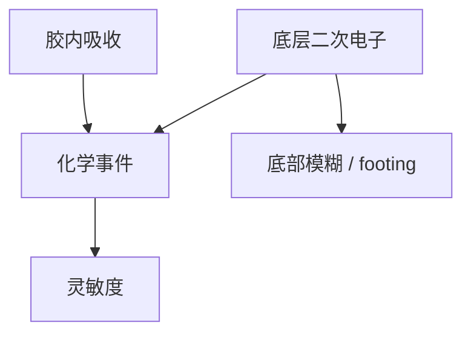

# 底层设计与二次电子

薄胶的界面是电子的出入口。底层可以提高二次电子产额来补灵敏度，也会把底部模糊和 footing 写成侧壁。

<footer>—— 据 Naulleau 二次电子模糊；Kozawa 电离产酸；Levinson 底层功能</footer>

[上一课](/litho/euv-resist-absorption)把膜厚和吸收系数锁在一起。缺口是膜下面那一层：事件不仅生于胶内吸收，也生于底层射上来的二次电子。[EUV 底层](/litho/euv-underlayer) 已列功能栈；[二次电子产额](/litho/euv-secondary-electron) 已给产额语言。本课把两者收成设计旋钮。高 NA 下这张薄栈如何转印，留给[下一课](/litho/high-na-pattern-transfer）。

## 问题

吸收课假设光子在胶内变成事件。胶只有十几纳米时，界面占比巨大：底层高 Z 或高密度会抬二次电子产额，等效增加底部剂量，灵敏度「免费」上升；同时底部模糊核加厚，清底与 footing 和光学离焦同貌。设计缺口是：用底层补 $\bar N$ 时，能补多少、侧壁还能不能立。不是再列黏附、平面化、硬掩模清单。

CAR 对底层酸碱敏感，衬底淬灭出 footing；金属氧化物对界面黏附和显影钻蚀敏感。二次电子是第三条、EUV 特有的耦合。

底层不是光学透明垫片。换 underlayer 等于换胶模型的界面源项，OPC 要紧凑模型重校准。

## 方法

实验：同一胶只换底层，看 $E_0$、侧壁、LER 高频和孔缺失。产额升而剖面倒锥，说明底部事件过密。产额低而膜又薄，随机先爆——应加 $\alpha$ 或 $D$，而不是只怪 SMO。栈：黏附层、电子调节层、硬掩模可以是一层或两层，电子调节与硬掩模的元素选择往往冲突（高 Z 利电子、未必利蚀刻）。

与吸收：胶内 $\alpha t$ 与界面产额是两源。模型要能分开，否则加剂量和换底层在仿真里不可区分。

### 电子调节与硬掩模常常打架

高 Z 底层利二次电子和灵敏度，干法选择比和金属沾污未必合格。含硅硬掩模利转印，电子产额可能不够。两层栈把功能拆开：薄电子层贴胶、厚硬掩模在下。涂布混合、烘烤互扩散会把两层重新搅在一起，窗口实验必须声明栈，不能只报「一种底层」。

## 机制

92 eV 光子在底层电离，电子级联，射程纳米量级，一部分越过界面进入胶。Naulleau 的模糊核、Kozawa 的电离产酸，在界面处变成轴向不对称：底部事件密度高于按胶内 Beer 定律的外推。热化距离随材料变，本课不编射程表，只要求资格认证声明底层。氢和真空污染课的出气，底层也是源之一，设计还要低放气。

「更敏的底层」可能是电子灌入，也可能是界面不淬灭酸。要用剖面和随机曲线拆，不能只看 Esize。

## 边界

本课不写干法如何把 15 nm 浮雕传到硬掩模，下一课才写高 NA 薄胶转印。不重写 BARC 驻波——EUV 驻波不是第一理由。界面电子是轴向不对称模糊，不能用对称高斯酸核代替。出处：Naulleau；Kozawa；Levinson；底层与产额课。

## 小结

- 底层二次电子是薄胶灵敏度的设计旋钮，也是底部模糊源。
- 与胶内吸收分源建模；换底层要重校准 OPC。
- 下一课：这张薄潜像怎样变成可蚀刻的硬掩模图形。
- 出处：Naulleau、Kozawa、Levinson。
