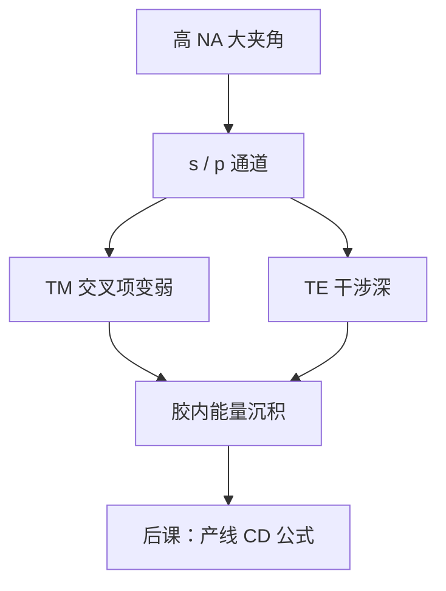

# 偏振与矢量成像

孔径角一大，电场不再能收成一个标量 $U$；s 与 p 在像面的干涉效率不同，胶里沉积的是矢量场的能量，不是 $|U|^2$。

<footer>—— 据 Born &amp; Wolf 对电磁边值与偏振的讨论，以及 Mack、Levinson 对高 NA 矢量成像的产线表述整理</footer>

[上一课](/litho/depth-of-focus)把离焦写成标量光瞳上的二次相位，$C(z)$ 与 NILS$(z)$ 都还在标量空中像里读。缺口是：$\mathrm{NA}\gtrsim 0.7$（浸没到 1.35）时，边缘光线的电场有不可忽略的纵向分量，TM 两束几乎不相干相加，标量对比度过于乐观。本课把强度升级成胶内能量沉积。产线 CD 公式仍留给[下一课](/litho/rayleigh-litho)，不要在这里提前写 $k_1$。

## 问题

标量模型假定偏振与传播方向无关：光瞳函数乘复振幅，像面取模方。高 NA 下这套接口破了。同一对衍射级，TE（s）电场彼此平行，干涉条纹深；TM（p）电场沿各自的 $\mathbf{k}$，夹角接近 $2\theta$ 时交叉项 $\mathbf{E}_1\cdot\mathbf{E}_2^*$ 变小，暗区抬高。上一课看到的「离焦毁掉 NILS」，有一部分其实是偏振损失被误写成焦深。

缺口因此是给空中像一个矢量定义，而不是开始挑偶极的偏振方向。没有这一定义，后课的浸没、离轴照明会把「TM 对比掉了」和「$\sigma$ 选错了」缠在一起。

### 像面强度不是真空里的 |E|²

光刻胶要的是被吸收的能量密度，与胶内电场（再乘吸收）有关，不是空气/水里的坡印廷矢量随便取一个分量。折射率台阶在胶界面上改变透射的 s/p 比，驻波沿 $z$ 再调制一层。本课允许把「矢量空中像」说成指定平面上的能量沉积 $I_\mathrm{abs}(x,y)$；薄膜堆栈的严格分层计算是材料缺口，这里只要求不再写标量 $|U|^2$。

「矢量 TCC」把 Hopkins 的重叠积分换成偏振通道。部分相干课的 $\sigma$ 定义不变，变的是每个源点携带的琼斯矢量如何进光瞳。

## 方法

把进入光瞳的每条光线写成局部 s/p（或 Jones），经投影后在像面矢量叠加，再对源点做强度积分。计算上这就是矢量 TCC 或偏振分解的和差相干。照明侧加偏振控制：让密线的关键方向走 TE，避免 TM 主导的那一组节距。这是后课离轴照明的偏振附件，本课只提供接口。

标量离焦相位仍然乘在每个偏振通道上。矢量效应与焦深叠加，不是互相替代：TM 损失在最佳焦距就已经存在，离焦再叠加二次相位。

### 浸没把夹角做大

$\mathrm{NA}=n\sin\theta$。水把 $n$ 抬到约 1.44，同样的空间频率对应更大的光线夹角，TM 退化来得更早。干式 0.93 已经需要小心；1.35 必须默认矢量模型。本课不讲水层流体，只钉：改 $n$ 就是改夹角，也就是改偏振对比。

## 机制

几何上，两束 TM 光的电矢量随 $\theta$ 张开，相干叠加的对比度按 $\cos 2\theta$ 一类的因子下降（具体形式随归一）。频率上，截止附近的级对夹角最大，所以密图形先付偏振税。这与上一课「高频先死于离焦」同构，只是本课的税在 $z=0$ 就征收。

掩模侧的偏振：透射铬栅会当线栅偏振器，反射 EUV 吸收体也有自己的 s/p 差。那是[掩模 3D](/litho/mask-3d-effect)的缺口。本课的物是「投影侧已经进光瞳的矢量场」，不在掩模膜里做电磁边值。

### 后课默认的接口

说到空中像，高 NA 默认 $I$ 是能量沉积，对比度与 NILS 的公式形式不变、输入变了。说到照明，必须声明偏振；只报 $\sigma$ 不够。不要在瑞利课里回头解释「为什么标量 $k_1$ 会乐观」。

## 边界

本课不是完整 FDTD。掩模波导、胶内二次电子、EUV 多层膜的偏振反射率，都不在这里展开。也不要把「用了偏振照明」写成已经解决矢量问题：它只是避开最差的 TM 组合。标量模型在低 NA、松节距上仍可用；切换判据是 $\mathrm{NA}$ 与目标 $k_1$，不是机台品牌。

Immersion 水的 $n$ 会改夹角，因而改 TM 损失，但流体缺陷与喷淋头不在本课。后课写瑞利式时，标量 $k_1$ 已经默认「在所用偏振下的能量沉积」，不必再把 0.61 和 Jones 矢量缠在一起。

产线口语里的「极化照明」几乎总是光源侧的线偏振或切向偏振，不是把投影物镜改成偏振器。物镜镀膜的 s/p 透过率差是二阶修正。

## 小结

- 高 NA 下标量 $|U|^2$ 不够；空中像升级为胶内能量沉积。
- TE 干涉深、TM 对比掉，密图形先付偏振税。
- 矢量效应在最佳焦距已存在，与离焦二次相位叠加。
- $\sigma$ 的定义不改；每个源点要带偏振状态。
- 产线 CD 公式下一课，本课不写 $k_1$。
- 出处：Born &amp; Wolf, *Principles of Optics*；Mack, *Fundamental Principles of Optical Lithography*；Levinson, *Principles of Lithography*。
