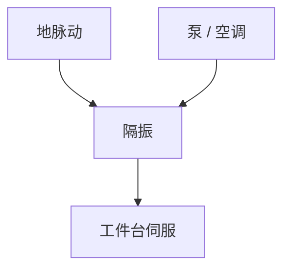

# 减振与地基

纳米套刻活在振动谱上。主动隔振把地脉动和泵声挡在台外，地基则决定厂里哪块地能放这台机器。

<footer>—— 对照扫描机 isolation frame / 主动隔振公开描述</footer>

[上一课](/litho/alignment-mark-design)把标记画完。缺口是环境力学：地脉动、空调、真空泵、邻机扫描反作用。本课钉减振与地基，台加速度下一课。

## 问题

套刻 nm 对应台相对位移 nm。楼板模态若落在伺服带宽附近，闭环会放大。把残差全写成编码器，会去调错环。

## 方法

被动橡胶/气垫加主动惯性传感器反馈。机器要独立惯性块或指定地基刚度。厂务：邻近打桩、AGV 通道都进振动预算。验收用频谱，不只用「感觉不抖」。

浸没头流体力是机内扰动，隔振挡不住，要靠台伺服与流体设计。分内外源。

## 机制

隔振传递函数在低频硬、高频软；主动环补中间带。过隔振会让台「飘」，与对准捕捉冲突，要折中。

## 边界

下一课台自己加速扫描时的反作用，是隔振之后仍要管的力。

## 小结

- 减振把厂频谱从套刻预算里抠掉一块。
- 验收看传递函数，不只看静标。
- 出处：扫描机 isolation 通识；套刻课。
