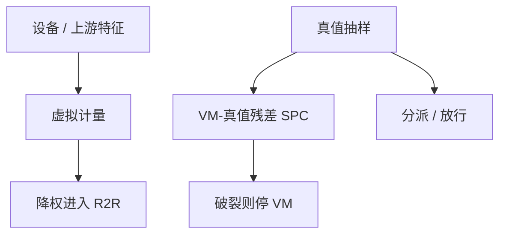

# 虚拟计量

虚拟计量用设备与上游数据估计本步 CD 或套刻，给 R2R 充样本；它估计的是相关，不是第二台 SEM，更不能当法律放行。

<footer>—— 对照半导体虚拟计量（VM）与 APC 的公开讨论；IEEE 半导体生产中的 VM 传统</footer>

[上一课](/litho/fab-data-loop)把数据对齐写清。缺口是抽样墙：不能每片 SEM。[ML 热点](/litho/ml-hotspot-prediction) 已限制学习模型做排序；本课钉过程控制里的虚拟计量（virtual metrology）。良率模型从下一课开始，不再扩控制环。

## 问题

VM：用轨迹传感器、胶厚、光源功率、上游 AEI 等，回归本层 CD/套刻，供 APC 在缺测片上更新。好处：节拍变快、边缘片也有估计。风险：漂移（换胶、保养后相关破裂）、外推（新产品开口率）、以及把 VM 当放行——分派必须用真实计量或明确的降级规则。

缺口是**角色**，不是网络结构。VM 进反馈要当「带较大方差的观测」，Kalman/EWMA 降权；当真理会让环在模型里自嗨。

### 相关不是因果

胶厚与 CD 相关，前馈课已经用物理模型吃过。VM 若再吃同一胶厚，等于双计。特征应是 APC 尚未用的残差信息（腔体 OES、扫描机传感器），或用于未测片的插值，并声明与前馈的正交。

保持集必须含时间外批次与保养后。只报训练 R² 的 VM 禁止进环。

## 方法

训练：与参考计量匹配后的尺度。部署：仅 APC 建议，限幅严于真值环；SPC 与放行仍用真值抽样。监控：VM 与真值差的控制图，破裂即停 VM。与 OPC：禁止用 VM 反演全芯片核。

特征表要声明哪些已被前馈使用，避免双计。IEEE 半导体生产里的 VM 传统把「软传感器」放在控制环里，同时把实验室计量留作法律量——本课沿用这道法律分界。

## 机制

$y \approx f(x_\mathrm{eq}, x_\mathrm{up})$。当 $f$ 的域（产品、机台、食谱）变，残差结构变。VM 误差通常空间相关（同一指纹盲区），会让高阶项更自信地错——比随机噪声更危险。故 VM 适合低维（均值、径向一次），禁止单独支撑场内高阶。

VM 是降权观测。真值抽样的残差图一破裂就停软传感器，放行仍用 SEM / 套刻机。

## 边界

VM 不替代 LRC，不替代缺陷检测。不发明 arXiv。本课结束过程控制单元。

后课默认：VM 只给低维环充样本，放行用真值。下一课程用缺陷与面积谈良率，不再拧扫描机旋钮。

## 小结

- 虚拟计量是降权观测，不是放行计量。
- 与前馈特征正交，保持集含保养后。
- 禁止用 VM 撑场内高阶或 OPC 核。
- 出处：半导体 VM–APC 公开讨论；IEEE 半导体生产 VM 传统。
