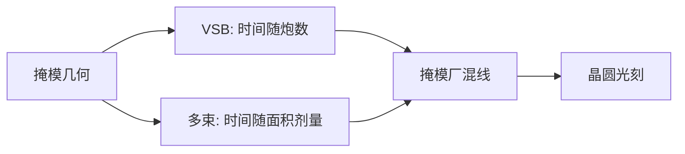

# VSB 对多束

变量成形束按矩形炮计数；多束按面积与剂量计数。选哪一种写入器，就是选哪一堵墙先撞上。

<footer>—— 对照 NuFlare 一类 VSB 与 IMS 一类多束掩模写入的公开原理</footer>

[上一课](/litho/multibeam-mask-writer)已经把多束收成：十万至数十万根并行细束，写入时间对图形复杂度一阶解耦，曲线 ILT 才进得了日历。缺口是对照。产线仍大量使用可变成形束（VSB）：用可变矩形孔径一次打一块曼哈顿。两种物理、两堵墙、两套 PEC，掩模厂混线而不是一夜切换。本课钉 VSB 对多束。全芯片计算如何赶上写入，留给 [GPU OPC](/litho/computational-litho-gpu)。

## 问题

VSB 的节拍是：偏转 → 成形（矩形或三角形） → 曝光 → 稳定。炮数随 OPC 碎片和微矩形逼近曲线而涨，时间墙是炮数。公开的 NuFlare EBM 一类机台把单束电流、成形精度和 PEC 做到掩模厂熟悉的 CD 均匀；它们没有把「任意 ILT」的炮数变免费。

多束的节拍是：栅格扫描一场的时间 ≈ 面积 × 剂量 / 总电流。复杂度墙被拆掉，剩下面积墙、数据带宽和阵列校准。IMS 一类 MultiBeam Mask Writer 的公开原理就是这道交换。缺口是：哪一层该走哪座墙，而不是宣布 VSB 过时。

### 简单层上 VSB 可以更快

稀疏接触、大面积铬、低 OPC 复杂度，VSB 单炮面积大，可能比多束扫完整场更短。多束的价值在复杂度尾部：碎 SRAF、全芯片曲线、短碎片曼哈顿。用「所有掩模都该多束」规划产能，会在简单层上买错机时，在 ILT 层上又排队。

不要把束数宣传常数（某代「二十六万束」）写进教材当永久物理。论证应落在「时间对复杂度的导数」，具体束数每代都会变。

## 方法

混线：关键 EUV / ILT 层走多束，较松的 DUV 层留 VSB。数据准备必须双输出——VSB 炮表与多束位图——并共用一套套刻与 CD 基准，使不同写入器写的层仍能对上。PEC、充电、加热模型按机台家族分开校准：多束瞬时剂量率分布与 VSB 不同，VSB 经验表不能直接贴。

曲线在 VSB 上的权宜之计是微矩形逼近，炮数爆炸，正好说明为什么曲线 MRC 与多束要绑在一起。曼哈顿在多束上完全能写，只是可能浪费其复杂度不敏感的优势。

### 误差指纹不同

VSB：成形孔径与偏转校准的残差，常表现为边的局部 CD 与位置误差，相对「几何」还比较像 OPC 熟悉的偏置。多束：阵列各通道电流/位置不均，留下栅格周期指纹，光学 OPC 很难当随机掩模误差来修。混线的计量必须能分辨这两种指纹，否则会把写入器问题送去「再跑 OPC」。

## 机制

单束电流受库仑效应与亮度限制，VSB 靠加大每炮面积换时间，所以偏好大矩形。多束把总电流摊到空间独立的许多束，库仑按单束计，总剂量速率按束数加，所以偏好「把整场当成位图」。这与晶圆 EUV 光源「提高总功率」不是同一句话：这里并行的是曝光通道。

PEC 补偿的都是电子在抗蚀剂与衬底里的散射，但剂量背景场的时间结构不同。曲线密度场更平滑，多束 PEC 可能更稳；VSB 在密碎矩形上的雾化与加热更尖锐。电子束邻近修正不是光学 OPC，两套模型不要合并流程。

NuFlare 与 IMS 是公开讨论里最常被对照的两条产品线，不是唯一供应商。写产能时用「VSB 家族 / 多束家族」，不要把商标写成物理定律。

## 边界

多束不消除空白片缺陷与吸收体粗糙度；VSB 也不因「更老」就更准。选择标准是该层的复杂度分布、CD 规格、以及机台队列，不是节点名称。数据带宽在多束上会变成假产率：机台等数据时，面积模型算出来的小时数无效。修补、检测必须与写入器一致，曲线层尤其如此。同一层中途从 VSB 改多束，CD 基准与 PEC 都要重资格认证，不能当「换一台更快的打印机」。

后课默认：复杂 ILT 默认活在多束的面积墙上；VSB 仍是简单层与混线的支柱。

下一课的 GPU 加速若没有对应的多束队列，只是更早把炮数墙或面积墙暴露出来。

规划先进节点掩模产能，要把 ILT 层比例、多束机数量和 VSB 队列放在同一张表。只扩 GPU、不扩多束，曲线堵在掩模厂门口。

## 小结

- VSB 按矩形炮计数，复杂 OPC/曲线会撞炮数墙。
- 多束按面积与剂量计数，对复杂度一阶解耦，撞的是面积、带宽与阵列指纹。
- 掩模厂混线；数据准备与 PEC 必须按家族分开。
- 简单层 VSB 可以更优，ILT 层需要多束。
- 出处：IMS 多束与 NuFlare VSB 的公开写入原理。
