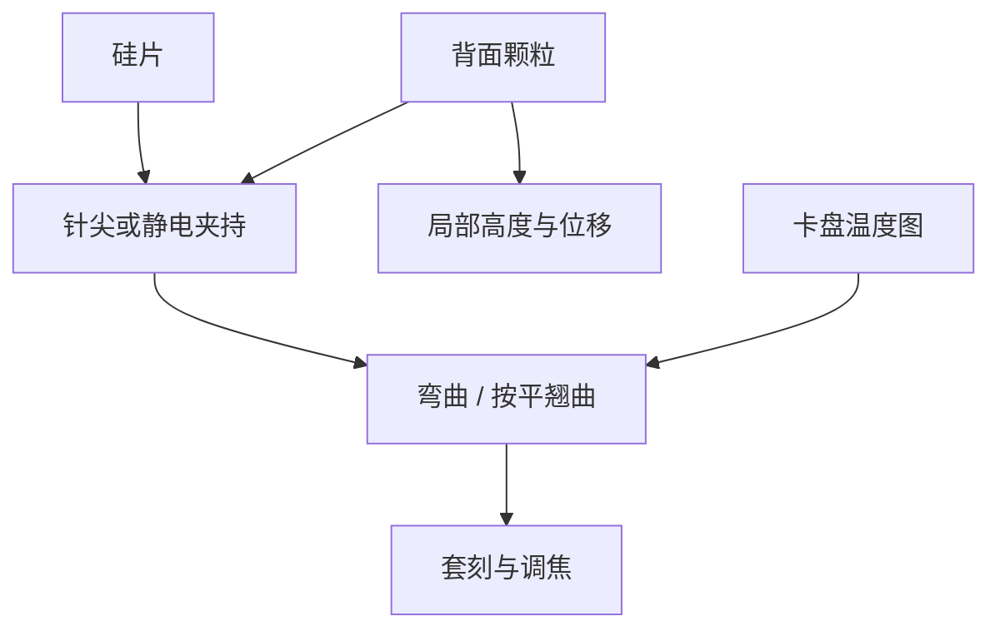

# 晶圆吸盘

对准网格写在被吸住的那张硅上；夹持针尖、静电垫和温度图改的是晶圆形状，套刻把它读成层间位移。

<footer>—— 对照 ASML 对晶圆夹持、卡盘与 on-product overlay 中夹持/热贡献的公开论述</footer>

[上一课](/litho/wafer-thermal-overlay)把曝光与换热写成晶圆侧温度场，网格在扫描中自己走路。缺口是机械边界：同一张热图，吸盘如何钉住硅片，决定膨胀往哪走、翘曲如何被按平。本课钉晶圆吸盘（chuck / clamp）。国产与管制从下一课序才开始，本课不把卡盘写成替代许可。

## 问题

硅片不是自由薄板。真空吸盘（浸没）或静电吸盘（EUV 真空）把背面压向针尖或垫：接触点之间的硅会微弯，正面高度进入调焦，面内位移进入套刻。针图、夹持力、背面颗粒，每一项都是可重复或不可重复的指纹。热套刻课已经指出卡盘温度图是热边界；本课写力边界。两者乘在一起，不是两段独立补丁。

EUV 没有浸没水的均热，但静电夹持的接触热阻和针尖稀疏度仍然决定局部温度。浸没还有水层与真空吸的耦合。缺口是夹持变形，不是再推一遍硅的热胀系数。

### 夹持变形对套刻是系统项

换卡盘、清洁针尖、换针图配方，产品 overlay 指纹会跳。看起来像扫描机网格变了，其实是晶圆以不同形状坐着。补偿必须跟到卡盘 ID 和夹持配方，而不是只跟机台。

掩模静电夹持在物面，本课是像面硅片。两边都叫 clamp，坐标和颗粒后果不同，不要共用一张清洁规范。

## 方法

针尖吸盘用稀疏接触减背面颗粒印，同时接受针间弯曲。静电吸盘用分区电极调力，可补偿部分翘曲，也引入电极图案指纹。测量台与曝光台各有卡盘：TWINSCAN 架构下，测量时的夹持形状必须能预言曝光时的形状，否则对准白做。

颗粒：背面粒子被夹持顶出正面鼓包，局部失焦 + 局部位移。与热指纹不同，颗粒事件不可用场平均倍率收掉。清洁、检验、拒吸是良率闸门。

### 与热套刻同一张预算

卡盘温控（公开讨论中的温水或温控盘）提供热边界；夹持提供机械边界。前几片、换批次薄膜应力、改剂量，形状都变。overlay 模型要把「夹持形状」和「热膨胀」分开估计，否则一个改剂量，另一个的补偿跟着错。

## 机制

针间弯曲的空间频率跟针距走，进入调焦的中频；面内泊松效应把按平翘曲变成放大和正交畸变。静电分区若在扫描中动态调力，形状成为时间函数，与狭缝积分耦合。这比静态网格更毒。

双工件台：两张晶圆卡盘的针图与磨损不同，必须分别表征。掩模台同步课假定像面网格已知；卡盘是这份已知的物理来源之一。

「吸盘」在浸没里还要排污和抗水印；EUV 静电盘要抗氢与真空放气。不要把 193 浸没卡盘的维护手册抄到 NXE。

## 边界

本课不重写对准标记算法，也不给针距毫米数。不要编造夹持力。后课默认：说到晶圆 overlay，先问这片是怎么被吸住的、卡盘是哪一块。

引用 ASML 对 wafer clamp / chuck 与产品套刻的公开论述。

背面供电减薄晶圆之后，吸盘与键合应力会再改形状。BSPDN 课的薄片要回到本课的夹持模型，不要假设刚度不变。

## 小结

- 吸盘夹持决定晶圆形状，因而决定套刻与调焦。
- 针图/电极是系统指纹；颗粒是不可平均的局部事件。
- 热边界与力边界要分开建模，再一起进 overlay 预算。
- 测量卡盘与曝光卡盘必须形状可预言。
- 出处：ASML 晶圆夹持与 on-product overlay 公开论述。
