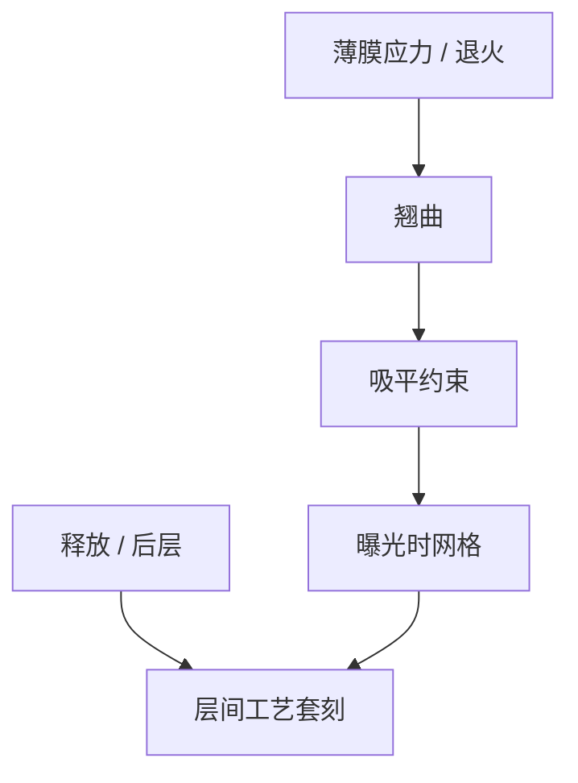

# 晶圆形变与应力

薄膜应力把圆片弯成碗或马鞍，对准看见膨胀与旋转，器件网格却按薄膜历史走；补的是形变，不是镜头放大。

<footer>—— 对照晶圆翘曲、工艺诱导 overlay 与 ASML 对 process-induced overlay 的公开论述</footer>

[上一课](/litho/edge-field-partial)处理边缘边界。缺口是整片：沉积、CMP、退火、背面膜让晶圆翘曲，曝光时卡盘强行吸平，释放后又弹回。[晶圆热套刻](/litho/wafer-thermal-overlay) 已谈热；本课钉应力形变。机台对机台套刻，留给[下一课](/litho/tool-to-tool-overlay）。

## 问题

应力 overlay 的典型指纹：径向放大、枕形、不对称弯月，随层叠厚度变。对准在吸盘上读到一个网格，器件在自由或不同吸平状态下是另一个。高阶场内项可以部分吃掉，但应力若随产品布局（密金属区）走，全球多项式不够，需要高密度计量或分区。

缺口是**工艺诱导套刻是集成问题**，不是扫描机坏了。只匹配镜头的厂，会在新 PECVD 或厚铜层后「套刻突然失控」。

### 吸平不是可逆的

卡盘吸平能压低翘曲，接触不良、背面颗粒会造成局部鼓包，焦点与套刻一起坏。真空吸盘与边缘接触策略是扫描机课已有的硬件；本课要求应力大的层检查吸平质量，而不是只加校正项。

双面加工与背面电源把应力源翻到背面，对准树和翘曲模型都要重做。助推器课点过 BPR；这里是控制后果。

## 方法

计量：翘曲仪、高密度套刻、对准残差图。动作：薄膜应力工程、退火、补偿层、扫描机高阶 + 晶圆专用校正。与 APC：应力指纹慢变，可当产品–层的静态地图，不要当片噪声。与标记：应力下标记相对器件滑动，关键对尽量用产品附近标记。

新薄膜或新退火导入等于新地图：要加密套刻直到指纹稳定，再降回稳态抽样。process-induced overlay 的公开论述把工艺当指纹源；本课要求源变则地图版本变。

## 机制

薄膜应力 $\sigma$ 产生弯矩，晶圆曲率 $\propto \sigma h_\mathrm{film}$。卡盘约束改变曝光时的面内应变。曝光后释放，层间相对位移留下。热与应力耦合：温度改应力状态。R2R 若把应力放大当镜头放大去补，换产品场排布即失败——分账与高阶课同一原则。

吸平约束下曝光、释放后弹回，层间留下工艺套刻。全球放大项冒充弯月，换场排布即崩。

## 边界

不写材料力学全文。不把某层未公开的翘曲微米数当规格。封装翘曲只点名，细节不在光刻控制课展开。

后课默认：工艺诱导指纹按产品–层存地图。下一课多机时，这些地图还要叠机台差。

## 小结

- 应力形变造成工艺诱导套刻，应工程减源并配静态地图。
- 吸平质量是焦点+套刻的共同前置。
- 全球放大项不能冒充应力弯月。
- 出处：process-induced overlay 公开论述；ASML 翘曲相关公开材料。
