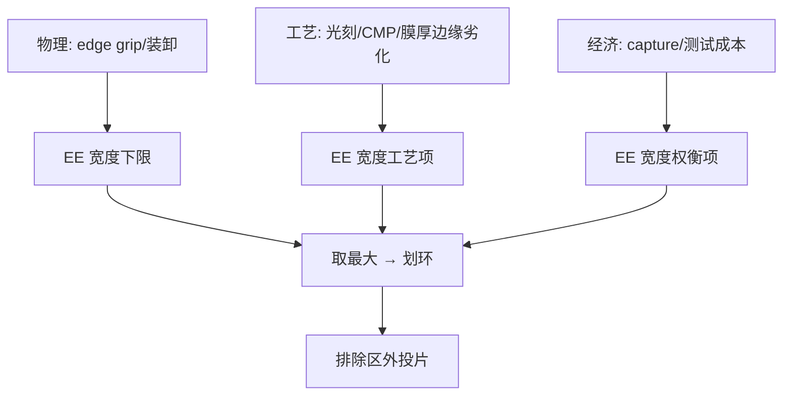
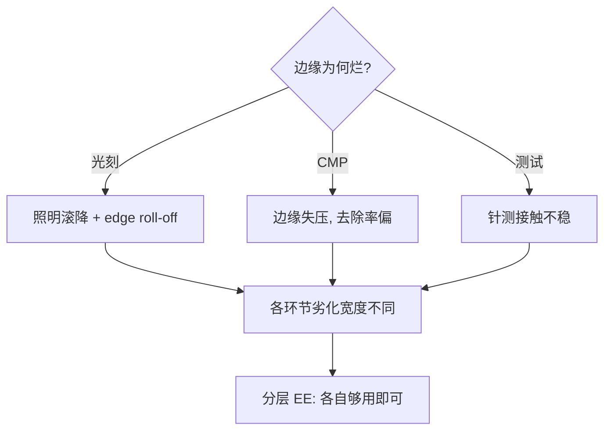

# 晶圆边缘排除区

晶圆最外圈几毫米天生是坏地：边缘效应从光刻一路烧到封装——划出排除区，把良率数学先赢回来。

<footer>—— 据 SEMI 晶圆规格边缘排除条款；各节点 fab 的 edge die 政策演变</footer>

[混合匹配与套刻拼接](/litho/mix-and-match-overlay)提过「边缘损失顺手消化」，本课把边缘单独成课。缺口是**边缘排除区（edge exclusion, EE）**：晶圆直径的最外 1–3mm 不做图形。看似浪费，实则是全工艺链的良率契约。本课不做边缘 die 的 capture 概率细算。

## 问题

边缘是物理上的重灾区：光刻的照明均匀性在晶圆边缘劣化（扫描曝光的场边缘效应）、CMP 的边缘失压（Pad 边缘力学）、传送与机械手的夹持痕（edge grip 区）、测试探针的边缘接触不良。在这些区域投片，die 的良率趋零但仍占曝光产能。缺口：**在直径上划出排除环**，让产能与计量资源集中在能活的区域。排除宽度是各节点的经济决策而非物理常数。

术语翻译：edge exclusion（EE）= 晶圆外缘不做工艺的环形区，宽度常 1–3mm；edge die = 场域中心落在排除区外的残缺 die；edge grip = 晶圆传送的机械夹持环，物理占用外缘。

数字实例：300mm 晶圆 EE=2mm 时可图形面积损失 π(R²−(R−2)²)≈18.5cm²，约 2.6% 面积；但这 18.5cm² 若不排除，其 die 良率近零且探针测试还会拖累测试产能——排除是「主动放弃换整体良率」。

## 方法

排除区设定三输入：**物理底线**——edge grip 与装卸要求的机械占用；**工艺极限**——光刻照明的边缘均匀性、CMP 边缘失压、膜厚 edge roll-off 各自要求的宽度，取最大值；**经济权衡**——die 的 capture 概率（残缺 die 被计入良率的比例政策）与测试成本。执行上排除区写进每层工艺的 recipe，不靠设计者自觉；先进 fab 的 EE 已从历史 3mm 压到 1mm 级，每压缩 1mm 换回约 1.3% 的 die 产出。

直觉类比：像农田边缘不种庄稼——田埂（edge grip）、水渠边上浇不匀（工艺边缘劣化）、收割机够不到（测试），与其撒了种子收瘪谷，不如留成路；但田埂也别太宽，多留一寸就少收一垄。

## 机制

边缘劣化的机制各层不同但同向。光刻：扫描曝光中狭缝照明的场边缘强度滚降 + 晶圆边缘的聚焦/平整度劣化（edge roll-off 数百纳米），CD 与叠加套刻在边缘双双恶化。CMP：抛光垫在晶圆边缘的接触力学突变（边缘气穴与垫形变），去除速率偏离中心——不排除则边缘层厚失配污染叠层。测试：边缘 die 的针测接触不稳，坏 contact 会误判好 die。机制的共同点：**边缘效应以毫米尺度缓变**，故排除区宽度是「够用即可」的阶跃决策，而非连续优化；难点在各环节极值不同，取包络后可能过排除——分层 EE（不同工艺不同宽度）是折衷。

常见误区：把 EE 宽度当 fab 常数一刀切到底——光刻 2mm 可能已稳，CMP 却要 3mm，统一 3mm 就是白扔 1mm 的 die；另一误区是「排除区绝对不碰」——edge die 的 capture 政策（残缺 die 是否测试计产）与 EE 宽度是一体两面的经济决策，二者须一起谈。

## 边界

EE 与先进封装的新纠缠：chiplet 时代晶圆边缘的 die 价值升高（小 die 在边缘 capture 率高），压缩 EE 的经济动力增强；对面板级封装（PLP）用方形基板，圆晶圆的边缘数学整体消失。工艺侧：edge bead removal（旋涂去边）、边缘曝光（edge exposure）是「在排除区内也要处理干净」的配套——排除的是「做产品」，不是「不做任何事」，边缘残留光刻胶会污染后续工艺。与[EUV 剂量预算](/litho/euv-dose-budget)的接续：排除区收缩后，照明边缘的剂量控制余量变小——边缘的剂量漂移成为 EE 能压多窄的隐形下限。

直觉类比：压缩 EE 像「把田埂改窄」——改造的是收割机（更贴边的计量与传送），不是把庄稼种进田埂；每一毫米的收复都要先确认水渠、田埂、收割机三方面都真的让得出来。

## 小结

- EE = 物理占用 + 工艺边缘劣化 + 经济权衡的包络，是阶跃决策。
- 光刻滚降、CMP 失压、针测不稳三机制同向，宽度取最大。
- chiplet 抬高边缘 die 价值，EE 从 3mm 向 1mm 收缩是趋势。
- 出处：SEMI 晶圆规格；edge roll-off 计量文献；fab edge die 政策实践。
