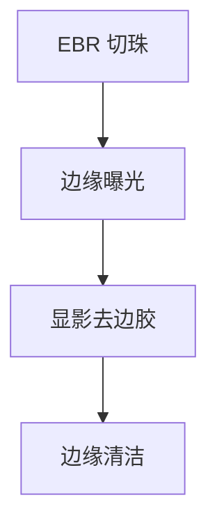

# 晶圆边缘曝光

WEE 用独立光源把边缘胶曝光掉，避免边缘残胶进刻蚀腔。它不是场内图形的一部分，却吃掉一圈 exclusion。

<footer>—— 对照 wafer edge exposure 模块的公开用途</footer>

[上一课](/litho/track-defect-sources)点到边缘渣。缺口是有意的边缘曝光（WEE）：在扫描仪主曝光之外，把边缘环的正胶打到可溶。与 EBR 溶剂切珠分工：一个切厚珠，一个清薄残胶或定义边缘。

## 问题

EBR 之后仍可能有薄胶裙，刻蚀时掉进腔体成颗粒。边缘芯片本就不完整，用光把胶去掉，换清洁。过宽 WEE 吃掉可出货管芯；过窄留渣。与 [边缘场](/litho/edge-field-partial)（若已写）的剂量补偿不是同一旋钮。

## 方法

轨道或扫描仪附属模块：宽带或匹配胶敏感波长的灯，环形曝光。宽度与 EBR、notch 方位对齐。正胶：曝光+显影去掉；负胶逻辑相反，不要套用。须进入掩模与曝光场规划，避免 WEE 打到对准标记。

有的厂把 WEE 放在主曝光前，有的后。相对 PEB 的次序改边缘 CD，须固定在配方里。

## 机制

正胶边缘被打到剂量饱和，显影全溶。光学邻近在边缘终止，不需要 OPC 那一套——这里没有器件图形。

## 边界

下一课背面与斜边：光够不着的地方，要溶剂或刷。

## 小结

- WEE 用光清边缘正胶，换腔体清洁，付 exclusion。
- 与 EBR、边缘场补偿分账。
- 出处：WEE 模块通识。
