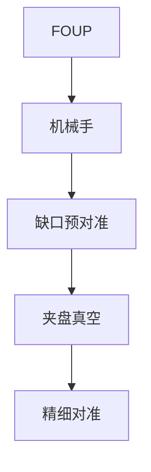

# 晶圆装载与预对准

机械手把片放到预对准器上找缺口，再交给夹盘。缺口误差几角分，精细对准就要用掉行程。

<footer>—— 对照 scanner pre-alignment / notch finding 通识</footer>

[上一课](/litho/thermal-airflow-control)维持柜内气候。缺口是进片：FOUP → 机械手 → 预对准 → 夹盘。本课钉装载与预对准，掩模库下一课。

## 问题

精细对准传感器视场有限。预对准太差，标记不进窗，这场报错或盲曝。夹盘吸偏、背面颗粒垫高，调平从一开始就歪。把对准失败全写成标记设计，会漏机械。

## 方法

光学找 notch/flat，旋转到配方角度，再放夹盘。真空吸盘检查泄漏。颗粒：背面清洗课的后果在这里爆发。节拍：装载时间进产能死时间，与双台掩盖相关。

薄片、翘曲片预对准更难。配方要有翘曲容忍，否则只服务理想硅。

## 机制

缺口 locates 旋转零点。残余角误差 × 半径 = 边缘切向偏差，精细对准用网格吸收，但标记必须仍在捕获窗。

## 边界

下一课掩模怎么上：另一只手、另一套夹持。

## 小结

- 预对准把精细对准关进视场。
- 夹盘真空与背面颗粒是装载质量。
- 出处：对准传感器课；背面清洗课。
