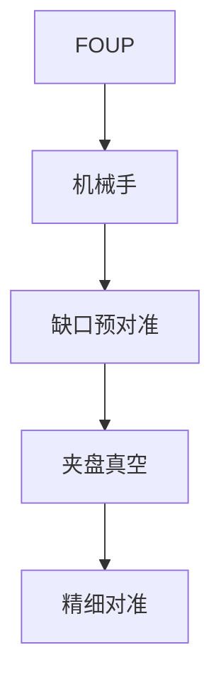
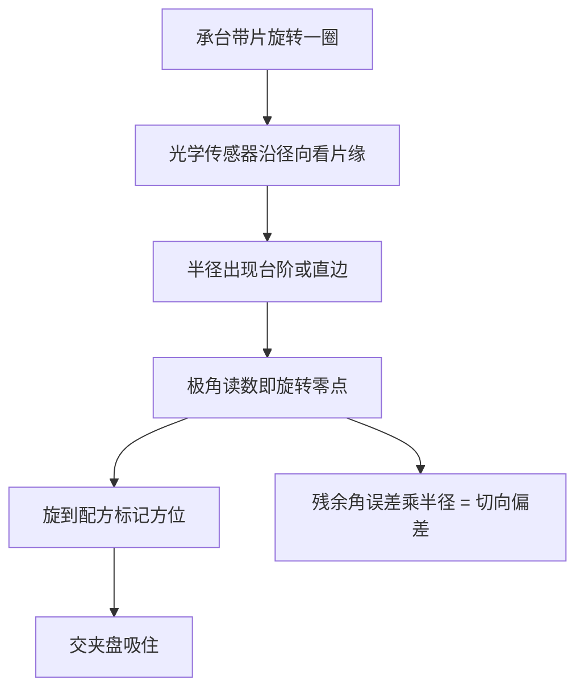

# 晶圆装载与预对准

机械手把片放到预对准器上找缺口，再交给夹盘。缺口误差几角分，精细对准就要用掉行程。

<footer>—— 硅片切口（notch）与主平边几何见 SEMI M1 硅片规格</footer>

[上一课](/litho/thermal-airflow-control)维持柜内气候。缺口是进片：FOUP → 机械手 → 预对准 → 夹盘。本课钉装载与预对准，掩模库下一课。

## 问题

精细对准传感器视场有限。预对准太差，标记不进窗，这场报错或盲曝。夹盘吸偏、背面颗粒垫高，调平从一开始就歪。把对准失败全写成标记设计，会漏机械。

「notch（切口）」是硅片边缘磨出的一个小圆弧凹口，「flat（平边）」是老式硅片上的一段直边；两者都是晶圆自带的「正北针」，告诉机器哪边朝上、该转到几度。

## 方法

光学找 notch/flat，旋转到配方角度，再放夹盘。真空吸盘检查泄漏。颗粒：背面清洗课的后果在这里爆发。节拍：装载时间进产能死时间，与双台掩盖相关。

工程流程：找缺口前先确认片在承台上落座，旋转找边时片不打滑；notch 与 flat 按配方切换判据；真空吸盘建立后查泄漏与卡盘平面度，背面颗粒超标的片在这里被拒收而不是进了曝光腔再返工。

```mermaid
flowchart TD
  FOUP["FOUP"] --> ROB["机械手"]
  ROB --> PRE["缺口预对准"]
  PRE --> CHK["夹盘真空"]
  CHK --> ALN["精细对准"]
```

薄片、翘曲片预对准更难。配方要有翘曲容忍，否则只服务理想硅。

## 机制

缺口锁定旋转零点。残余角误差 × 半径 = 边缘切向偏差，精细对准用网格吸收，但标记必须仍在捕获窗。

数字实例：残余角误差 0.01° 看着微不足道，乘上 150 mm 半径就是约 26 µm 的边缘切向偏差——精细对准视场往往只有几十微米量级，这就是「几角分吃掉行程」的算术。

常见误区：对准失败就先怪标记设计。若预对准根本没把标记送进传感器视场，再好的标记也扫不到——先分清是「标记不在窗」还是「标记信号差」，再决定改机械还是改图形。

```mermaid
flowchart TD
  SPIN["承台带片旋转一圈"] --> OPT["光学传感器沿径向看片缘"]
  OPT --> SIG["半径出现台阶或直边"]
  SIG --> ZERO["极角读数即旋转零点"]
  ZERO --> ROT["旋到配方标记方位"]
  ROT --> HAND["交夹盘吸住"]
  ZERO --> ERR["残余角误差乘半径 = 切向偏差"]
```

预对准器把片缘过一遍光：机械手把片放到可旋转的承台上，光学传感器沿径向看边缘，承台转一圈，半径出现台阶的位置就是 notch（SEMI M1 规定的圆弧切口）或 flat 的直边，极角读数即旋转零点；随后把片旋到配方期望的标记方位，再交夹盘。notch 与 flat 只是信号形状不同——台阶对直边——找零点的算法一致，片型混产时按配方切换判据即可。

## 边界

本课不写对准标记设计与对准传感器原理——那是精细对准一层的课域；FOUP 与机械手的厂级自动化接口也归联机课。预对准的前提是片缘完整：缺角、崩边或边缘有附加结构的片会在找缺口一步就报错，这类异常片走人工处置，而不是调配方硬扫。

## 小结

- 预对准把精细对准关进视场。
- 夹盘真空与背面颗粒是装载质量。
- 下一课掩模怎么上：另一只手、另一套夹持。
- 出处：对准传感器课；背面清洗课。
