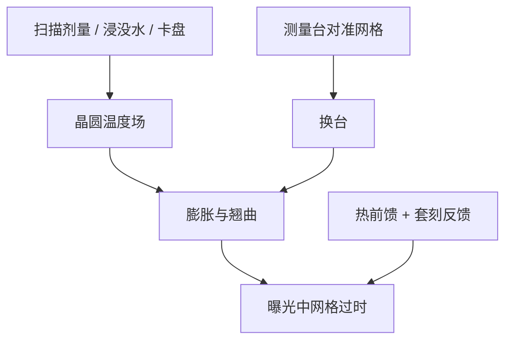

# 晶圆热套刻

硅片吃下曝光剂量、浸没水和卡盘的热交换，温度场一变，已对准的网格在扫描过程中自己走路——这是晶圆热套刻，不是掩模胀，也不是台子没对准。

<footer>—— 据 ASML 对 on-product overlay 中晶圆加热 / 冷却贡献的公开论述</footer>

[上一课](/litho/reticle-heating)把物面热胀从套刻里拆出来。缺口是像面：晶圆在测量位被对准之后，到曝光位还要吸收扫描热量、与卡盘和水换热，膨胀和翘曲改网格。本课钉晶圆热套刻。国产供应链从下一课序才开始，本课不把热控写成替代许可。

## 问题

对准发生在测量台，曝光发生在曝光台，中间有交换和等待。硅的热胀系数比石英大一截，同样温升，晶圆侧位移更狠。浸没扫描还有水层带走或带入热；EUV 真空里没有水，但剂量和卡盘仍在。ASML 把晶圆加热写成产品套刻的主工艺项之一：前几片、换卡盘、改剂量，指纹会动。

上一课掩模热随版图密度；晶圆热随场剂量、扫描路径、薄膜应力和卡盘温度图。两者可以同号叠加。只补掩模模型，晶圆侧仍会把 SRAM 区与稀疏区涨成不同放大。

### 翘曲不是均匀放大

薄膜应力让晶圆呈碗或马鞍，热再叠一层。高阶对准能拟合一部分静态翘曲；扫描中的瞬态热是时间函数，测量台上的网格会过时。双台加密的是进曝光前的那张图，不是曝光期间的温升轨迹。

卡盘温度图本身是执行器。均匀加热晶圆有时比「尽量冷」更利于可重复膨胀。

## 方法

治理与掩模热对称，对象换成硅与卡盘。卡盘温控与预热片；浸没水温与流量稳定；按剂量和扫描方向的前馈网格；片间反馈用套刻计量更新热指纹。Holistic overlay 公开叙述把对准（片间变化）和计量反馈（慢漂）分工：热的可预测部分可以前馈，晶圆间随机部分仍靠对准采样。

实验拆分：同一版、改剂量，看放大项是否随剂量走——偏晶圆或掩模要再用换版、换卡盘交叉。本课不引用未核对的 NXT 规格纳米数当良率。

### 与工艺层的耦合

刚镀的膜、刚抛的铜，应力和导热都变，同一热功率下的指纹变。所以「热 overlay」会在换胶、换 CMP 后看起来像机台坏了。要对着工艺改卡盘图和前馈，而不是只重做对准色权重——上一课的 OCW 压的是标记不对称，不是硅的热胀。

## 机制

热量来自吸收的曝光能量（胶和衬底）、浸没换热、卡盘接触。径向温度梯度造成放大；方位和扫描方向造成偏扭和扫描畸变。时间常数从秒到片，决定前几场与稳态场的差。EUV 剂量高、没有浸没水，热路径不同，但「网格在曝光中过时」同一句。

套刻预算里这一项属工艺+设备：卡盘是设备，膜堆是工艺。Chiplet 不消除它——每颗小片仍在 300 mm 晶圆上被扫过。

产品套刻含这一项；单机套刻在受控标记上会把它洗掉一部分。拿规格书单机数去卡产品热层，会过于乐观。

## 边界

不要发明国产浸没机的卡盘温控曲线或 wph。不要把掩模热的补偿表直接拷到晶圆——材料、几何和时间常数都不同。本课不重写 SPM：SPM 管台位环，晶圆热是硅自己胀，编码器可以很准而图形仍相对下层偏。对准策略加密采样能跟上片间翘曲，跟不上一场扫描内部的连续温升，必须前馈。

热套刻课程到此；下一课序的管制与供应链不再把纳米热指纹当主题。

出处：ASML 对晶圆加热 / 冷却与 on-product overlay 的公开论述；与 reticle heating 并列的热贡献分解。不编造未公开的硅片温升纳米比。

## 小结

- 晶圆在曝光中升温膨胀，测量台上的对准网格会过时。
- 与掩模热、镜头热像差分源；剂量、水和卡盘是晶圆侧旋钮。
- 前馈可预测部分，对准吃片间变化，套刻计量吃慢漂。
- 换膜换 CMP 会改热指纹，不像机台突然失准。
- 出处：ASML overlay 公开热源叙述。
