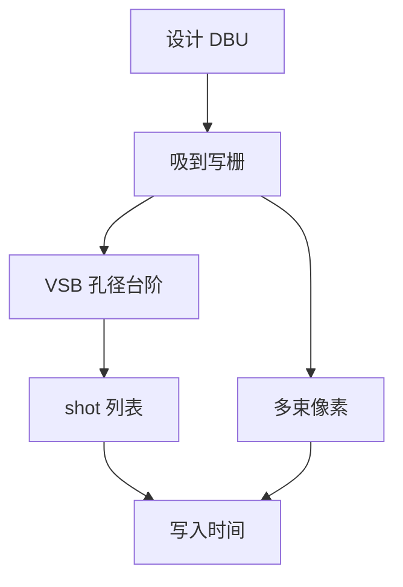

# 写入网格与 shot 数

地址栅量化每一条边；炮的离散尺寸量化每一次曝光。两张梯子叠在 PEC 剂量图上，才是写得出的几何。

<footer>—— 对照 VSB 地址栅、成形孔径台阶与多束像素的写入器通称</footer>

[上一课](/litho/mask-pec-detail)把剂量图拆成多层核。缺口是这张连续图必须落在硬件栅格上：地址单元、最小炮、束距。本课钉写入网格与 shot 数。落在栅格上的 CD 如何统计成整张均匀性，留给[下一课](/litho/mask-cdu）。

## 问题

[GDS 的 DBU](/litho/gdsii-oasis) 可以比写模地址栅更细。细网格上的 OPC 边会被吸到最近可写坐标，短 jog 消失，助条宽度跳一档。VSB 还叠加孔径成形的离散宽高：不是任意矩形，是台阶上的矩形。shot 数因此有两层意思：几何分割给出的炮列表，以及为了灰度或 PEC 动态范围拆成的多次曝光。

缺口是**量化**，不是再卷积一次背散射。把「网格 1 nm」写成「掩模 CD 精度 1 nm」，忽略了成形台阶、束斑与刻蚀。多束像素尺寸是第三张梯子：曲率半径小于若干束距，曲线 MRC 已经判不可写。

### 过采样换的是时间

地址栅加密、多遍交错扫描，可以降低量化噪声和粗糙，但 shot 数或遍数涨，[写入时间](/litho/mask-write-time) 几乎线性涨。节点预算里 mask LER 有一截来自这张梯子，不是来自晶圆扫描机。

合同里的「写栅」要与 OPC 输出网格、MRC 最小 jog 对齐。三套数各说各话时，TAPOUT 会在 fracturing 报告里才发现边被量化掉。

## 方法

设计规则与 OPC 碎边长度必须 ≥ 可写量子（再留刻蚀偏置）。灰度 VSB 用重叠炮逼近斜边，shot 数上升，量化误差下降——要在同一张 CDU/LER 预算里验收。多束：选束距使光学通带内的边足够光滑，再停止加密。

计数：曼哈顿层用炮密度（炮/μm²）预测 VSB 时间；曲线层用像素数 × 剂量预测多束时间。两套 KPI 不要加总成一个「复杂度分数」去排产。

## 机制

量化误差是周期性的：边落在栅格之间时，CD 误差在 ±½ 格子附近跳。经 MEF 放大后进入晶圆，但通常小于光学项——除非助条本身只有两三个量子宽。PEC 剂量台阶同样离散：过稀的剂量档会在疏密交界留下条纹，像剂量域的量化噪声。

## 边界

网格不提高 NA。加密网格不能用光学分辨率去论证，只能用写入器与检验能力论证。不要把某机型的最小炮表抄成本课常数。

后课默认：可写几何已经过栅格量化；下一课把整张版的 CD 离散与工艺残差收成 CDU。

## 小结

- 写栅与孔径台阶量化边与炮；多束另有束距梯子。
- shot 数含分割炮与灰度/多遍拆分；直接驱动 VSB 日历。
- OPC 网格、MRC jog、写栅必须对齐。
- 出处：VSB 地址栅与成形束通称；多束像素写入公开讨论。
