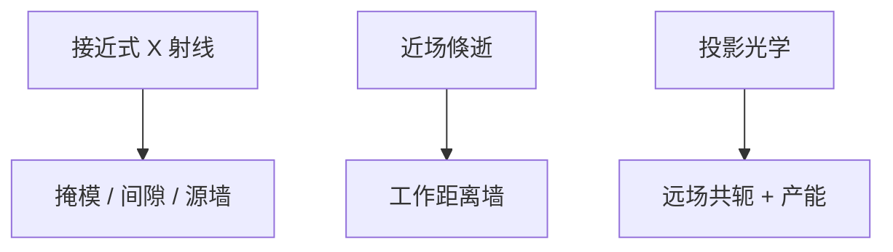

# X 射线与近场

更短的波长在 1980–90 年代走过接近式 X 射线；掩模、间隙与源让它让位给延长寿命的 193 nm。近场则用倏逝波，焦深薄到几乎不是扫描机。

<footer>—— 对照 X-ray lithography（IBM 等传统）与近场/倏逝光刻的公开历史</footer>

[上一课](/litho/interference-lithography)展示无透镜周期。缺口是短波接近式与倏逝。本课钉 X 射线与近场。封装尺度的激光直写，留给[下一课](/litho/laser-direct-write-packaging）。

## 问题

接近式 X 射线光刻：掩模贴近晶圆，用同步辐射或等离子源，分辨率好，工业上卡在掩模（吸收体、支架）、间隙控制、源与对准。193 浸没 + RET + 多重在成本上赢了，路线被放弃为逻辑主路径。近场/表面等离子体光刻：突破远场衍射，但工作距离纳米级，不适合晶圆扫描产能与形貌。

缺口是**历史岔路**，不是再推瑞利去证明 X 射线「应该赢」。课程要记住：更短 λ 不是充分条件。

### LIGA 与 MEMS

厚胶 X 射线在 MEMS/LIGA 仍有尼奇，对象是高 AR 金属结构，不是 CMOS 金属节距。后课 MEMS 会点到。

EUV 是反射投影，不是 1990s 接近式 X 射线的复活。不要把两者混成「都是短波所以一样」。

## 方法

读史：为何 157 nm 与 X 射线让位浸没。近场：实验室演示 vs 晶圆 wph 算术（工作距离、平整度）。评估替代技术时沿用同一算术。

## 机制

接近式衍射与半影随间隙变；间隙要小，颗粒与形貌不可忍——pellicle 逻辑的反面。近场强度随距离指数衰减，台阶直接毁掉均匀性。投影光学把掩模放到远处共轭，正是为了躲这两者。

## 边界

不宣布近场永远无用（存储、模板可能）。不把同步辐射当已死的科学。本课不重开 EUV 源物理。

后课默认：短波接近式不是先进 CMOS 主路；下一课波长更长、场更大的封装激光直写。

## 小结

- 接近式 X 射线卡在掩模、间隙与源，被 193 路径取代为逻辑主线。
- 近场破远场衍射，工作距离与形貌不适合扫描产线。
- EUV 投影 ≠ 接近式 X 射线。
- 出处：X-ray lithography 产业史；近场光刻实验室传统。
