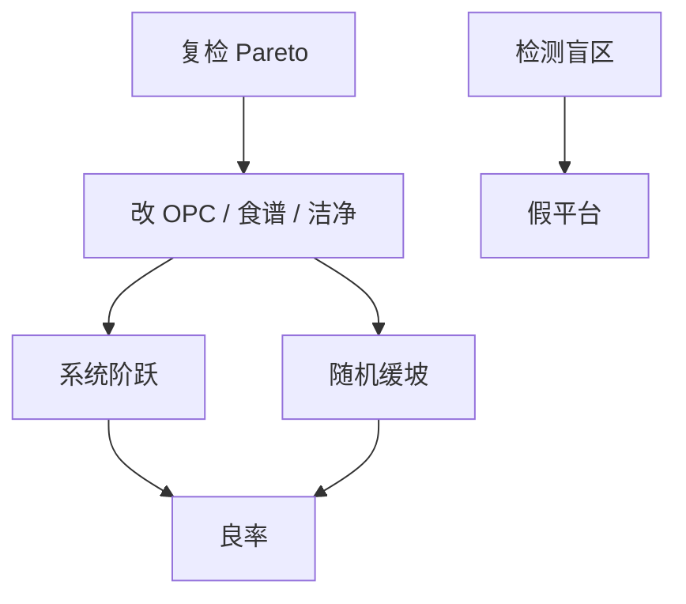

# 良率学习曲线

新节点的良率不是一条平滑指数；它是系统热点被一项项杀掉、随机密度被一轮轮压低的阶梯，学习速度由检测–分类–改版闭环决定。

<footer>—— 对照半导体 yield learning 与缺陷学习周期的公开讨论</footer>

[上一课](/litho/defect-review-classification)给出可行动 Pareto。缺口是时间：从首片到目标良率，闭环转多快。[DTCO](/litho/dtco-patterning) 已说规则冻结前应少留系统债；本课钉量产后的学习。参数良率与 CD 分布，留给[下一课](/litho/parametric-yield-cd）。

## 问题

学习曲线：良率对周或对累计晶圆。系统项呈阶跃（一次 OPC 改版、一次规则、一次食谱），随机项呈缓坡（洁净、过滤、剂量优化）。若检测看不见 stoch，曲线会在光学 Pareto 耗尽后平台——假成熟。改版周期（掩模、OPC）是学习的节拍，比 APC 慢得多。

缺口是**把学习当项目管理**，不是拟合一条 $Y=1-e^{-t/\tau}$ 就结束。每阶跃要对应 Pareto 头号杀手的关闭条件。

### 学习与产能抢掩模

加密 PWQ、改 OPC、新切线版都吃掩模与扫描机时间。学习太猛伤交付；太慢把系统缺陷固化进库存。分派与工程片额度是这条曲线的显式资源。

把 APC 把均值钉住当成「学会了」。能力（窗口、随机 p）没动，曲线只是方差变小，天花板还在。

## 方法

跟踪：按类的缺陷密度与系统 clips 关闭率。节奏：热点库版本、OPC 版本、食谱版本与良率阶跃对齐。与设计：LFD 回馈是否进入下一产品。与 IRDS 类路线图（后课程）的密度目标对比：本课只要求曲线可解释。

周会只看总良率会把阶跃和缓坡搅在一起。看板应按类：头号系统 clips 是否关闭、光学颗粒 $D$、电子束 $p$。关闭条件预先写好，避免「再观察一周」变成平台。

## 机制

系统关闭：一次改版令 $Y_\mathrm{sys}$ 跳变。随机：$D(t)$ 随洁净与工艺缓降，$Y_\mathrm{rand}=e^{-D(t)A}$。总良率乘积。平台 = 看不见的类或改版停摆。边缘场若从未进学习样本，出货量上升（用满边缘）时曲线会倒退。

系统关闭呈阶跃，随机呈缓坡。检测盲区会在放量后让曲线倒退，看板必须按类而不是只看总良率。

## 边界

不编造某节点学习周数。不把财务良率（含封装）与晶圆探针混报。本课不写限价。

后课默认：学习曲线按类解释，系统阶跃对随机缓坡。下一课即使缺陷为零，CD 分布仍会杀掉参数良率。

## 小结

- 学习是系统阶跃乘随机缓坡，节拍是改版与检测可见性。
- APC 钉均值 ≠ 学会能力。
- 边缘与 stoch 盲区会在放量时让曲线倒退。
- 出处：半导体 yield learning 通称；缺陷学习周期公开讨论。
