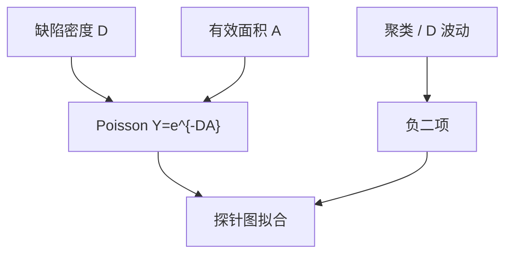

# Poisson 与负二项良率模型

良率先是一张缺陷密度的概率：Poisson 假定管芯间独立均匀；簇生和晶圆间不齐用负二项把方差撑开。

<footer>—— 对照 Stapper 对 IC 良率与负二项的经典工作；半导体良率模型教材通称</footer>

[上一课](/litho/virtual-metrology)结束控制环。缺口是出货概率：缺陷如何把管芯杀死。[光刻](/litho) 主干已多次点名随机与系统失效；本课钉经典良率函数。关键面积如何把布局变成有效缺陷灵敏度，留给[下一课](/litho/critical-area）。

## 问题

Poisson 模型：$Y = e^{-DA}$，$D$ 缺陷密度，$A$ 有效面积。它低估实际良率时，往往是因为缺陷簇生（一次颗粒打一簇管芯）或 $D$ 在晶圆间波动。负二项（Murphy、Seeds、Stapper 等形式）引入聚类参数，同样平均 $D$ 下良率更高——因为缺陷挤在少数管芯上。

缺口是**模型是计数统计，不是工艺物理**。把 Poisson 倒过来估 $D$，再当光刻缺陷密度去拧剂量，会把系统热点当成随机颗粒。下一课关键面积、再下一课系统对随机，就是为了拆开。

### 大管芯更疼

同一 $D$，面积翻倍，Poisson 良率指数下降。这是芯片尺寸与缺陷密度的第一课，也是为何边缘部分场的管芯统计要分开：它们的有效 $A$ 和 $D$ 都不同。

拟合聚类参数需要足够失败管芯。良率 99% 时，负二项与 Poisson 在工程上难分，却会在下一节点面积增大时分叉。

## 方法

数据：探针图、缺陷检测计数（需复检课校正）。拟合：Poisson 对负二项，看残差是否空间相关——相关则系统或簇生。分层：按层、按缺陷类型。与控制：APC 不直接进 $Y$ 公式；良率模型吃的是缺陷与参数分布。

拟合前先做系统叠图。空间相关强时，先拆系统账，再对残差拟合 $D$。Stapper 的负二项处理的是随机簇生，不是把 OPC 热点平均进聚类参数。

## 机制

Poisson 来自稀有独立事件。负二项可理解为 Gamma 混合的 Poisson（$D$ 随机）。空间上，簇生造成相邻管芯同死。图形化随机（缺孔）更接近独立 Bernoulli，用 Poisson 面积要换成「每孔失败率 × 孔数」，不是颗粒 $DA$——随机良率课再写。

Poisson 是独立均匀的基线；空间相关应先拆系统，再对残差拟合聚类。倒推 $D$ 不能直接拧扫描机。

## 边界

模型不区分桥连来自 OPC 还是颗粒。不发明新 arXiv。不把某厂 $D$ 数字当公开规格。

后课默认：随机颗粒可用 Poisson/负二项做账；布局灵敏度用关键面积。下一课把 $A$ 从芯片面积改成关键面积。

## 小结

- Poisson 是独立均匀缺陷的基线；簇生用负二项。
- 倒推 $D$ 不能直接当光刻旋钮。
- 大管芯与边缘管芯要分层拟合。
- 拟合前先做系统叠图，相关残差再进负二项。
- 出处：Stapper 良率与负二项；半导体良率教材通称。
