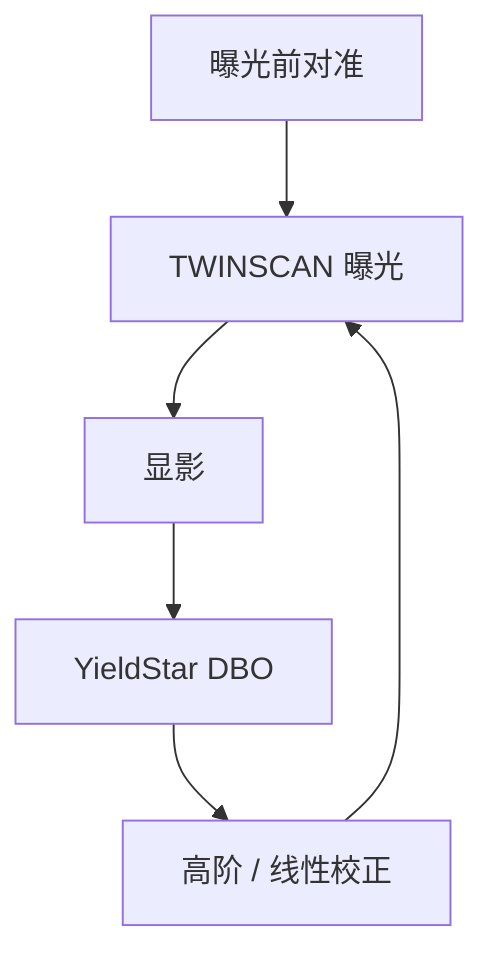

# YieldStar 与扫描仪内计量

高阶项要有人量、有人立刻写回扫描机。YieldStar 把衍射套刻做成可挂在光刻簇上的计量，角色是闭环，不是又一张离线检验海报。

<footer>—— 据 ASML YieldStar 公开产品口径与 TWINSCAN 计量闭环的公开叙述整理</footer>

[上一课](/litho/high-order-overlay)把校正写成线性加高阶网格，并假定有够密的 DBO 读数。缺口是设备角色：谁在产线节拍里量这些点、如何与双工件台的曝光前对准分工。本课钉 YieldStar 一类扫描仪内 / 簇内计量。长程杂散光如何抬空中像底座，留给后课的 [flare](/litho/flare-and-stray)；本课不把剂量底座写成位移。

## 问题

离线套刻机可以准，但周转慢，高阶 APC 吃不到本批的翘曲。扫描机自己的对准传感器在曝光前读网格，看不见「这一层相对已刻下层」的事后残差。缺口是一条曝光后（常为显影后）的快速衍射套刻链，密度够喂上一课的项，延迟短到能回写下一片或后续批次。独立实验室级的准，若隔了数小时，对热瞬态已经过期。

ASML 公开把 YieldStar 定位为基于衍射的套刻（及部分 CD）计量，可独立、也可集成到光刻簇，与 TWINSCAN 形成控制环。本课用这个公开口径，不引用任何未刊登的精度表或 wph 扣减。

### 对准网格不是套刻闭环

双工件台加密的是曝光前对准与调平。[套刻 Overlay](/litho/litho-overlay) 已经分开：对准把晶圆挂到机器上，套刻是层间事后计量。YieldStar 吃的是后者。把对准残差直接当 overlay 闭环，会漏掉曝光到显影之间的工艺变形。

「机内」指计量与扫描机同簇、同节拍，不是把显微镜塞进投影物镜。投影镜头仍只负责成像；位移读数来自专用 DBO 光学。

## 方法

产品流：涂胶曝光显影后，晶圆去 YieldStar（或等价 DBO）密采标记，拟合允许的高阶项，经 APC 送回扫描机的曝光网格。短环监控用稳定栈看设备；产品监控含薄膜。CD 通道若开启，量的是光栅平均 CD，服务剂量反馈，与 [OCD](/litho/ocd-mueller) 同类统计量，不是 SEM 热点。

集成还是独立，是物流与产能选择：集成缩短周转，独立便于多机共享。公开产品页强调与扫描仪的匹配控制、产品上套刻，而不是规定每条产线必须把计量机物理焊在扫描机上。

多机共享时，算法与标记滤波必须锁成同一套，否则匹配套刻里会混进计量差。

### 与双台、编码器的边界

工件台编码器与双台架构决定「能不能走到网格」；YieldStar 决定「走完之后层间还差多少、下一次怎么改」。三者缺一，高阶故事不完整。本课不重写编码器光学，只要求闭环图画到计量机。

## 机制

DBO 单点快，才能在不吃光产能的前提下提高场内点数——上一课要的识别条件在这里变成机台节拍。延迟方面，本片校正用于「下一片」是稳态翘曲；热瞬态若快于片周转，闭环会欠阻尼，表现为 overlay 振荡。于是有本片内可用的扫描机自身校正，与跨片 APC 两档，不能把 YieldStar 当成无限带宽的反馈。

标记不对称同样进闭环：系统偏置会被认真地补进网格。短环与产品的偏置差，必须定期用 SEM/电学监护，否则簇内计量越勤，错得越坚决。

公开口径里的 overlay 纳米数带机型与指标定义（单机 / 产品上 / 交叉匹配）。不要把产品页演示值抄成所有层、所有栈的闭环残差。

## 边界

本课不展开 YieldStar 内部光路，不列举未公开型号指标，也不把 CD 功能写成可以替代孔层缺陷检测。EUV 与浸没混跑时，交叉匹配是产品问题，计量机要能在两种栈的标记上工作，不是自动保证 cross-matching 数字。

计量课序在 flare 之前还要把设计热点和刻蚀偏置收完；本课只把「谁量套刻、谁写回扫描机」钉死。后课默认：说到在线套刻控制，就是 DBO 计量加扫描机高阶，产品名可以是 YieldStar 或其后续，物理角色不变。

划片槽点密度是硅面积账。计量再快，标记太多仍与 SRAM 争槽。闭环设计包含「哪些场、哪些点」，不是全开。

## 小结

- YieldStar 的公开角色是簇内衍射套刻（及平均 CD），把高阶项送回扫描机。
- 对准是曝光前网格；它是曝光后层间闭环，两者不可互换。
- 节拍与延迟决定能补多快的翘曲；不是无限带宽反馈。
- 标记偏置会被闭环放大，要短环与电学监护。
- 出处：ASML YieldStar 产品页与 TWINSCAN 计量闭环的公开叙述。
