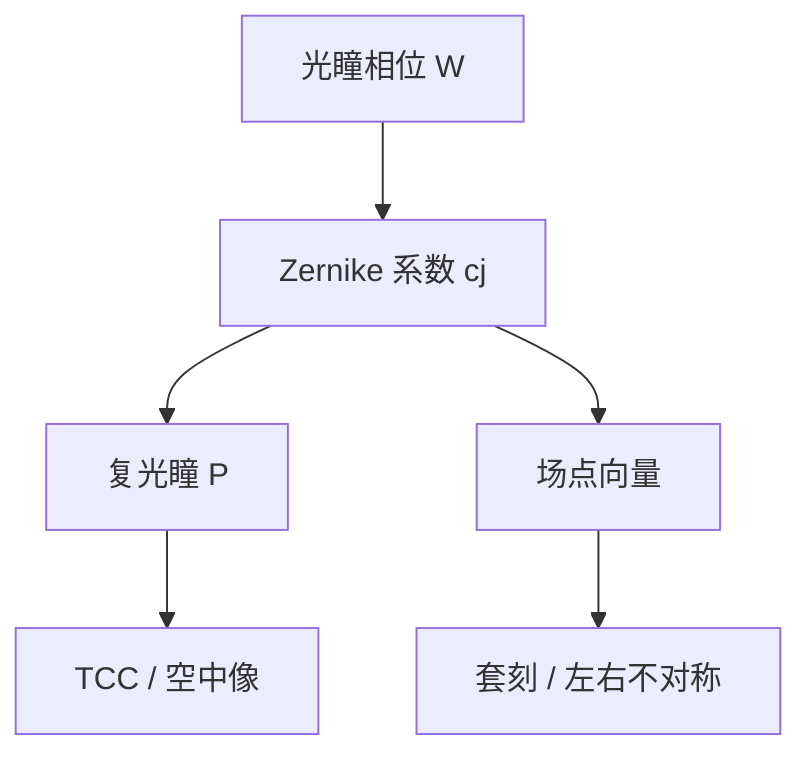

# Zernike 像差

光瞳里残留的相位不是一团雾；在圆域上它可以按 Zernike 多项式展开，每一项对应一种可测量、可补偿的波前形状。

<footer>—— Zernike 圆域正交多项式；光学车间与镜头计量的用法见 Malacara, Optical Shop Testing</footer>

[上一课](/litho/jones-polarization)（Jones 矩阵）。把矢量通道的对比差钉死，光瞳仍被当成「除几何 s/p 与离焦外相位理想」。缺口是：真实投影物镜的波前有加工、装调与热漂移残差，必须在单位圆上展开。本课把光瞳相位写成 Zernike 系数；有限带宽如何把这些项按波长搅在一起，留给[色差与光源带宽](/litho/chromatic-bandwidth)。不要从瑞利 CD 重讲，也不要引用未公开的某代镜头 Zernike 预算表。

## 问题

TCC 里的 $P(\mathbf{f})$ 是复透过率。振幅近乎硬切之后，剩下的信息主要是相位 $W(\rho,\phi)$。不展开，$W$ 只是一张图，无法说「彗差还是像散在吃套刻」。Zernike 多项式 $\{Z_j\}$ 在圆域上正交，把

$$
W(\rho,\phi)=\sum_j c_j Z_j(\rho,\phi)
$$

收成一列系数。缺口因此是光瞳相位的基底，而不是再选一次 TE/TM。

离焦已经在焦深课里作为二次径向相位出现，它正是展开里的一项（Fringe 约定下常与 $Z_4$ 对应）。本课要的是其余项：像散、彗差、球差、三叶……以及它们随视场怎么变。

### 约定必须声明

光刻与干涉仪常用 Fringe Zernike（Zygo 一类排序），与 Noll 索引同名不同号。球差、彗差的编号对不上表，系数全部错位。报 $c_j$ 必须写哪一套。Malacara 把计量端的读法写清楚；本课不背诵全表，只要求后课引用系数时带约定。

Zernike 在单位圆上正交，加权是面积元 $\rho\,d\rho\,d\phi$。光瞳若有中心遮拦或非圆，严格正交基要另选；产线仍常用 Zernike 当工程语言，残差另报。

## 方法

把干涉仪或镜头出厂波前投到投影光瞳坐标（已按 $\mathrm{NA}$ 归一），拟合 $c_j$。低阶：倾斜（远心课的主光线斜率）、离焦、像散（两正交焦线）、彗差（视场随孔径的不对称）、球差（边缘带焦点相对近轴移动）。高阶项吃对比与通过焦点的 CD 不对称，对密图形的 NILS 更狠。

场相关：每个视场点（扫描狭缝上的位置）可以有自己的系数向量。扫描方向再做时间平均。因此「本台镜头的彗差」必须声明是狭缝中心还是边缘。TCC 对每个场点可以不同，OPC 若用单一核，等于忽略这根向量。

### 偏振通道共用几何相位，再乘矢量

同一套 $c_j$ 乘在 TE 与 TM 通道上，再叠加上一课的点积损失。像散让两个取向的 Bossung 错开；彗差让左右边 NILS 不对称，线变「一边陡一边缓」。机制是相位，不是又一种偏振。

热致波前随曝光负荷变。计量在冷态做的 Zernike 表，不等于扫描时的表。控制上这是镜头加热补偿，不是改定义。

## 机制

相位在光瞳上乘场，等于在像面与一个复衍射核卷积。离焦拉长核；像散让核变椭圆；彗差让核带尾巴，线端和套刻标记最敏感。频率上，高阶径向项对光瞳边缘加权重，而截止附近的级正走边缘，所以密图形先付像差税。

补偿：扫描机用镜头操纵（波长微调、透镜加热、可变形镜一类，视机台公开架构而定）去抵低阶项。本课不把补偿清单写成产品目录；只承认系数是可驱动的控制量。

### 后课默认的接口

说到像差，默认是 Zernike（或等价正交基）系数，带约定与场点。$P$ 的相位进 TCC，因而进 NILS 与 Bossung。色差课把 $c_j$ 变成 $\lambda$ 的函数，本课先当单色。

## 边界

Zernike 展开不包含杂散光、不包含多层膜散射。EUV 反射镜同样用波前系数说话，基底仍是圆（或 High-NA 变形光瞳要另写）。本课禁止编造未公开的 RMS 毫波数表；教科书与出厂计量原理已经够用。也不要把「Zernike 拟合残差小」写成成像已经理想：截断阶数之外的高频波前照样吃对比。

## 小结

- 光瞳相位在圆域上按 Zernike 展开；报系数必须声明 Fringe 或 Noll。
- 离焦是其中一项；像散、彗差、球差改核的形状与对称。
- 系数随场点变；TCC 可以场相关。
- 同一套相位乘在 TE/TM 通道上，与矢量点积相乘。
- 单色系数下一课要对带宽积分。
- 出处：Zernike 圆多项式；Malacara, *Optical Shop Testing*；成像核见 Born &amp; Wolf / Mack。
