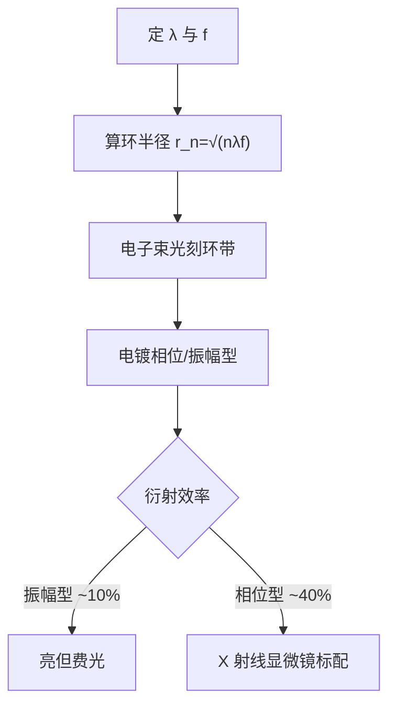
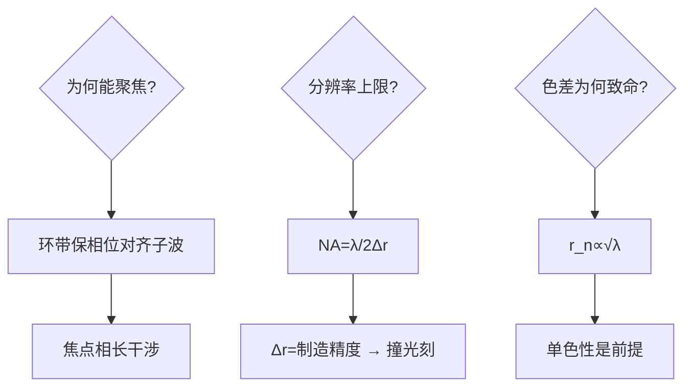

# 波带片光学

没有透镜能折射 X 射线，就给波前画同心圆环：亮环透、暗环挡，一块「波带片」让 X 射线学会聚焦。

<footer>—— 据 Fresnel zone plate 光学；X-ray 显微/光刻应用文献（Attwood《Soft X-Rays and Extreme Ultraviolet Radiation》）</footer>

[EUV 剂量预算](/litho/euv-dose-budget)管的是反射式光学的预算，本课回到更短的波长：X 射线几乎不折射也不易反射，常规透镜全数失效。缺口是**波带片（zone plate）**——用衍射而非折射聚焦的「伪透镜」。它是 X 射线光刻、光束线聚焦与最近的 X 射线显微镜的共同起点。本课不做全息光学的一般理论。

## 问题

波长越短分辨率越高，但光学元件的路线图在 X 射线段断链：折射率接近 1（透镜失去屈光力）、反射率除掠入射外趋零。缺口：**给 X 射线造一个聚焦元件**。Fresnel 的答案：不用「弯折光线」，用「相长干涉的几何」——只保留波前上相位相干贡献的环带。

术语翻译：波带片（Fresnel zone plate）= 一组半径递减的同心透明/不透明环，环半径满足 $r_n\approx\sqrt{n\lambda f}$——相邻透光带的相位差 $2\pi$，在焦点相长叠加；数值孔径 NA ≈ λ/(2Δr)，最外环宽 Δr 决定分辨率。

数字实例：λ=1nm、焦距 f=1cm 的波带片，最外环宽 Δr=25nm 时 NA≈0.02、理论分辨率 ≈ λ/(2NA)≈25nm——分辨率由最外环的**制造精度**决定，环要刻到几十纳米且同心，本身就要用电子束光刻来做——「用光刻造光学的镜」。

## 方法

设计三步：定波长与焦距 → 算环半径序列 $r_n=\sqrt{n\lambda f+(n\lambda/2)^2}$ → 交给电子束光刻 + 电镀（金/镍）做成振幅或相位型。相位型（环厚设计成 π 相位差）比振幅型衍射效率高约 4 倍——这是现代 X 射线显微镜的标准配置。光刻场景的用法：接触式 X 射线光刻时代波带片做聚束，同步辐射光束线用大口径波带片把光聚到微米点。

直觉类比：像「合唱队只留同拍的人」——舞台（波前）上每位歌手（子波）到听众的路程不同、相位杂乱；波带片把路程差恰为整数波长的歌手留下（透光环带）、其余请出去（挡环带），留下的歌声在听众席（焦点）同相叠加，声音反而最响。

## 机制

衍射机制：环带把波前切成「相位对齐的圆环集合」，各环对焦点的光程差为整数波长——菲涅尔半波带理论的正用。分辨率的机制冷酷：NA = λ/(2Δr)，Δr 是制造精度，所以**波带片的分辨率直接撞在光刻工艺上**——最外环 25nm 就需要 25nm 级电子束光刻，这既是它的上限也是它与现代半导体工艺的缘分（制造它正是半导体业的拿手活）。色差机制是软肋：$r_n\propto\sqrt{\lambda}$，波长一变焦点就移，X 射线的单色性（同步辐射 Δλ/λ ~ 10⁻⁴）因此是前提。

常见误区：把波带片当「透镜的替代品」从能量效率看——它吃掉大部分光（振幅型只透 ~10%），同步辐射的亮度预算因此更紧；另一误区是「环越多越好」——环数决定聚焦深度与效率，但最外环精度不变时分辨率不变，环多只增益光通量。

## 边界

波带片的适用半径：微米级焦斑的 X 射线显微（生物、电池原位成像）、光束线聚焦、以及实验性的 X 射线光刻；大面积平行曝光用不了它（口径与效率都不够），这也是 X 射线光刻败给 EUV 反射式路线的原因之一。制造边界：厚高比（环要够厚才挡得住硬 X 射线，但环宽纳米级）是电镀工艺的极限拉扯；多层劳厄透镜（MLL）用多层膜堆叠逼近更硬的 X 射线，是波带片的「重装版」。与[Offner 中继成像](/litho/offner-relay)的呼应：两者都是「常规透镜失效处的替代光学」——一个用衍射对付 X 射线，一个用反射环形镜对付紫外像差。

直觉类比：波带片之于 X 射线，像「用节拍器组织人群」——没有喇叭（透镜），就让人群（波前）按节拍分组前进，同拍的一起喊（相长干涉），杂音互相抵消；组织得越细（外环越窄），声音聚得越尖（分辨率越高）。

## 小结

- 波带片 = 相位对齐的同心环，衍射聚焦补上 X 射线无透镜的空白。
- 分辨率 = λ/2Δr，直接撞电子束光刻的制造精度。
- 相位型效率 ~40%；色差要求单色光；大面积光刻非其所长。
- 出处：Attwood《Soft X-Rays and EUV Radiation》；Fresnel 半波带理论；XRM 显微镜应用综述。
