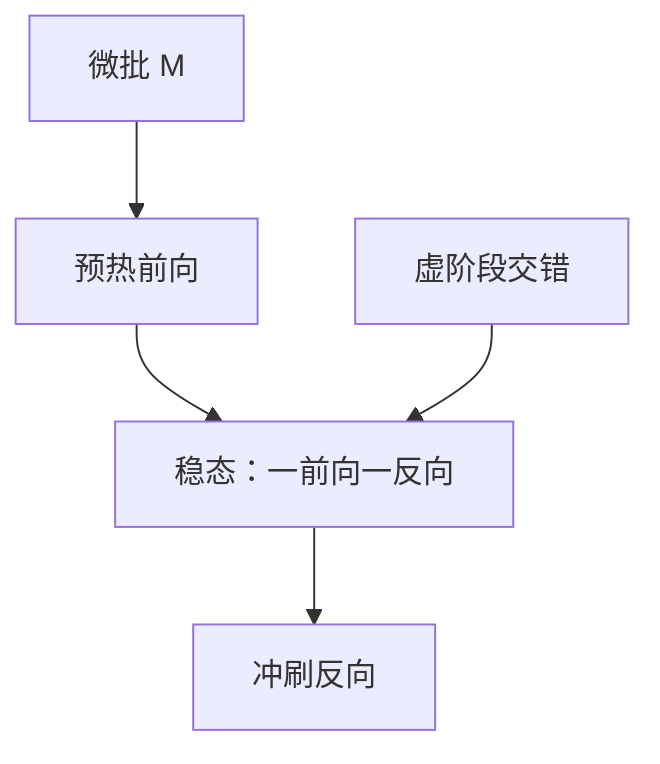

# 1F1B 与交错流水

稳定段里每个阶段交替做一个前向和一个反向，激活只需为「在飞的那几份微批」留着；再把一层切成多个虚阶段交错，气泡还能再压一截。

<footer>—— Narayanan 等，Megatron-LM，SC 2021；对照 Huang 等 GPipe</footer>

[上一课](/llm/anneal-mixture)把数据时间表写完。这些 token 要在切成 $P$ 段的流水线上跑起来。主干 [流水线并行](/llm/pipeline-parallel) 已经给出 GPipe 的先全前向再全反向、以及 1F1B / PipeDream-Flush 的交替调度。本课不重讲「为什么要切深度」。缺口是工程上真正用的两件事：1F1B 的激活内存公式，以及把模型层交错成多个虚流水（interleaved 1F1B）来进一步填气泡。后课零气泡会拆反向；本课先把调度日历钉死。

## 问题

GPipe 的激活内存随微批数 $M$ 涨。大模型激活早已是显存主角，$M\gg P$ 虽能填气泡，却存不下。1F1B 在一个全局 batch 内同步更新，稳定段每个阶段做完一个微批前向立刻做另一个微批反向，激活只保留约 $P$ 份在飞微批，而不是 $M$ 份。Narayanan 等人在 Megatron-LM 里把这套调度写进 GPU 集群配方。缺的是：预热与冲刷仍有气泡，$(P-1)$ 量级的空拍在 $P$ 很大时仍疼。

交错流水的想法是：同一张卡持有不相邻的多层（虚阶段），让气泡里的空拍去算另一虚阶段的活。这不增加设备，只改变层到卡的映射。代价是更复杂的依赖图，以及与 [张量并行](/llm/tensor-parallel) 叠在一起时的通信顺序。

### 微批仍是数据维

$M$ 切的是 batch，不是序列。退火阶段的长文档上采样会让每微批激活变大，1F1B 的内存公式系数不变，常数变大。调度课必须能读数据课的序列长度，不能假定微批体积恒定。

PipeDream 的异步权重版本与预训练常用的 Flush 式 1F1B 不同。本课默认同步更新：反向对齐该微批前向时的权重。

## 方法

标准 1F1B：warmup 让管道填满；稳态 F、B 交替；cooldown 冲刷。选 $M\ge P$，气泡比例约 $(P-1)/(M+P-1)$ 量级。交错：把 $L$ 层分给 $P$ 卡时，每卡拿 $v$ 个虚阶段（层块交错），调度按虚阶段的 1F1B 展开。$v$ 增大，气泡下降，但每卡要为更多虚阶段存一份「在飞」激活，内存又涨。$v$ 是气泡与激活之间的旋钮，不是越大越好。

实现上，集合通信（TP 的 All-Reduce）应挂在每个虚阶段的前后，避免跨虚阶段误用同一块通信缓冲。与数据并行的梯度同步仍在全局 batch 边界。

### 与重计算的搭配

重计算丢掉中间激活、反向时重做前向，可与 1F1B 相乘：在飞微批数已是 $P$ 量级，再对层内激活重算。交错后虚阶段变多，重计算的时间表更碎，要防止与通信重叠课里的流（stream）抢资源。

$M$ 不能被梯度累积的「逻辑 batch」偷换。累积步数、微批、流水深度三者乘完才是优化器 batch。

## 机制

流水线的空拍来自前向依赖链与反向依赖链无法在同一时刻铺满 $P$ 张卡。1F1B 用反向填充前向留下的洞。交错把一条深依赖链拆成多条浅链叠在同一设备上，洞里有别的链的活可干。数学上的层计算没有变，变的是日历。气泡降到零需要改反向结构——下一课。

## 边界

交错增加实现复杂度与死锁风险，调试应先在 $v=1$ 的 1F1B 上对齐损失。它不减少层间激活的通信量，只减少空算。MoE 的 All-to-All 另有日历，不能假设与 1F1B 自然咬合。零气泡课会把反向拆成输入梯度与权重梯度两拍，才能在不增加 $v$ 的情况下再挤空拍。

## 小结

- 数据配方之后，本课补 1F1B 日历与交错虚阶段，不重讲为何切深度。
- 1F1B 把激活从 $M$ 降到约在飞的 $P$ 份；交错用同卡多层填气泡。
- $v$ 与重计算、TP 通信顺序互相抢资源，要一起定。
- 默认同步 Flush，不把 PipeDream 异步噪声引进预训练。
- 出处：Narayanan et al., Megatron-LM, SC 2021；Huang et al., GPipe；Narayanan et al., PipeDream。
