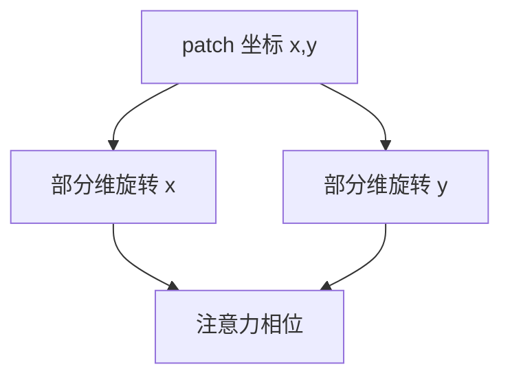

# 2D RoPE

一维 RoPE 把序列当下标。图像的邻居在二维格子上。把旋转拆到高与宽，相对位置才回到上下左右。

<footer>—— Su 等 RoFormer 的旋转位置；VLM 中的二维 / 多轴推广</footer>

[上一课](/llm/native-resolution-vit)需要二维位置。主干文本 RoPE 把位置写成旋转。本课写 2D RoPE：对 patch 坐标 $(x,y)$ 分别旋转一部分维度。缺口是不要把图像当一维 raster 编号完事。后课视觉指令数据默认位置编码已经能表达格子。

## 问题

可学习一维位置嵌入难外推分辨率。一维 RoPE 外推的是长度，不是高宽。把 patch 按行扫描编号，竖直邻居在序列上相距一行宽度，旋转角与真实空间距离不成比例。2D RoPE 把通道分成两组（或更多），一组旋转 $x$，一组旋转 $y$，注意力的相对相位由 $\Delta x,\Delta y$ 决定。Qwen2-VL 的 M-RoPE 再把时间轴算进去，视频与图共用多轴。

分辨率变化时，坐标如何归一（像素、patch 格、还是 $[0,1]$）是协议，写错会让高低分辨率图的「同一相对结构」对不上。

文本 token 仍用一维 RoPE。多模态序列里，视觉段用二维，文本段用一维，轴要对齐到同一旋转实现，避免两套尺度。

## 方法

对视觉 token 赋 $(x,y)$（及视频 $t$），按轴应用 RoPE。训练应含多种分辨率，否则外推仍失败。与绝对 2D 嵌入可比：RoPE 利于相对几何，绝对嵌入利于「这是画布角落」的绝对先验。产品常用 RoPE。评测：把图平移/缩放后问相对位置，看是否保持。

## 机制

RoPE 把点积变成带相对位置相位的形式。二维推广希望 $\Delta x$ 与 $\Delta y$ 可分地进入相位，于是「左边那个」在不同分辨率下仍对应相似的相对旋转。若把 $x,y$ 编码进同一组维而不分轴，相位会耦合，竖向与横向相对关系缠在一起。

## 边界

2D RoPE 不增加 OCR 分辨率——那是切块 $P$ 与 $N$。它只让已有格子的相对结构可学。下一课：格子有了，还要指令数据才会对齐到语言动作。

## 小结

- 2D RoPE 按高宽分轴旋转，修复 raster 一维编号的空间扭曲。
- 坐标归一与多分辨率训练属于协议。
- 文本一维与视觉二维要在同一实现里对齐尺度。
- 出处：Su 等 RoFormer；Qwen2-VL 等多轴 RoPE。
