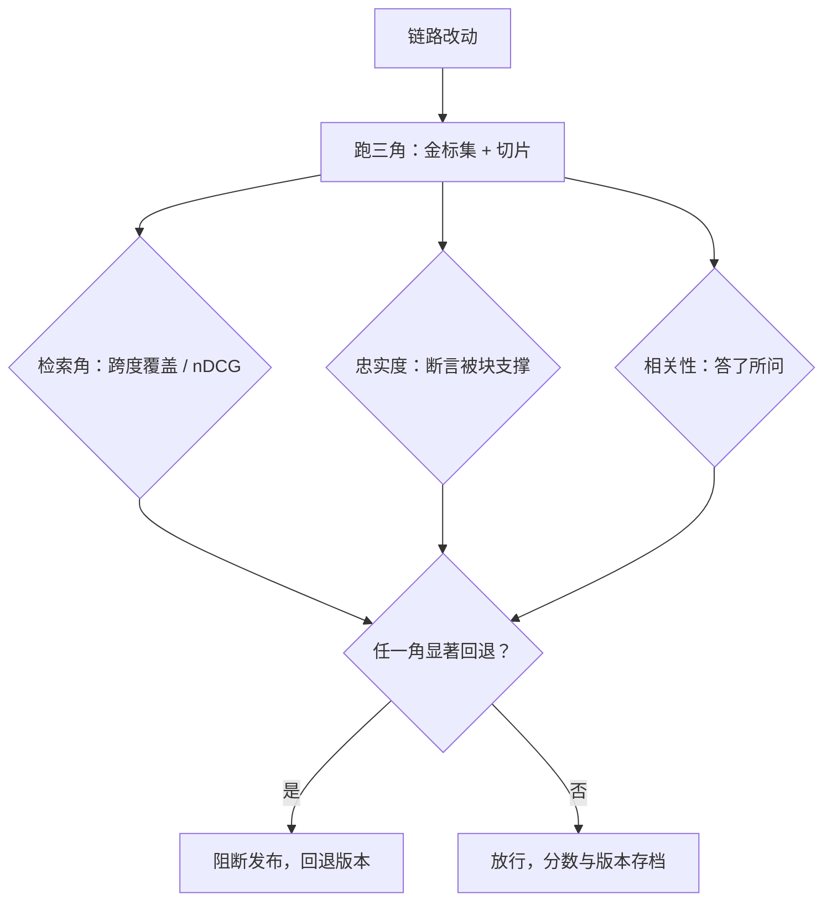
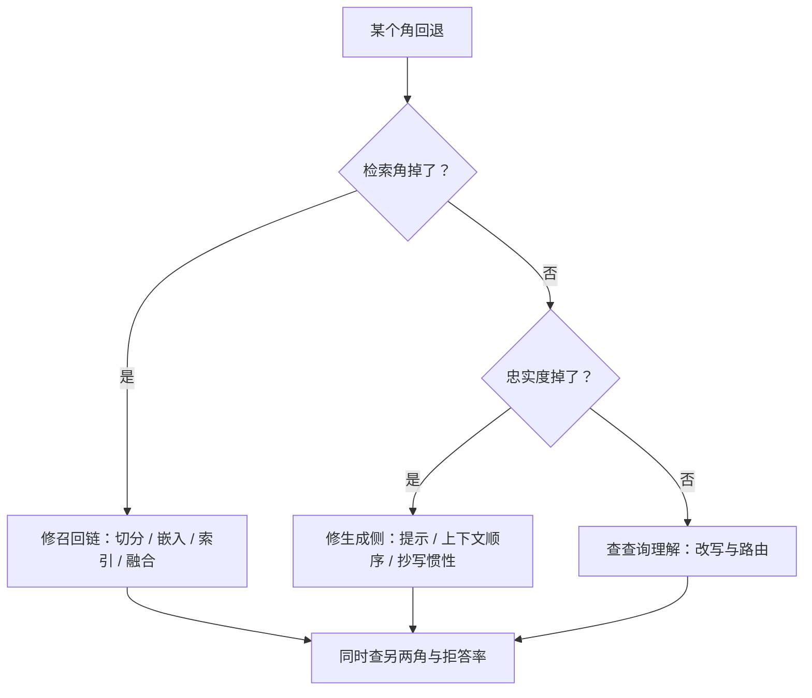

# 评测：RAG 三角

端到端准确率把检索错误与阅读错误绑死在一个数字里；三角分开量，管道才知道该改哪一段。

<footer>—— Es 等 RAGAS；Gao 等 ALCE；据 RAG 评测工程实践整理</footer>

[上一课](/llm/rag-multimodal)把视觉对象接进路由，检索与生成两段的工程都铺开了。本课回答验收：链路上任何一段改动，怎么知道是变好还是变坏。「检索与生成分列」的第一性在主干[RAG 评测](/llm/rag-evaluation)，引用归因在[引用与归因](/llm/citation-attribution)。本课把这些收成三角加门禁：三个角、一个安全阀、一套改动必须过的流程。

## 问题

只报端到端准确率，归因瘫痪：换重排器后端到端没动，可能是检索本来就给对了、是生成在抄错；换嵌入涨了一点，也可能只是某类查询的波动。三角是三个角：检索质量——金标跨度覆盖与 recall@k、nDCG；忠实度——答案的断言是否被所给块支撑；答案相关性——是否答了所问。三者不同时可控：拉高 $k$ 涨检索角，塞进更多块会伤忠实度（噪声块诱导编造）与相关性（注意力稀释）；重排阈值收紧，忠实度看似涨，其实是把难题以拒答的形式推出了管道。没有第四个量——拒答率——两个角的「改善」无法解读。

忠实度（faithfulness）可以理解为「不瞎编程度」：把答案拆成一句句断言，逐句检查能不能在检索到的块里找到出处，每句都有出处才得分。它衡量的是「答案与材料对不对得上」，与「答案本身好不好」无关——所以可能出现忠实度很高但答非所问的情况，这才需要另外两个角补位。

## 方法

金标集：问题、金标支撑跨度（第一课协议）、金标答案三件套；切片按查询类型（标识符、改写、多跳）、语料域、难度分列。判官：忠实度与相关性用 LLM 判官打分，判官与被评系统不同族，抽人工对齐并报告一致率，分数分布随版本监控漂移。引用归因：答案逐句断言可解析到块 ID 且被该块支撑，覆盖与精确分列。门禁：换嵌入、调切分、改融合权重、换重排器、改提示，一律跑三角，分列报告，任一角显著回退即阻断发布——这是长上下文收束课「门禁」口径在 RAG 上的对应物，上线与否由三角签字，不由端到端均分签字。

为什么判官必须换族：如果拿同一个模型的近亲版本当判官，它会觉得自家行文「看起来就对」，忠实度被系统性打高——相当于让学生给自己阅卷。换一个不同家族的模型当判官，再抽几十条人工标注对齐一致率，分数才站得住。

## 机制

三角为什么能定位层：检索角掉而其余稳，问题在召回链（切分、嵌入、索引、融合）；忠实度掉而检索角稳，问题在生成侧（提示、上下文顺序、抄写惯性）；相关性掉而忠实度稳，是检索给对了但答非所问——查询理解与改写的问题。角与角牵制的机制在预算：$k$ 与上下文长度交换、重排阈值与拒答交换、块长与覆盖交换；任何「单角大涨」的改动都要查另外两角与拒答率，十有八九是代价被藏进了没报的量。判官为什么必须换族：判官与生成器同源时，模型偏爱自己的行文与结论，忠实度被系统性高估；人工对齐的对子要覆盖「部分支撑」「支撑但过时」这类边界样本，只对齐干净样本的一致率是虚高。

数字实例：$k$ 从 5 提到 20，检索角的 recall@k 可能从 0.72 涨到 0.85，但塞给生成器的上下文块翻了 4 倍——token 费用涨约 4 倍，注意力被稀释，忠实度和相关性反而可能下跌。这就是「角与角牵制」最常见的一笔账：涨的那个角是明账，跌的那两个角和账单都是暗账。

拒答率是安全阀不是失败项：阈值收紧后忠实度上涨，先查拒答率涨了多少——把答不了的问题推出去，三角上看不见，端到端价值却掉了。带拒答分支的评测才算数。

## 边界

LLM 判官有自偏好、长度偏置与位置偏置，校准与抽检不能省，高利害域留人工复核队列。金标集会过时：语料换代后金标跨度要重新对齐，与增量更新课的版本口径联动。在线信号（点击、追问率、人工升级率）是三角的滞后代理，能发现盲区但不能替代门禁。评测集本身要防污染：金标问题混进索引会全员满分，与通用评测的污染纪律同一口径。三角立住后，下一课处理优化的钱与时间。

## 小结

- 三角分列：检索质量、忠实度、答案相关性；拒答率是解读一切的第四个量。
- 金标三件套：问题、支撑跨度、金标答案；按查询类型切片报。
- 判官换族、人工对齐覆盖边界样本；分数分布随版本监控。
- 改动过门禁：任一角显著回退即阻断，分数与版本一起存档。
- 单角大涨先查另外两角与拒答率，代价常藏在没报的量里。
- 出处：Es 等 RAGAS；Gao 等 ALCE；据 RAG 评测实践整理。
