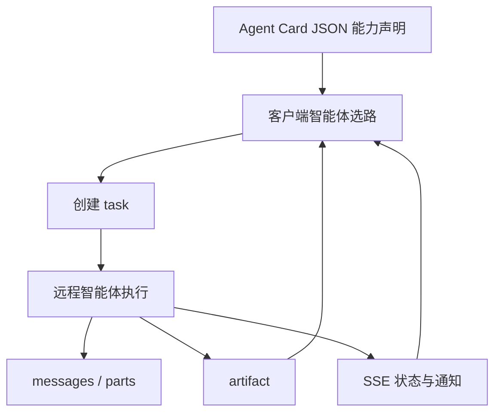

# A2A 协议

    
智能体之间不共享记忆、工具与上下文时，仍要用一张卡片声明能力、用任务对象同步生命周期，并在 HTTP 上交换多模态消息——而不是把对方降级成一个函数。

    <footer>—— Surapaneni、Jha、Vakoc、Segal 等，Google Cloud，Agent2Agent（A2A）协议公告，2025 年 4 月 9 日</footer>

Google 在 Cloud Next 上把 **Agent2Agent（A2A）** 写成开放协议：让不同厂商、不同框架训练出来的智能体互相发现、委派任务、交换进度。公告由 Rao Surapaneni、Miku Jha、Michael Vakoc、Todd Segal 署名，宣称超过 50 家技术与咨询伙伴参与。传输落在已有栈上：HTTP、Server-Sent Events、JSON-RPC。它被明确写成 [MCP](/llm/mcp) 的互补：MCP 给智能体接工具与资源；A2A 给智能体接智能体。本篇写设计原则、Agent Card、任务生命周期，以及它不是 function calling 的别名。

## 问题

企业里每个业务系统都在长自己的助手：招聘、差旅、IT 工单、供应链。助手若只能调自家 API，跨系统流程就要在编排层写死。把对方智能体封装成 MCP 工具或 OpenAPI 函数，等于否认对方有自己的规划、澄清与长时运行：你拿到的是一次 RPC，不是一个可协商的合作方。多智能体研究常用共享记忆或共享工具箱，生产里恰恰相反——内存、密钥、合规边界不能共享。需要一种协议：双方保持不透明，只交换任务、消息与产物。

另一半问题是发现。没有目录时，客户端智能体不知道该把「筛简历」发给谁。A2A 用 JSON **Agent Card** 做能力广告，让客户端按卡片选远程智能体。卡片是声明，不是证明：实现可以夸大能力，治理仍要鉴权与审计。

### 五条设计原则

公告列出：拥抱智能体能力（非结构化协作，不把对方限成 tool）；建立在现有标准上；默认按企业级鉴权设计，启动时与 OpenAPI 的鉴权方案对齐；支持长任务（数小时到数天、人在环内），过程中可推送状态；模态无关，含音视频流。原则是产品约束：若你的实现只支持同步 JSON 一次返回，你实现的是 RPC，不是 A2A 的任务模型。

A2A 的「client agent / remote agent」是一次交互里的角色，不是永久身份。招聘助手对简历库助手是 client；对人力资源系统里另一个编排器时可能是 remote。协议对象是任务，不是进程树。

## 方法

交互按任务（task）定向。客户端把用户请求收成任务，发给远程智能体；远程推进任务，产出 **artifact**（产物）。任务有生命周期：可立即完成，也可长时间处于进行中，双方用消息同步状态。消息由 **parts** 组成，每部分带内容类型，便于协商 UI 能力（表单、iframe、视频等），而不是只假设纯文本。能力发现：远程发布 Agent Card（JSON），客户端据此选择并建立 A2A 会话。

传输：JSON-RPC 方法调用放在 HTTP 上；流式进度用 SSE，避免长任务只能靠客户端狂轮询。鉴权对齐 OpenAPI 常见方案（API key、OAuth 等，以当时规范草案为准），使现有 API 网关可以复用，而不是另发明一种智能体专用登录。规范草案与示例放在项目站点；公告承诺开源并接受贡献，生产就绪版本当时计划在当年晚些时候与伙伴一起推出——实现应以当时规范版本号为准，不要把博文示意图当 wire 格式。

招聘例子（公告）：用户在统一界面让助手按职位、地点、技能找候选人；该助手用 A2A 呼叫专门的寻源智能体；用户确认后再让助手预约面试；背调再交给另一个智能体。例子要说明的是**跨系统委派**，不是 Google 内部实现了完整 ATS。每个远程智能体仍用 MCP 或私有 API 碰自己的数据源：A2A 不替代数据库连接器。

### 与 MCP、function calling 的边界

Function calling：一次模型请求里列出函数 schema，模型产出名字与参数，宿主执行。MCP：宿主与**工具服务器**之间的发现与调用，服务器通常无自主目标。A2A：两个**智能体**之间的任务协议，对方会再规划、再问用户、再调自己的工具。把 A2A 远程端包装成一个 `delegate(task)` 函数，在最小 demo 里能跑，但会丢掉任务生命周期、流式协商与多模态 parts。Amin Vahdat 在发布相关说明里把 MCP 与 A2A 说成互补：开放取数 vs 智能体互操作。

安全默认「企业级」指鉴权方案对齐，不是自动安全。Agent Card 泄露内部能力清单、任务消息带 PII、远程智能体被提示注入后通过 A2A 扩散指令，都是部署问题。协议提供通道与身份挂钩点，策略仍在网关：哪些卡片可被发现、哪些任务类型允许跨域、人工确认插在哪一状态。

## 机制

不共享记忆时，协作只能通过消息里的显式上下文。任务对象把「这件事做到哪了」从双方各自的隐状态里抽出来，变成可同步的协议状态，否则长任务无法在进程重启、换实例后恢复。Parts 与内容类型把协商从自然语言猜 UI，变成类型化握手，减少「我发给你一段视频你却当文本解析」的失败。SSE 让远程在无请求的间隙推进度，匹配「深研究要跑很久」的原则，否则客户端只能同步阻塞或盲轮询。

发现机制使路由成为数据：卡片变了，客户端不必改代码。这也引入投毒面：伪造卡片、能力钓鱼。因此发现应落在可信目录，而不是任意 URL 抓 `.well-known` 就信。社区讨论里常见 `well-known` 发现路径，具体字段以规范版本为准。

「模态无关」不是模型已经会看视频，而是协议允许 parts 携带非文本。两端模型与工具是否真能消费该模态，是实现能力，不是 A2A 保证。

### 长任务与人在环

状态更新让人可以在远程跑的中途插入指令（换约束、取消、补材料）。协议若只有一次 request/response，人在环必须做成新任务，上下文要重新塞。A2A 把插入写成同一任务上的后续消息，artifact 仍挂在该任务 id 下。这对审计有好处：一条任务一条证据链。代价是双方必须实现状态机，不能把智能体写成无状态 HTTP 函数。

## 边界与工程取舍

公告阶段规范仍是草案，字段会变。伙伴名单说明生态意向，不说明互操作已测过。没有共享工具时，错误处理、重试、幂等要在任务层定义，否则重复委派会双花。把 A2A 当通用 RPC 会忽略智能体的不确定性：远程可能澄清、可能拒绝、可能部分完成，客户端必须能把这些映射回用户。与 Kubernetes 工作流、现有 BPM 引擎如何对齐，协议不管，是集成问题。

不要把 A2A 写成对 MCP 的替代或对 OpenAI 兼容 API 的替代。三者叠在同一产品里很常见：对用户走 Chat Completions，对工具走 MCP，对兄弟智能体走 A2A。也不要假设 Google 托管是唯一运行时；协议目标是跨云。后续若进入基金会共治，引用应更新治理主体，技术对象仍是任务与卡片。

能力发现不等于负载均衡。卡片不会告诉你对方的队列深度与 SLO。生产还要另做容量与超时，否则长任务原则会变成无界等待。

### 何时不必上 A2A

只有一个智能体、工具都在本进程，MCP 或 function calling 足够。双方可以共享工具总线且信任同一记忆，多智能体框架内部消息更轻。监管要求所有动作必须是同步可审计 RPC、不允许对等协商。团队没有状态机实现预算，先不要承诺 A2A 兼容。

## 小结

- A2A 是智能体对智能体的任务协议：Agent Card 发现、task 生命周期、消息 parts、artifact，传输为 HTTP / SSE / JSON-RPC。
- 与 MCP 互补：MCP 接工具与上下文，A2A 接不共享内存的对等智能体。
- 原则含长任务、企业鉴权对齐 OpenAPI、多模态协商；角色是一次交互中的 client/remote。
- 卡片是声明不是证明；鉴权与目录治理仍要另做。
- 出处：Google Developers Blog，*Announcing the Agent2Agent Protocol (A2A)*，2025-04-09；规范草案见 A2A 项目站点。
