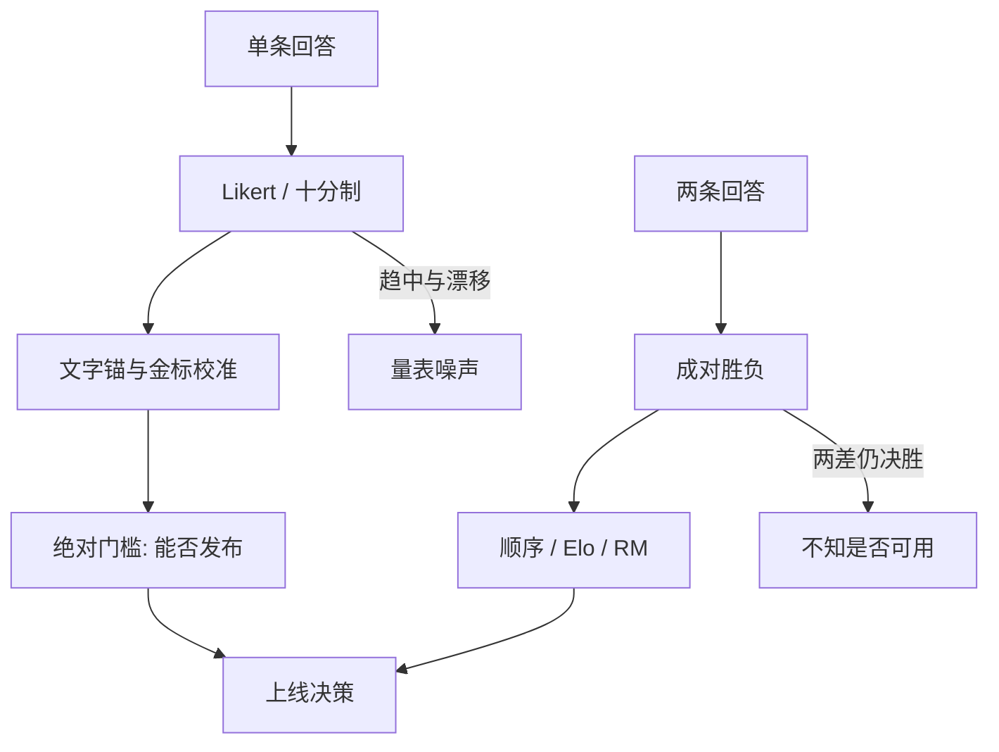

# Likert 与绝对评分

给一条回答打三星或七分，问的是绝对质量；标注员的锚点、量表压缩和时间漂移会把同一条回答打成不同的数。成对比的是顺序，绝对分比的是校准——两件事常常被写成同一种「偏好」。

<footer>—— Likert 量表是态度测量的老仪器；助手评测里绝对分仍用于门槛、校准与 MT-Bench 十分制</footer>

李克特式量表（同意—不同意的有序档，或 1–5、1–7 质量分）让人在没有对照的情况下给 $y$ 一个绝对位置。产品评审、内容审核、[MT-Bench](/llm/mt-bench) 的 1–10、客服质检都在用它。强化学习文献却大量改成成对：Ouyang 等人观察到绝对分在标注员之间校准很差，比较更稳，于是奖励模型吃成对数据。这不意味着绝对分没有用。发布门禁需要「低于 3 分不许上线」，校准需要「自信是否与正确率对齐」，安全需要严重等级而不是「比另一条更有害」。本篇写绝对评分作为仪器：量表、锚、漂移、与成对如何分工，而不是劝所有人改回打星。成对采集见 [成对比较协议](/llm/pairwise-label-protocol)。

## 问题

绝对分要回答「这条有多好」，隐含一个全体回答上的公制。人没有这个公制。同一标注员在周一和周五的 4 分会漂；看见一条极好的之后，下一条中等会被压低（对比效应）；量表两端会被避开（趋中）。结果是：数字像间隔数据，实际常常只是有序、且有序还不稳定。拿它当回归目标训 RM，模型会学标注员的锚，而不是学质量。

即便如此，决策里仍有绝对问题。两个模型成对胜率 55%，并不告诉你两者是都可用还是都不可用——成对在两条都差时仍产出胜者。需要一个带门槛的量表，哪怕噪声大，也要能说「绝对不行」。安全严重度、有害类型，更不能只靠相对：必须标「这一条是否超过拒答线」。

### 量表档数是分辨率与噪声的折中

两档（好 / 差）接近成对里的强制决胜，丢失中间。五档 Likert 常用，七档更细、更难校准。十分制（MT-Bench）看起来连续，法官实际会堆在 6–9，有效档数远小于十。连续滑条同样会被用成离散习惯位置。协议应预先定义每档的行为锚（「5 = 完全满足指令且无明显事实错误」），并在培训里用金标条标定，而不是假设数字自解释。

把 Likert 平均成 4.32 再拿去减另一个实验室的 4.11，通常没有意义。没有共同锚和共同标注总体，小数点是假精度。

## 方法

一次绝对标注包含：提示、单条回答（或一条会话）、量表、锚定义、标注员、可选评语。同一条应抽重复标注，报组内相关或 κ（对有序档用加权 κ）。均值的置信区间要考虑标注员随机效应：把所有星级当 i.i.d. 会低估方差。

减轻漂移的工程：定期插入金标校准题、把量表做成带文字的锚而不是光秃数字、限制班次长度、对标注员做固定效应减除（同一员的分减掉其均值）再进入模型。减除之后，绝对门槛不能再用原始 3 分，要回到未减除的尺，或重新定义门槛。

与成对的混合协议常见几种。GSB（Good / Same / Bad）相对一条参考回答，是绝对与成对的中间物：有参照，降低锚问题，仍保留「是否够好」。先绝对后成对：用绝对筛掉双差，再在可接受集合里成对排。先成对后绝对：用 BT 得分层，再对层抽样打绝对分以定门槛。混合时必须写清哪一步的输出进入训练、哪一步进入门禁，避免 RM 吃了门槛标签、产品却用成对胜率当同一数字。

$$
s_{\mathrm{abs}}(x,y)\in\{1,\ldots,K\},\qquad
\mathbb{E}[s_{\mathrm{abs}}]\ \text{依赖标注员与近期所见样本。}
$$

识别的是带噪的有序测量，不是 $y$ 的真值质量。

### MT-Bench 十分制是绝对仪器，Arena 是成对仪器

Zheng 等人同时用两种：MT-Bench 绝对、Arena 成对。绝对方便按题平均、画类别雷达；成对方便跨模型排序、少谈校准。LLM 法官在绝对上趋中、在成对上位置偏差，误差形态不同。用 GPT-4 打 MT-Bench 再把分数差解释成 Arena Elo 差，是在转换未校准的仪器。相关可以高，单位不可互换。

## 机制

趋中：不确定时选中间档，方差被压扁，模型之间的绝对差看起来都在 0.2 分里。两端回避：极好极差用得少，量表实际动态范围更窄。对比效应：会话式标注里，上一条的残像就是下一条的零点。时间漂移：指南疲劳后，尺度整体平移，看起来像模型周更变好或变差。

成对规避的是锚，不规避启发式。冗长在绝对上变成「更长更接近满分」，在成对上变成「更长更常赢」。所以改仪器不等于改特征。要打长度，绝对与成对都要控长或事后分层。绝对独有的好处是能看见天花板：两条都得 9，成对仍会强迫一个赢，绝对至少承认都已经顶格——尽管顶格也可能是量表饱和而不是真的完美。

### 安全轴更需要绝对等级

有害性经常要「是否超过政策线」而不是「哪条更毒一点」。Likert 或等级表（无 / 轻微 / 严重）直接对线。成对可以把明显有害标成双差，但训练如果丢掉双差、只吃决胜对，安全信号会稀。协议应规定：安全是绝对（或绝对+分类），有用性才成对。Llama 2 分两个 RM，是模型层承认这一点；仪器层更应先分开采集。

审核员的绝对分常被当成地上真值。审核指南一改，历史分数不可与新分混成一条趋势。绝对评分的时间序列必须带指南版本号。

## 边界与工程取舍

绝对分不适合作为高容量 RL 的唯一样本：贵、噪、不可比。它适合：校准金标、发布门槛、安全等级、小样本专家评审、以及需要按题输出雷达图的评测（MT-Bench）。大规模偏好训练仍应以成对为主，用绝对做监测。

跨文化、跨语言的 Likert 更糟：同一「有礼貌」在不同总体落在不同档。中文产品用英文锚翻译过来，档位会错。要在目标语言重做锚示例。专家与众包的尺也不同：专家趋严，众包趋中，混合平均没有解释。

不要把星级平均当成用户满意度的充分统计。用户给 App 打的星还含启动失败、价格、品牌，与「这一条回答的 Likert」不是同一测量。助手质量的绝对分只在该界面、该指南下有效。

连续化（把 1–5 当实数回归）会暗示档距相等。若锚写的是名义类别，更老实的是有序回归或只看达标率 $\Pr(s\ge t)$。达标率还更接近门槛决策。

## 小结

- Likert / 十分制测绝对位置，受锚、趋中、对比效应和漂移支配；成对测顺序，看不见「是否可用」。
- 档位必须配文字锚和金标校准题；跨实验室减平均分通常无意义。
- 发布门槛与安全等级需要绝对仪器；大规模 RM / Arena 需要成对仪器。
- GSB 与分层混合可以分工，但训练目标与门禁用的标签要写清。
- MT-Bench 的十分制与 Arena 的胜负单位不可互换。
- 达标率 $\Pr(s\ge t)$ 往往比均值更接近决策。
- 出处：Likert 的有序量表传统；Ouyang et al. 对绝对分校准差而改成对的观察；Zheng et al. 的 MT-Bench 绝对分与 Arena 成对分工。
