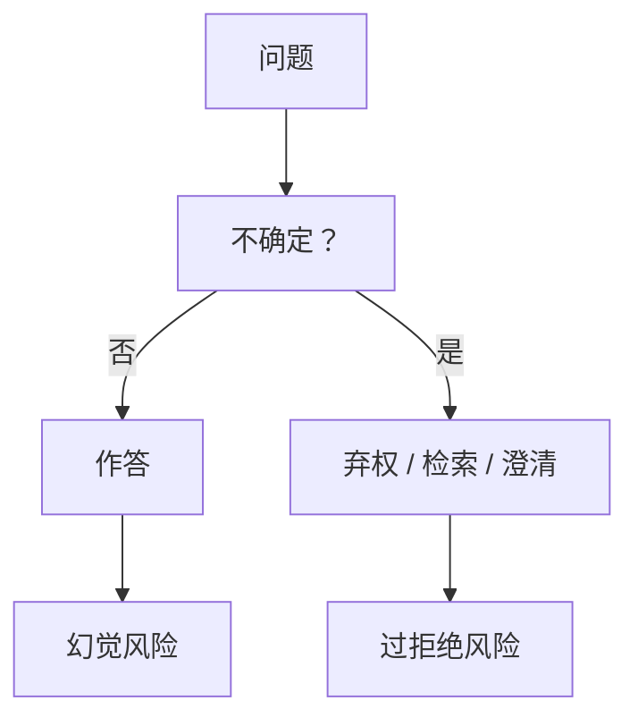
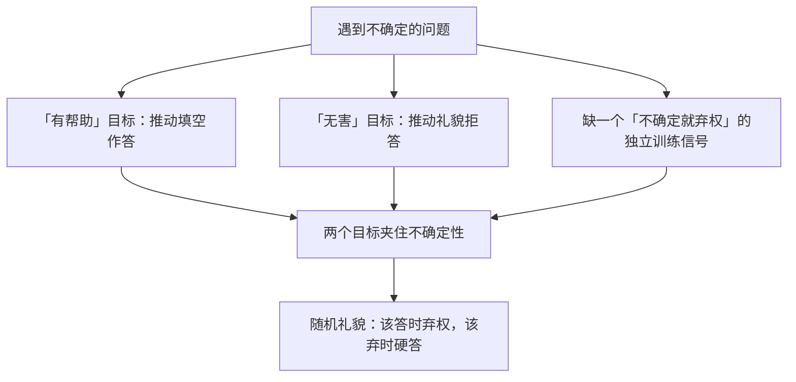

# 弃权与校准拒答

会说「我不知道」并且知道何时说，比把每个空档填满更接近诚实。校准是频率，不是礼貌。

<footer>—— 对照 Kadavath 等对语言模型自知的讨论；[过拒绝](/llm/over-refusal) 是另一方向的误差</footer>

[上一课](/llm/hallucination-taxonomy)把事实错误单列。本课补动作：弃权（abstention）与校准拒答——在不确定或无来源时不编。缺口是：拒绝训练容易把「无害拒答」泛化成过拒绝，而「必须有帮助」又把空档填成幻觉。后课记忆化不再处理校准，只处理训练数据复现。

## 问题

[过拒绝](/llm/over-refusal) 是安全轴上的假阳性。本课是知识轴上的假阳性/假阴性：该弃权时硬答（幻觉），该答时弃权（无用）。两者不能用同一条拒答率优化。校准要求：在「我有把握」的声明下，正确频率接近声明的置信度，见 [ECE](/llm/calibration-ece)。

校准可以理解成「天气预报式的诚实」：预报 90% 下雨的那些天，长期看确实九成下了雨，预报才叫校准。模型说「我有九成把握」也一样——把这类声明攒起来看，实际答对率要接近九成，置信度这个词才有含义；ECE 量化的正是这中间的差距。

产品还要把「无工具时弃权」与「有检索时必须答」分开，否则 RAG 会学会永远不敢用检索到的段落。

这一步如果做错了：训练把「没把握就拒答」一刀切，RAG 系统在检索已经命中的问题上也不敢引用段落——检索白建，产品显得无用，团队再误判成「检索质量差」。所以「无工具时弃权」与「有检索时必须答」要当成两种场景分开训练、分开评测。

口头「我不确定」若后面仍给一个确定事实，是风格不是弃权。弃权必须改变动作：不给可核验命题，或明确标成猜测。

## 方法

持有集两列：必须答（简单事实、检索已命中）；必须弃权（过时、无源、冲突源）。优化与评测都报双列，禁止合成一个「安全分数」。动作空间：短拒答、给出检索、给出置信区间、要求澄清。不要把长道歉当弃权。

「持有集」就是专门考「知不知道自己不知道」的考卷：一列必须答（简单事实、检索命中），一列必须弃权（过时、无源）。模型要像好学生一样既会做题、也会留白——两列分数必须分开报，混成一个大平均，就看不出缺的到底是知识还是自觉。

```mermaid
flowchart TD
  Q["问题"] --> U["不确定？"]
  U -->|"否"| A["作答"]
  U -->|"是"| AB["弃权 / 检索 / 澄清"]
  AB --> OV["过拒绝风险"]
  A --> HAL["幻觉风险"]
```

## 机制

RLHF 的「有帮助」头推动填空；「无害」头推动拒答。知识不确定性若没有自己的头，就会被两头夹成随机礼貌。可验证任务上可以用「答错惩罚大于弃权」塑形；开放事实只能靠检索门与校准数据。口头置信度往往过满，因为训练语料里少有「我不知道」的高质示范。

```mermaid
flowchart TD
  K["遇到不确定的问题"] --> P1["「有帮助」目标：推动填空作答"]
  K --> P2["「无害」目标：推动礼貌拒答"]
  K --> GAP["缺一个「不确定就弃权」的独立训练信号"]
  P1 --> SQ["两个目标夹住不确定性"]
  P2 --> SQ
  GAP --> SQ
  SQ --> OUT["随机礼貌：该答时弃权，该弃时硬答"]
```

## 边界

本课不处理有害请求的拒答策略（那是安全分类器与宪法）。下一课记忆化问的是「答对了但是否在背训练样本」，与不确定弃权正交：背得出来仍可能侵权。

## 小结

- 弃权是知识轴上的动作，必须与安全拒答分列评测。
- 校准看频率，不看套话。
- 「有帮助」与「无害」两头夹不住不确定性，需要单独持有集。
- 出处：Kadavath 等；过拒绝课。
