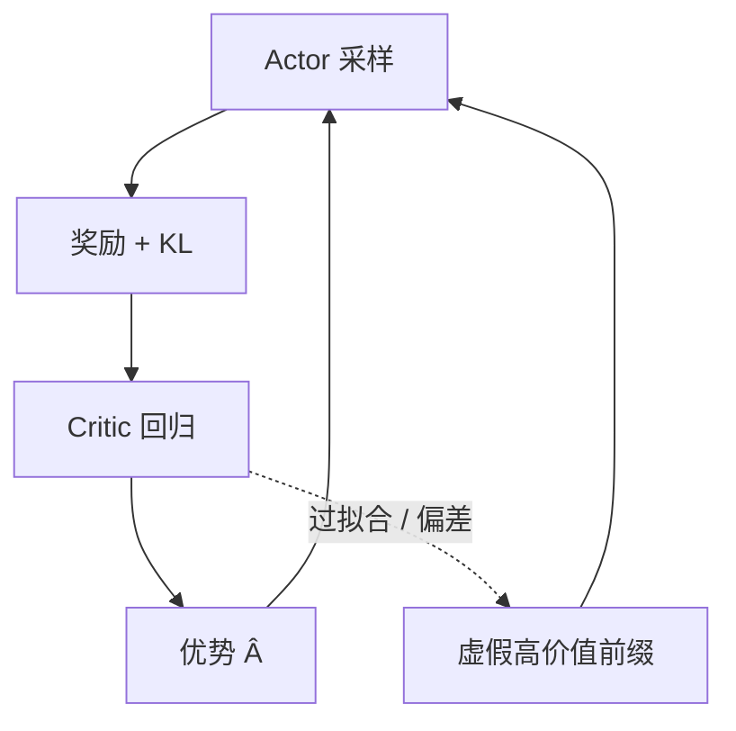

# Actor-Critic 稳定性

策略沿着价值函数指出的方向走；价值函数又在策略刚刚改变的分布上拟合。两者互相追，长序列上很容易追丢。

<footer>—— 接到 Schulman 的 PPO / GAE 与 Ouyang 的四模型 RLHF；对照后续去掉 critic 的群体基线</footer>

PPO 在语言模型里是 actor-critic：actor 是生成策略，critic 是逐步价值头。控制文献里这套结构已经以方差换偏差；接到 LLM 之后，地平线变长、奖励更稀、critic 往往与 70B 级 actor 同骨架，不稳定从「偶发」变成默认要管的工程对象。Ouyang 等人仍然用 PPO 跑通指令模型，说明它能用；后文大量出现的 [GRPO](/llm/grpo)、[RLOO](/llm/rloo)，动机之一正是少训一个会抖的 $V$。本篇写抖从哪来，而不是另给一条假装永远收敛的公式。

## 问题

策略梯度要用优势 $\hat A=Q-V$。$V$ 若是随机噪声，等于给每个 token 乘了一个乱符号，更新方向无信息。$V$ 若系统性地偏，符号稳定地错：某类前缀被高估，actor 会冲进这些前缀，RM 分或正确率并不升。LLM 上 $V$ 的训练信号弱：数百步才在 EOS 看到一个 RM 标量，中间全靠 bootstrap。bootstrap 用的还是自己尚未学准的 $V$，偏差会沿序列回传放大。

同时 actor 每步都在改 $p(y\mid x)$，critic 的训练分布跟着漂。这是非平稳回归：标签 $r+\gamma V'$ 依赖当前策略与当前 $V$。PPO 用近端裁剪限制 actor 一步走多远，并不能让 $V$ 的回归目标停下来。于是常见症状是：奖励曲线上升、KL 受控、下游回归崩；或价值损失降到接近零、策略却不再学——critic 背下了这批 rollout 的噪声。

### 信用分配与长度偏置

终点奖励对短答与长答量纲不同。RM 若偏爱长而礼貌的完成，$V$ 会学会「前缀越长价值越高」，actor 被教成注水。GAE 与折扣改变的是把终点分摊得多远，不改变 RM 的长度偏置本身。若不在奖励里对长度归一、或在数据里平衡短答，critic 会把偏置变成光滑的价值地形，比无 critic 时更难察觉。

共享主干时，价值损失是对表征的额外任务。它拟合的是当前 RM，不是预训练的语言建模。系数一大，指令遵循所依赖的特征被「此刻的分数面」覆盖，看起来像灾难遗忘，根因是多任务权重，不一定是学习率。

## 方法

稳定化是一篮子约束，没有单开关。第一，让奖励定义与 $V$ 的回归目标一致，KL 进奖励则 $V$ 也看见 KL，见 [KL 惩罚与价值函数](/llm/ppo-kl-value)。第二，限制 critic 过拟合：价值 epoch 少于策略、独立（更小）学习率、dropout 或把价值梯度停在主干之外。第三，优势标准化与分位数裁剪，挡住极端 RM 分。第四，PPO clip 与生成—更新比：rollout 一旦过期就重采，避免 actor 在 critic 已背下的噪声轨迹上继续挖。

$$
L_V = \mathbb{E}_t\bigl[\bigl(V_\psi(s_t)-\hat R_t\bigr)^2\bigr]
$$

$\hat R_t$ 是回报或 GAE 目标。对 $\hat R_t$ 做 clip（相对旧 $V$）是 PPO 原文就有的价值裁剪，减少 $V$ 一次跳太远。LLM 实现里常被关掉或抄错符号；应显式测试开与关，不要默认「语言模型不用」。

### 诊断应看符号，不只看损失

价值损失下降只说明回归拟合了当前目标，不说明 $\hat A$ 的符号对下游有利。有用的监控包括：优势与「最终是否答对 / 人工抽检」的相关；按长度分层的 $V$；KL 分位数；SFT 锚任务。若相关接近零，应减小价值学习率或暂时用蒙特卡洛回报（$\lambda=1$、少 bootstrap）。组采样后用组内均值当基线，是把 critic 整段替换，见 GRPO / RLOO；那是换方法，不是给旧 $V$ 再加一层平滑。

## 机制

Actor-critic 的不动点要求 $V$ 等于当前 $\pi$ 的真价值。优化是交替的：$\pi$ 一变，真价值立刻变，$V$ 落后。落后的 $V$ 产生的 $\hat A$ 是旧地形上的方向，近端更新把 $\pi$ 推到既不完全新、也不在旧最优上的中间点。序列越长，中间点越容易落在「价值高、语言坏」的脊上——重复短语让 $V$ 好预测，RM 也可能给中等分，KL 尚未爆。这是稳定性问题的典型几何，不是随机种子问题。

降低方差与降低偏差冲突。更信 critic（小 $\lambda$）平滑、也把 critic 的系统误差写进每一步；更信蒙特卡洛（大 $\lambda$）噪、但少一条错误的价值脊。LLM 奖励更稀时，许多人发现 critic 的偏差伤害大于它省下的方差，于是转向同提示多采样的无参数基线：用真实的其他完成当对照，不再回归一个函数。

参考模型冻结，critic 不冻结。有人误把 $\pi_{\mathrm{ref}}$ 的对数概率当基线。那是 KL 项，不是 $V$。基线必须是「不依赖当前动作 $a_t$」的值，才能不偏置策略梯度；$\log\pi_{\mathrm{ref}}(a_t)$ 依赖 $a_t$，不能当 $V$ 用。

## 边界与工程取舍

### 何时该放弃 critic

同提示能便宜地采 $G\ge 4$ 条、且奖励是可比较的标量（对错或 RM 分）时，组内基线通常比一个不准的 70B 级 $V$ 更划算。提示极多、每条只能采 1 次、奖励跨提示不可比时，仍需要能泛化的 $V$，否则没有基线。不要在 $G=1$ 时宣称「我们用了无 critic 的 PPO」——那只是高方差 REINFORCE。

即使保留 critic，也不要用它当产品指标。上线看的是人类或规则评测。Critic 过拟合当前 RM 时，训练日志里的「平均 $V$」会与真实质量反向。RM 一换，旧 critic 作废，必须重训或重热，不能接着当稳定器。

梯度裁剪、损失缩放、BF16 下的价值头溢出，会造成「看起来像算法不稳」的数值事故。换超参之前先查价值头输出是否爆炸、是否常年近零。数值健康是稳定性的前提，不是论文情节。

## 小结

- LLM-PPO 的不稳定多来自稀疏奖励上滞后、过拟合的 critic，而不只来自 clip 半径。
- 共享主干会让价值任务改写表征；长度偏置会被 $V$ 磨成光滑地形。
- 监控优势与真实质量的相关，不要只看价值损失。
- 能组采样时，用组内基线替换 $V$ 往往更稳；不能组采样时，才值得养一个 critic。
- 出处：Schulman et al., PPO, 2017 与 GAE, ICLR 2016；RLHF 中的 critic 角色见 Ouyang et al., NeurIPS 2022。
