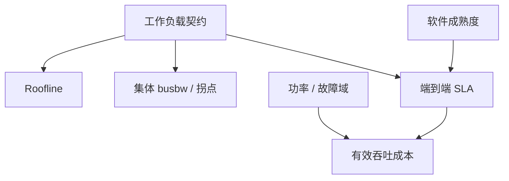

# 加速器对比方法

峰值 FLOPS 是厂商的屋顶；MFU、集体 busbw、编译时间和软件能否跑你的网格，才是你的屋顶。对比是多维测量，不是一列规格表排序。

<footer>—— 屋顶线思想对照 Williams 等 Roofline；集体微基准见带宽模型课</footer>

[国产谱系](/llm/chinese-accelerators) 把各栈画成四格。本课收束「通信与集群」：给出 **同一把尺子**，避免用 NVIDIA 的 TFLOPS 去除别人的 TFLOPS。缺口是方法，不是再介绍一家芯片。下一课程压缩进阶会用到这里的一维——哪种低精度核真实存在——但对比方法本身在本课讲完。后课默认你会：没有微基准与软件维的「赢」，只是营销。

## 问题

不可比的来源：精度不同（FP32 峰值对 FP8 峰值）、是否含稀疏、是否含稀疏 Tensor Core 的 2:4 假设、互连是否算进「平台 FLOPS」、batch 与序列是否相同、prefill 对 decode、训练对推理。再叠软件：有没有融合核、集体库拐点、框架并行实现。把这些压成一个加速比，决策会被单点演示绑架。

问题是固定 **工作负载契约**，再测多维：计算屋顶线、内存屋顶线、集体屋顶线、端到端 step 或 tokens/s、以及工程成本（人、编译、故障）。[预训练通信](/llm/pretrain-comm) 与 [NVLink](/llm/nvlink) 课已经示范过：同一条 All-Reduce 在不同链路上不是同一个数。对比加速器时，这条纪律推广到整机。

Roofline（Williams 等）用算术强度把计算墙和带宽墙画在一张图上。加速器对比至少要有「你的 kernel 落在哪一侧」，否则峰值比没有意义。

## 方法

契约：模型（或代理层）、精度、batch、序列、并行网格、是否含数据加载与检查点。代理层要用真实消息大小的 GEMM 与集体，而不是只跑 LINPACK。

维度：

1. 单核 / 单卡 Roofline：算力 vs HBM vs 片上。
2. 节点内互连 busbw（对标 NVLink 域，但用该栈的集体测试）。
3. 跨节点集体拐点（$\alpha$–$\beta$）。
4. 端到端：训练 step time 或 decode P99，含软件栈。
5. 软件：内核覆盖、编译时间、框架成熟度、可观测性。
6. 设施：功率、冷却、故障爆炸半径、调度 gang。
7. TCO：有效吞吐 / 瓦 / 元，用你测的吞吐，不用峰值。

禁止：把稀疏峰值当密模型成绩；把单卡 decode 乘卡数当线性扩展；把不同精度的 loss 质量当成同一工作负载。

## 机制

端到端被最弱维卡住。一张卡 HBM 很强、集体很弱，则 TP 网格在该卡上不可行，只能 DP，于是对比变成网络对比。软件缺 All-to-All，则 MoE 不是该加速器的工作负载，应从契约里删掉或标为不支持，而不是给一个「N/A 当零」。确定性 LPU 与 GPU 必须在声明的 batch 下比 P99，不能比峰值吞吐。

测量本身有偏差：厂商容器开了特殊环境变量、关闭了数据加载。对比要固定镜像与参数，或明确「厂商最优 vs 默认同构实现」两行都报。

本站量化栏是金融微观结构，与权重量化无关。加速器对比里的「量化」指数值精度与 INT/FP 核，见下一课程。

## 边界与工程取舍

方法不产出唯一赢家。训练集群、decode 服务、端侧可以选三个不同答案。不要把本课当成采购结论。通信与集群课程结束；下一课从均匀量化格子开始，因为对比里反复出现的「有没有 INT4/FP8 核」需要格子本身的语言。

## 小结

- 先锁工作负载契约，再测 Roofline、集体、端到端、软件、设施、TCO。
- 峰值 FLOPS 与稀疏营销必须从主表拿开。
- 最弱维决定网格是否可行；缺集体就标不支持。
- 用自测吞吐算成本，不用规格表。
- 出处：Roofline；集体微基准与前序通信课；各栈公开文档只作规格上限。
