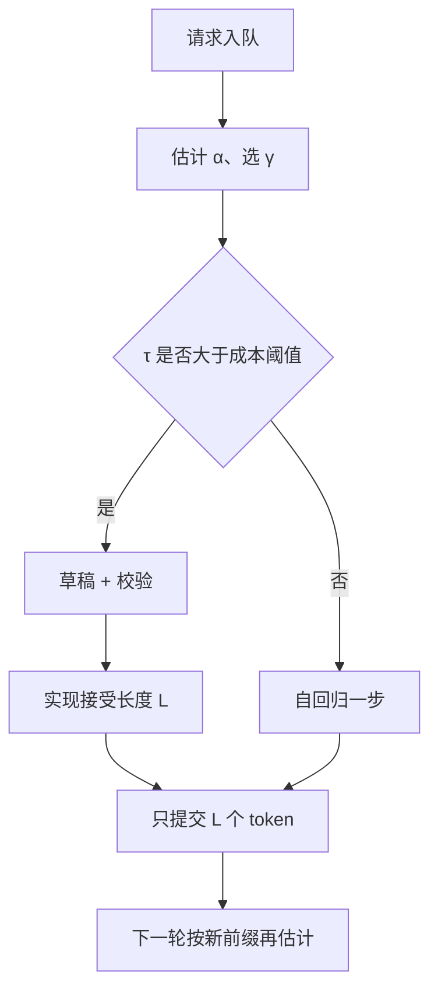

# 接受长度调度

    
一轮投机的期望前进长度是接受率与草稿深度的函数；调度器若假装每条请求每步都只走一个 token，连续批的槽位、KV 与超时都会按最慢的那条链对齐。

<footer>—— Leviathan 等给出的 $\tau=(1-\alpha^{\gamma+1})/(1-\alpha)$；调度要把 $\tau$ 当成每轮的资源需求</footer>

投机解码把「一步一个 token」变成「一轮前进随机个 token」。Leviathan、Kalman、Matias 在独立同分布接受率 $\alpha$、草稿长度 $\gamma$ 下写出期望接受长度（含拒绝后的修正 token）

$$
\tau=\sum_{i=0}^{\gamma}\alpha^{i}=\frac{1-\alpha^{\gamma+1}}{1-\alpha}.
$$

$\tau$ 落在 $[1,\gamma+1]$。墙钟加速大约是 $\tau$ 除以「一轮里目标前向相对自回归一步的代价」，再扣掉草稿成本。连续批、PD 分离、MTP 闭环一旦进入生产，调度器必须看见 $\tau$：它决定每轮占用的解码步、校验算力、以及批内参差。本篇写如何用接受长度做调度，而不是再推一遍拒绝采样公式；闭环步骤见 [MTP 验证闭环](/llm/mtp-verify-loop)。

## 问题

普通连续批按「本 iter 每条请求一个新 token」切预算。投机开启后，同一 iter 有的请求接受了 $\gamma$ 个草稿，有的第一个就拒绝，只写出修正 token。若仍按最慢请求切齐，快请求的超额进度要么丢掉（浪费），要么写入 KV 导致批内长度分叉，注意力核要处理更歪的块表。若完全不对齐，长接受的请求会在一轮里吃掉大量校验 FLOPs，把短请求的 TPOT 打穿。

$\alpha$ 不是常数。模板、代码、系统提示高，开放对话、高温度低。Leviathan 等还把 $\alpha$ 连到 $p$ 与 $q$ 的散度。同一模型在同一服务上，不同请求的 $\tau$ 可以差一倍。固定 $\gamma$ 会在低 $\alpha$ 时净亏损：草稿与校验开销买不回 $\tau\approx 1$。调度要同时选：这条请求要不要投机、$\gamma$ 取多少、本批如何混排。

### 期望不是实现值

$\tau$ 是期望。尾部会出现连续拒绝（$\tau$ 近 1）和连中（$\tau=\gamma+1$）。SLO 若写 p99 TPOT，必须按最坏接受路径留校验算力，或对低 $\alpha$ 请求降 $\gamma$。用均值 $\tau$ 做容量规划会在坏主题上超时。监控应同时报逐步 $\alpha$、每轮实现的接受长度、以及「因投机净亏损」的比例。

公式假定各位置 $\alpha$ 独立同分布。真实序列上，一旦草稿走偏，后续更容易拒绝，有效 $\tau$ 小于 i.i.d. 预测。EAGLE-2 用草稿置信度动态长树，正是放弃「深度处处同一 $\alpha$」。调度器若只喂一个全局 $\alpha$，会在难前缀上过度投机。

## 方法

### 按请求调节 $\gamma$

短请求、低 $\alpha$ 估计、已经接近最大生成长度时，取 $\gamma=0$（关掉投机）或 $\gamma=1$。MTP $D=1$ 天然 $\gamma=1$，调节空间小，但仍可按主题开关。独立草稿模型或 EAGLE 树可以在 $\gamma$ 上做一维搜索：目标是最大化 $\tau/(c_{\mathrm{tgt}}+c_{\mathrm{draft}}(\gamma))$，其中 $c_{\mathrm{tgt}}$ 是一次校验前向相对单步解码的倍数（近似 1，但树节点多时大于 1）。$\alpha$ 可用近期滑动窗口、草稿 softmax 置信度（EAGLE-2 的经验）或主题分类器估计。

批级：优先把「预期 $\tau$ 接近」的请求放进同一微批，减少参差。无法分开时，校验核按树或链的最大深度开，短请求用掩码提前结束，避免为空气算注意力。Hydragen 式共享前缀批处理在「许多请求同一系统提示、各自投机」时有效，但接受长度仍按请求提交。

### 把 $\tau$ 折算成槽位

解码池的并发上限常按 HBM 里 KV 体积。投机不增加最终序列长度的期望（无损时与自回归同分布），但**峰值** KV 会含未提交的草稿节点；拒绝后要释放。调度应按 $\gamma$ 预留草稿缓冲，否则高峰时 OOM。吞吐规划用有效 token/s $\approx \mathrm{iters}\times \bar\tau$，而不是 $\mathrm{iters}\times$ 批大小。PD 分离时，投机几乎全在解码侧；预填充池不必为 $\gamma$ 扩容。

## 机制

### 为什么 $\gamma$ 有最优值

$\tau(\gamma)$ 随 $\gamma$ 递增但边际递减：$\alpha\lt 1$ 时后几个草稿很难被全部接受。草稿成本近似线性于 $\gamma$（自回归草稿）或线性于树节点。于是存在使净加速最大的 $\gamma^\star$。$\alpha$ 升高，$ \gamma^\star$ 右移。服务若全局锁死 $\gamma=5$，在 $\alpha=0.5$ 的流量上 $\tau=1.97$，五步草稿几乎白做。动态 $\gamma$ 就是在这条曲线上爬坡。

与连续批的交互：Orca 式 iteration-level 调度本就按 iter 插入新请求。投机把一个 iter 的「工作量」变成随机变量。稳定做法是：iter 的时间片按「一次目标前向」来切（校验一次），接受长度只影响本请求的进度，不改变 iter 边界。这样新请求仍能在校验结束后加入，TPOT 方差主要来自 $\alpha$，而不是来自偶发的超长草稿循环。

温度为 0 时，接受变成前缀匹配，$\tau$ 由草稿与目标是否逐步相同决定，公式仍可用，只是 $\alpha$ 变成「逐步一致率」。评测加速比必须声明温度与采样器，否则和论文表不可比。

### 和公平、抢占

高 $\alpha$ 请求每轮前进更多，看起来「更快结束」，低 $\alpha$ 请求占用同样校验 iter 却少写 token。若计费按输出 token，低 $\alpha$ 用户更亏算力。公平调度应按「目标前向次数」而不是「输出 token」记账，或给低 $\alpha$ 请求提高优先级以免饿死。抢占时，未提交草稿一律丢弃，只保留已接受 KV——与 MTP 闭环的提交点相同。

## 边界与工程取舍

不要用训练 perplexity 直接当 $\alpha$。不要在树投机里把节点数当成 $\gamma$ 代入 i.i.d. 公式。不要为抬 $\tau$ 而放宽拒绝采样，那是在改分布。MTP 的 1.8× 对应浅 $\gamma$，接受长度调度的空间有限，更大杠杆在 EAGLE 类可调树。监控若只报吞吐不报 $\alpha$，无法判断变慢是模型差了还是 $\gamma$ 设错了。

出处：Leviathan 等，*Fast Inference from Transformers via Speculative Decoding*，ICML 2023，arXiv:2211.17192；Chen 等投机采样；EAGLE-2 动态树；DeepSeek-V3 报告中 MTP 的接受率数字。调度启发式是工程层，不要伪造成 Leviathan 论文里的现成算法名称。

$\alpha\gt 0.55\text{–}0.60$ 一类经验阈值只说明「草稿开销开始赚回来」，依赖草稿/目标成本比，不是定理。换 MTP 这种极便宜草稿，阈值更低；换又慢又不准时的草稿，阈值更高。

## 小结

- 接受长度 $\tau$ 是投机每轮真正产出的 token 期望，调度应按 $\tau$ 而不是按「一步一 token」切预算。
- $\gamma$ 有随 $\alpha$ 移动的最优值；固定过深会在低接受率上净亏损。
- 批内参差、草稿 KV 峰值、按目标前向次数的公平，都由 $\tau$ 的随机性引出。
- iter 边界应对齐「一次校验」，不要对齐「本轮最长接受」。
- 出处：Leviathan 等 ICML 2023；对照 EAGLE-2 与 V3 MTP。
