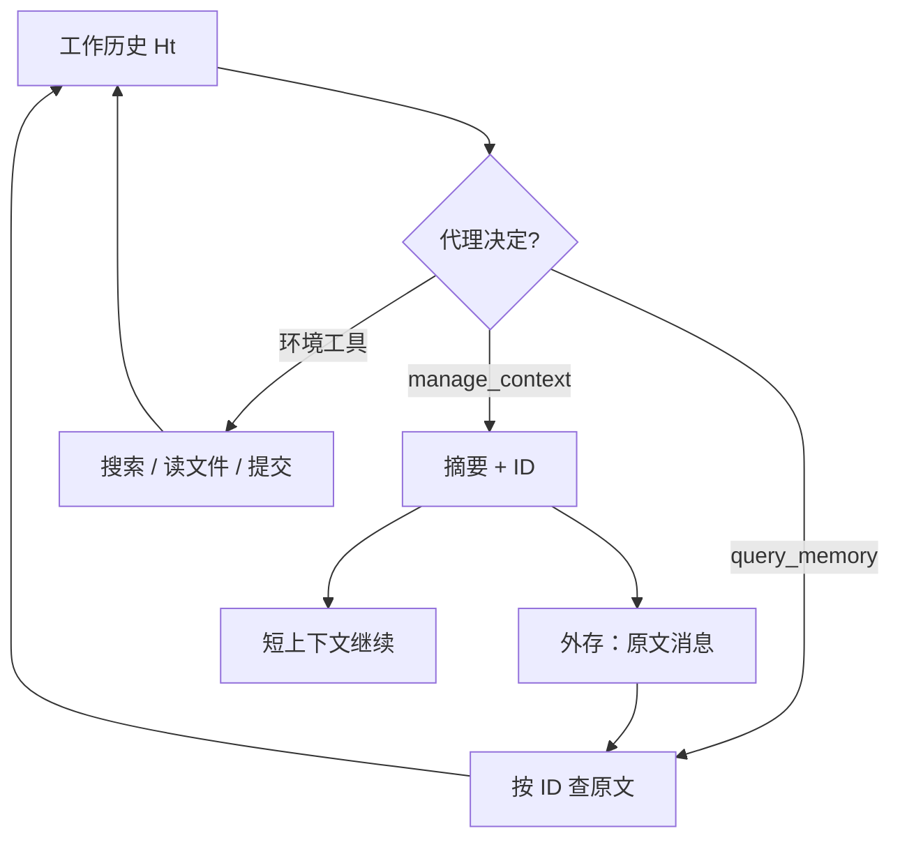

# ACM Agentic Context Management

    
给代理两件专用编辑工具，让它自己决定何时压缩工作上下文：丢掉的原文卸到外存，需要时再按标识查询，而不是按阈值把历史抹掉。

    <footer>—— Li、Ming、Chu、Shao、Jin、Xiong，ACM: Agentic Context Management for Long Horizon Tasks，arXiv:2607.23809</footer>

Xiaochuan Li、Ryan Ming、Meng Chu、Shuai Shao、Rong Jin、Chenyan Xiong 提出 **ACM**（Agentic Context Management）：长程代理任务里，启发式压缩既有损又与推理焦点错位。ACM 只增加两个工具——`manage_context` 把此前轮次收成摘要并把原文卸到磁盘；`query_memory` 按摘要标识从原文里按需取回。压缩由代理发起，而不是 90% 窗口监视器。再配一套教师—学生双向约束的后训练，把「何时管上下文」内化进 Qwen3.5-9B。代码与数据在 `lixiaochuan2020/agentic-context-management`。本篇写无损卸载与时机学习，对照表里点名的 [Mem1](/llm/mem1-context)、[ReSum](/llm/resum-context)、[ACON](/llm/acon-context)、[SUPO](/llm/supo-context)、[AgentFold](/llm/agentfold)。

## 问题

ReAct 把思维、动作、观察追加到 $H_t$，直到窗口顶满。摘要代理在占用超过阈值时强制 $a_{\text{sum}}$，然后把历史换成 $\{s, o_{\text{sum}}\}$，原文丢弃。Li 等认为两条都不够：前者噪声饱和；后者时机由外部监视器决定，且不可再取回。表 1 把若干近期方法按是否压缩、是否可训练、是否无损、是否代理发起、数据是否开源对照：ReSum / ACON / SUPO / AgentFold 能压缩但原文不保留；Mem1 可训练但不做工作上下文压缩；ACM 五项为是。

BrowseComp-Plus、DeepSearchQA、SWE-Bench Verified 上，未训练的 Qwen3.5-9B 已能靠工具调用把 BrowseComp-Plus Pass@1 从 ReAct 的 0.570 拉到 0.635；后训练到 0.727，相对 ReAct 约 +27%。DeepSearchQA +16%，SWE-Bench Verified +8%（文中相对增益表述）。峰值 token 约降 20% 量级，工具调用次数上升——小模型靠探索补参数，压缩是为了让探索继续，而不是为了少做事。简单题往往在顶满之前就结束，因此训练与评测都故意选长程搜索与修仓库；把 ACM 接到闲聊机器人上，管理工具会被闲置，数字也对不上。

### 两个工具，而不是一个摘要器

`manage_context` 把上一摘要边界以来的消息交给摘要 LLM，原文写入工作区，摘要带唯一 ID。`query_memory` 把查询与该 ID 映射的原文交给查询 LLM，返回相关片段。工作上下文保持短；长期记忆在盘上。这模仿 Atkinson–Shiffrin 的短时/长时分离，也接近 [MemGPT](/llm/memgpt) 的 RAM/磁盘，但发起压缩的是策略本身，不是容量警告插入。

「无损」指原文可按 ID 取回，不是摘要零误差。查询器仍会漏召回或改写。审计时应能打开磁盘上的原始消息，而不是相信摘要里的「已核实」。

## 方法

形式：系统提示 $s$，动作 $a_t$（推理加工具），环境 $o_t$。摘要代理在阈值触发后丢弃 $H_t$。ACM 代理可在任意步调用管理工具，压缩点跟随推理状态（死循环、主题已收束、上下文自报占用高）。图 3 呈锯齿：压缩发生在撞顶之前。案例（BrowseComp-Plus qid 347）里模型在约 55k、41k、114k token 等处自报占用并 `manage_context`，穿插 `query_memory`，83 轮后作答；无压缩会在约第 47 轮越过 128k。基座模型该题 0/4。

后训练：学生分别在有/无 ACM 工具下滚动，得 $H^+$、$H^-$。教师带参考答案审轨迹：在 $H^-$ 上注入该压缩的点（重复检索、无产循环、信息已够）；在 $H^+$ 上撤掉过早压缩，换成更深检索或提交答案。学生从改写点继续。再用同族强教师做 on-policy 蒸馏，对助手 token 的 top-$K$（$K=20$）软标签。过滤：只留学生多次未全对的题；教师推理不得泄漏标准答案。训练数据含 BrowseComp-Plus 680 / 评测 150，SWE 用 SWE-Gym。教师为 Qwen3.5-397B-A17B。消融：只蒸馏 GPT-5.5 轨迹并不稳定提高搜索；ACM 数据与蒸馏可叠加。

### 时机是要学的技能

文中与 Ye、Lu 等一致：即便前沿模型也很少主动管上下文。GPT-5.5 在 ACM 框架下几乎不调两个管理工具。因此不能只靠教师自己的成功轨迹——简单题教师不压缩，监督为零。必须从**学生的失败与误用**上标注。这解释了为何双约束：既教「该压」，也教「现在该搜或该交卷」。

## 机制

代理发起使压缩对齐子目标边界，而不是对齐 90% 字节。峰值下降是因为锯齿在顶峰前就卸货，KV 峰值与「最后一刻才压」不同。无损使错误摘要可被 `query_memory` 纠正，这是相对 ReSum/ACON 一次性替换历史的结构差异。代价是两次额外 LLM（摘要器、查询器），论文用同一 9B 学生兼任以控成本。

一致性：压缩后探索轮次增加，独立试验更常收敛到同一解。机制解释是噪声少、可继续搜，而不是参数变聪明。Pass@1 与工具次数正相关；强前沿模型用更少工具达到高分，小模型靠管上下文才撑得住长探索。

ACM 是单题内方法，不跨任务累积策略笔记。跨任务演化应对照 ACE 一类，而不是把 ACM 写成终身记忆。表 2 里 ACE 峰值更高、搜索项更弱，引用时不要混。

### 与折叠、递归摘要的分工

AgentFold 在每步输出折叠指令，多尺度摘要留在窗口内，训练靠 SFT，数据未公开。ReSum 用外部摘要工具周期性重启，原文丢弃。ACM 强调开源数据管道 + 外存可查。工程选型：需要可审计原文用 ACM；需要每步多尺度折叠且可 SFT 用 AgentFold；需要即插即用、改动 ReAct 最小用 ReSum。

## 边界与工程取舍

数字绑在 Qwen3.5-9B、所列三基准与教师 397B。不要把 +27% 写成任意模型。Meta 仅顾问，实验在 CMU。摘要器/查询器若与策略同模型，会共享其偏差。磁盘上的原文是敏感日志，多租户必须按会话隔离工作区。教师若泄漏答案，模型会学到「看见某模式就压」的捷径而非结构。

出处：Li, Ming, Chu, Shao, Jin, Xiong，*ACM: Agentic Context Management for Long Horizon Tasks*，arXiv:2607.23809。代码 https://github.com/lixiaochuan2020/agentic-context-management。基线含 Yao 等 ReAct、Wu 等 ReSum、Kang 等 ACON、Lu 等 SUPO、Ye 等 AgentFold、Zhou 等 MEM1。

## 小结

- ACM 用 `manage_context` / `query_memory` 做代理发起、原文可查的上下文管理。
- 后训练用双约束教何时压、何时不要压；9B 在 BrowseComp-Plus 相对 ReAct 约 +27%。
- 锯齿降低峰值约 20%，探索轮次增加；无损相对一次性摘要可回查。
- 出处：arXiv:2607.23809。
