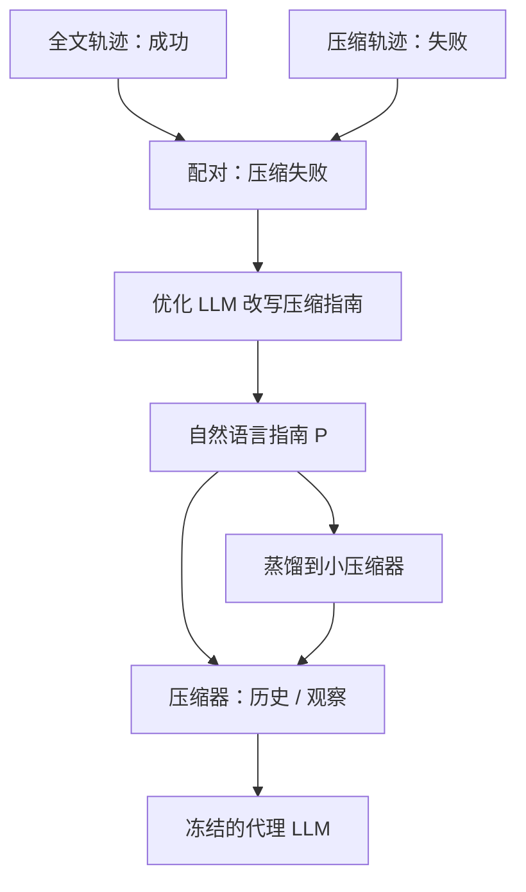

# ACON 上下文导航

    
在自然语言空间里迭代改压缩指南：对照「全文成功、压缩失败」的成对轨迹，让指南学会保住环境相关的状态，而不去微调代理权重。

    <footer>—— Kang、Chen、Han 等，ACON: Optimizing Context Compression for Long-horizon LLM Agents，arXiv:2510.00615，ICML 2026</footer>

KAIST / Microsoft 的 Minki Kang、Wei-Ning Chen、Dongge Han 等提出 **ACON**（Agent Context Optimization）。中文里常被说成「上下文导航」，指的是用自然语言指南**引导**压缩器走哪条保留/删除路径，而不是在图上做 GIS 导航。长程代理的观察与历史无界增长，截断或通用摘要会丢掉文件路径、API 参数这类状态。启发式脆，梯度更新又碰不到专有 API 模型。ACON 用失败分析改压缩提示，再把优化后的压缩器蒸馏到小模型。AppWorld、OfficeBench、多目标 QA 上峰值 token 降 26–54%，任务成功不低于压缩基线；小模型作代理可因少分心提升最多约 46%。代码 `microsoft/acon`。本篇写指南优化与双对象压缩（历史 / 观察）。

## 问题

生产力代理（邮件、办公套件、多应用工作流）必须记住异质信号：事实史、动作—结果、成功前置条件、下一步线索。对话记忆系统优化连贯聊天；文档压缩假设单步用完即可丢。Agent 压缩若只靠「总结得短」，OfficeBench / AppWorld 上会丢路径。MEM1、AgentFold、SUPO 把压缩与策略绑在一起训，不适合只拿得到 GPT API 的部署。

环境写成 POMDP，历史 $h_{t-1}$ 与最新观察 $o_t$ 条件化出 $a_t$。上下文代价是峰值 token（决定 KV）与平均长度。压缩器 $C$ 在超过阈值时把历史或观察改写成更短文本，代理权重冻结。目标：在任务奖励不塌的前提下减小峰值。难点是「该留什么」随环境变，手写规则迁不走。

### 两种压缩对象

**历史压缩**：交互变长时把 $(o_0,a_0,\ldots)$ 收成状态摘要，类似 [ReSum](/llm/resum-context) 的重启材料，但指南是优化出来的。**观察压缩**：单次工具返回过长（HTML、邮箱列表）时先压观察再让代理看，类似工具结果清理，但是可学生成式压缩而不是删除。二者阈值独立。论文强调同时覆盖，而先前工作常只做一种。

指南优化属于提示优化家族（Pryzant 等 OPRO/TextGrad 一类思想），监督信号是「压缩后失败而全文成功」的对比，不是人工写的摘要平行语料。没有这对轨迹时，优化器不知道缺了哪条状态。

## 方法

收集训练集轨迹：同一任务跑全文代理与压缩代理。筛选全文成功、压缩失败的配对。优化 LLM 阅读完整 $H$ 与失败的压缩版，指出丢失信息，改写指南 $P$。迭代直到压缩代理成功率贴近全文，或步数用尽。全程不更新代理参数，故可用 gpt-4.1 一类 API 当代理，压缩器可以是另一模型。

为降压缩税，用优化后的师生轨迹 LoRA 蒸馏到 Qwen3 / Phi-4 等学生压缩器，文称保留教师准确率 95% 以上。AppWorld 图 1：大模型相对朴素提示压缩，峰值下降且准确率保住；Qwen-14B 作代理时压缩后准确率甚至上升——长上下文分心（Shi 等）被减轻。小模型在 AppWorld / OfficeBench / 多目标 QA 上相对未压缩长历史，分别约 +32% / +20% / +46%（论文贡献条）。

### 失败对比是定位器

稀疏的成功/失败不够指导「删哪句」。全文里有而压缩版没有、且与失败动作相关的跨度，才是指南应增加的保留规则（例如「始终保留绝对路径」「保留最后一次 API 错误码」）。环境换了，规则会改：AppWorld 要应用状态，QA 要已搜集的子答案。这就是「导航」：指南在自然语言里指向状态流的关键航点。

基线含朴素提示压缩、启发式、以及与策略耦合的 RL 压缩。ACON 的卖点是**代理可闭源**。ICML 2026 接收；引用以 arXiv:2510.00615 为准。

## 机制

压缩指南是可解释的策略：人可以读 $P$ 做审计，这是相对黑盒 LoRA 压缩器的产品优势。蒸馏之后可解释性部分转移到学生权重，生产若需要审计应保存教师指南版本。观察压缩降低单步峰值；历史压缩降低随时间的峰值。只做一种时，另一侧仍可能顶满。

小模型受益更大，因为它们更易被长 distractor 打偏。压缩不是免费智能：若指南过猛，关键前置条件丢失，成功率会低于全文。优化目标是贴近全文成功，不是最短摘要。95% 蒸馏保留说明压缩技能可与代理分离，这与 SUPO「摘要即策略」相反。

用户标题里的「导航」不要理解成检索跳转或知识图谱遍历。ACON 不检索外库，只改写已在窗口/观察里的字节。外库记忆见 Mem0 / Zep。

### 与 ReSum、SUPO、ACM

ReSum 训策略适应固定摘要工具；ACON 训（优化）压缩指南且代理冻结。SUPO 联合优化工具使用与自评摘要，要开源可训权重。ACM 要代理主动调用卸载工具。闭源办公代理 + 要降 KV：ACON 最贴。要策略学会自己压：SUPO。要原文可回查：ACM。

## 边界与工程取舍

配对轨迹假设「全文能成功」——全文也失败的任务给不出对比信号，难题可能欠优化。优化器 LLM 的费用发生在离线阶段，应摊入训练预算。蒸馏学生若比代理还大，峰值收益会被压缩步骤吃回；论文才强调小压缩器。AppWorld / OfficeBench 步数 15+，不是单轮聊天；不要把 26–54% 套到客服闲聊。

出处：Kang, Chen, Han, Inan, Wutschitz, Chen, Sim, Rajmohan，*ACON: Optimizing Context Compression for Long-horizon LLM Agents*，arXiv:2510.00615，ICML 2026。https://github.com/microsoft/acon。Microsoft Research 出版物页同步。分心现象见 Shi 等 *Large Language Models Can Be Easily Distracted*。

## 小结

- ACON 用失败对比在自然语言里优化压缩指南，代理权重不动，适合 API 模型。
- 同时压历史与观察；峰值 token 降 26–54%，小压缩器可蒸馏到教师约 95%。
- 小代理可因去分心提升最多约 46%；「导航」指指南引导保留航点。
- 出处：arXiv:2510.00615。
