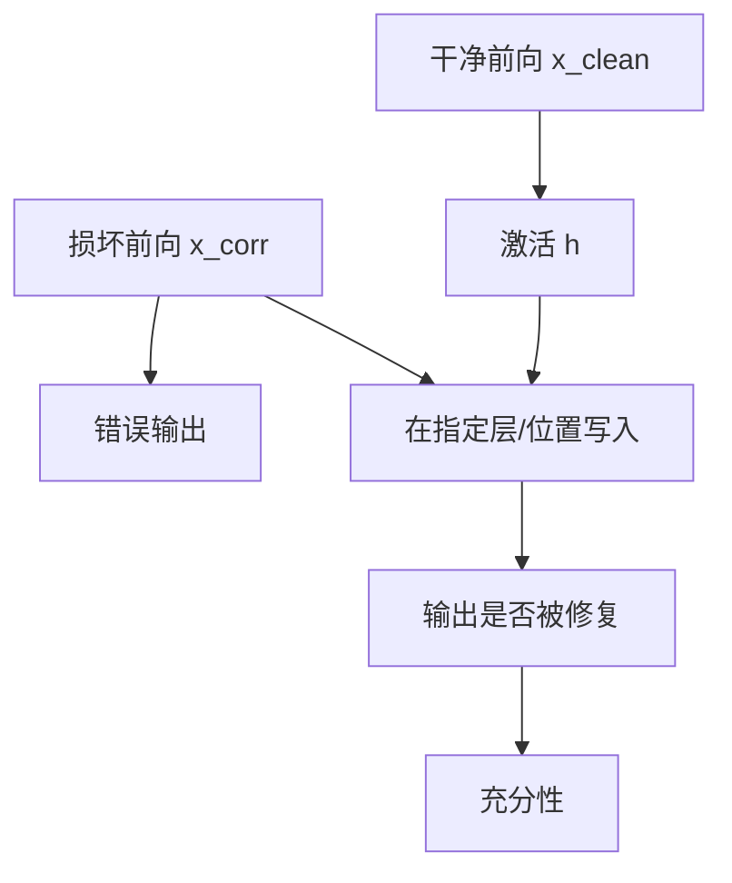

# Activation Patching 激活修补

我们设计一种因果干预，用来找出对模型事实预测起决定作用的神经元激活，并显示中间层前馈模块在处理主语 token 时介导了事实回忆。

<footer>—— Meng et al., Locating and Editing Factual Associations in GPT, NeurIPS 2022</footer>

激活修补（activation patching）是把一次前向里的激活，换成另一次前向里对应位置的激活，看输出如何变。它问的是因果介导，不是相关。Meng 等人在 ROME 论文里称之为因果追踪（causal tracing）：在干净运行与损坏运行之间，把隐藏状态按层、按 token 逐块贴回去，定位事实回忆发生在哪。Wang 等人在 IOI 电路工作里用同类干预还原 GPT-2 small 的间接宾语识别。Nanda、Heimersheim、Zhang 等人后来整理了度量与最佳实践。本篇写协议、度量、以及它不能推出的结论。

## 问题

消融一个头、看准确率下降，只能说明该头「有贡献」，说不清贡献的是信息本身还是破坏了无关通路。梯度归因给出敏感度，不是反事实。要回答「这个激活是否携带了使输出从错误变正确的信息」，需要一次对换：在失败的前向里，注入成功前向的激活，输出是否修复。

修补的最小单元可以是一层残差、一个注意力头输出、MLP 输出、甚至单个神经元。单元越细，定位越准，组合爆炸越严重。协议必须先规定干净输入、损坏输入、以及成功的操作定义（正确 token 的 logit 差、准确率、或 KL）。

### 干净、损坏与修复

典型三元组：干净提示 $x_{\mathrm{clean}}$ 模型答对；损坏提示 $x_{\mathrm{corr}}$（改主语、打乱人名、切掉关键句）模型答错；修补则在 $x_{\mathrm{corr}}$ 的前向中，把指定位置的激活换成 $x_{\mathrm{clean}}$ 同位置的激活。若修复度量显著上升，该位置介导了干净运行里的关键信息。反向修补（在干净运行中贴入损坏激活）测量必要性：贴入后是否变糟。

Meng 的因果追踪常用高斯噪声破坏主语嵌入，再看哪一层把干净激活贴回去能恢复「宾语」预测。这与改写提示文本的损坏不同。噪声损坏假设「损坏 = 看不清主语」；改名损坏假设「损坏 = 主语换成别人」。两种损坏定位到的层可以不同，必须在论文里写死。

## 方法

记 $h^{\ell,t}(x)$ 为输入 $x$ 在层 $\ell$、位置 $t$ 的激活。修补前向计算

$$
h^{\ell,t}(x_{\mathrm{corr}}) \leftarrow h^{\ell,t}(x_{\mathrm{clean}}),
$$

其余仍按 $x_{\mathrm{corr}}$ 走。度量常用 logit difference：正确续写 token 减对照 token 的 logit。Zhang 与 Nanda（ICLR 2024）比较了多种度量，指出归一化方式会改变「哪一层看起来最重要」，并建议报告完整的修复曲线，而不是只报峰值层。

### 路径修补与冻结

普通修补把某个张量整块替换，信息仍可从该张量的下游与旁路同时走。路径修补（path patching）进一步冻结其余节点，只允许指定边把差异送下去，用来画电路里的边。IOI 工作依赖这类精细干预，才把「哪些头读哪些头」从相关做成因果。代价是实现复杂、且冻结假设可能人为切断真实并行通路。

Heimersheim 与 Nanda 的教程强调：先做残差流的粗修补定层与 token，再在候选层里头级、MLP 级细分。一上来就扫所有头，多重比较会制造假阳性。

## 机制

修补能修复输出，说明被替换的激活对下游是充分的信息源之一：下游计算会读它。它不说明这是唯一源。并行电路很常见——修补 A 能修复，修补 B 也能修复，消融 A 却几乎无事，因为 B 顶上。充分性与必要性必须成对做。

### 事实定位为何落在中层 MLP

Meng 等人发现，对「主语–关系–宾语」型事实，修复峰值常出现在中层 MLP、且在主语最后一个 token 上。解释是：MLP 作为键值记忆，在主语位置写入属性；之后注意力把属性拷到句末再解嵌。ROME 用这一因果定位去做秩一权重编辑。定位依赖于损坏方式与模板；换一种关系，峰值层会漂移。激活修补在这里的角色是「找到编辑该动手的计算位点」，不是「证明记忆只存在于这一层」。

修补替换的是激活，不是权重。它告诉你这一次前向的介导位点，不直接给出可迁移的参数手术。从修补走到 ROME/MEMIT，还要假设 MLP 近似线性关联记忆，并用秩一更新去改权重。中间多了一层建模假设。

度量饱和也是机制的一部分。若干净与损坏的 logit 差已经极大，修补会显得「处处有效」。应在难度适中的对照上做，或报告相对修复比例 $(\Delta_{\mathrm{patch}}-\Delta_{\mathrm{corr}})/(\Delta_{\mathrm{clean}}-\Delta_{\mathrm{corr}})$。

## 边界与工程取舍

修补假设两次前向的位置对齐。变长提示、不同分词、插入干扰句，都会让「同一 $t$」失去意义。对生成任务，只修补提示最后一格，可能漏掉已经写进 KV 缓存的早期计算。对长链推理，关键信息可能分布在许多 token 上，单点修补会低估。

统计上，层 × 位置 × 头 的网格很大。应预注册扫描顺序，用保留集确认峰值，避免在同一批提示上既发现又验证。Zhang 与 Nanda 还警告：某些度量在数值上偏好深层，因为深层更靠近 logits；这不是机制更「集中」，只是杠杆更大。

不要把修补热力图当成电路图。热力图是充分性的扫描；电路还需要边、需要反向修补、需要在分布外提示上重复。IOI 之所以成立，是因为后续一串头级路径修补与行为预测都对上了，而不是因为某一层颜色深。

## 小结

- 激活修补用干净运行的激活替换损坏运行的对应激活，检验该位点是否因果介导目标行为。
- 必须成对看充分性（贴入能否修好）与必要性（贴入损坏能否弄坏）。
- 损坏构造、度量与归一化会改变定位；应报告修复曲线而非单一峰值。
- 粗修补定层与 token，细修补定头与边；路径修补才能谈电路的边。
- 修补定位的是激活位点，权重编辑还需要额外的记忆模型假设。
- 出处：Meng et al., NeurIPS 2022；Wang et al., *Interpretability in the Wild*（IOI）, ICLR 2023；Zhang & Nanda, ICLR 2024。
