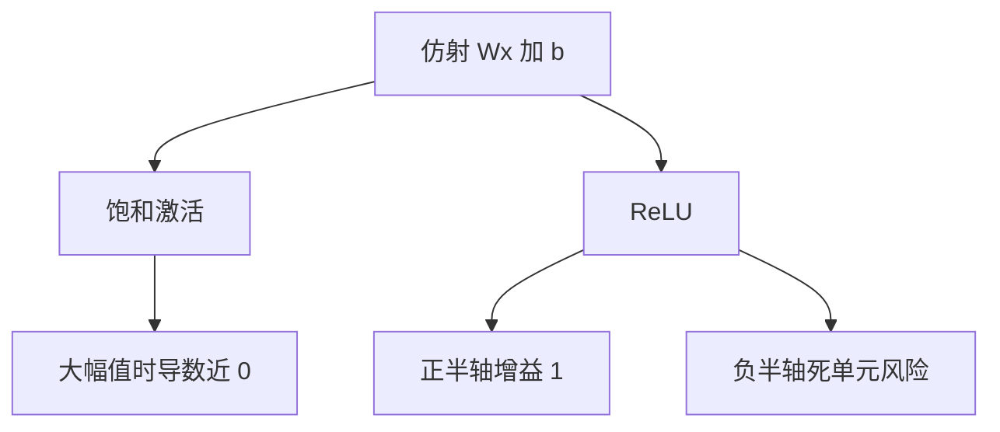

# 激活：ReLU 与饱和

逐元素非线性把一串仿射从「仍是一层仿射」里救出来；导数长期接近零，反向增益就被掐断。

<footer>—— 据 Nair &amp; Hinton, Rectified Linear Units Improve Restricted Boltzmann Machines, ICML 2010；Glorot, Bordes &amp; Bengio, AISTATS 2011 整理</footer>

[线性层与偏置](/llm/linear-layer-bias)补上 $b$。本课不重写仿射。缺口是：仿射的复合仍是仿射，再深的 $W^{(\ell)}$ 也只是一张等效矩阵。必须在层间插入不是仿射的逐元素函数 $\sigma$。本课对比饱和激活与 ReLU：前者在幅值大时 $\sigma'\approx 0$，加重消失；后者在正半轴增益为 $1$，负半轴为 $0$。GELU、SwiGLU 是后话，这里只把「为何要非线性、饱和如何伤反向」钉住。

## 问题

两个仿射 $A_2(A_1 x)$ 等于一个仿射。没有 $\sigma$，深度不增加函数类，只增加参数化同一超平面的方式。分类、语言建模需要的决策面是弯曲的、分区的。缺口是最小的非线性：每个坐标独立地 $\sigma(z_i)$，形状不变，不引入新的轴。

sigmoid $\sigma(z)=(1+\mathrm{e}^{-z})^{-1}$、tanh 把值挤进有界区间，大 $|z|$ 时导数指数变小——这就是饱和。它曾被当作「概率」或「有界特征」的优点，却与[梯度消失与爆炸](/llm/vanish-explode-grad)的增益连乘直接冲突。ReLU $\sigma(z)=\max(z,0)$ 正半轴不饱和，负半轴硬切。函数类因此变成分段线性，深度开始真正增加折点数量。

### ReLU 不是「不会消失」

负半轴导数为 $0$，若一个单元对几乎所有样本都为负，它的 $W$ 行收不到梯度，称为死 ReLU。这是另一种消失，只是发生在单元子集上，而不是整层谱半径。学习率过大、偏置过负、输入分布突然偏移，都会制造死单元。Leaky ReLU、GELU 缓解硬零，但不取消「需要非线性」这条。把 ReLU 宣传成消失问题的彻底解决，后课残差与初始化会显得多余。

输出层接 softmax 时，倒数第二层常用 ReLU 或 GELU，而不是再接一个 sigmoid。概率由 softmax 提供；中间层要的是不饱和的增益，不是再做一次单纯形。

## 方法

MLP 一层：$h=\sigma(Wx+b)$。反向：$\mathrm{d}z=\mathrm{d}h\odot\sigma'(z)$。ReLU 的 $\sigma'$ 是指示函数 $\mathbf{1}_{z\gt 0}$（$0$ 点的次梯度取 $0$ 或 $1$ 均可，实现任意约定）。tanh 的 $\sigma'=1-\tanh^2 z$。堆叠 $L$ 层就有 $L$ 次逐元素门，夹在 $L$ 次仿射之间。本课不讨论宽度如何选，那是参数量课。

## 机制

分段线性网络把 $\mathbb{R}^d$ 切成多面体，每个多面体内仍是仿射，边界由 ReLU 的过零决定。深度增加折点的组合数，这是表达力来源。饱和激活则把表示压进有界盒子，前向不会爆炸，反向却容易没梯度——前向稳定与反向可训不是同一件事。现代前馈默认非饱和（或弱饱和）激活，把有界性交给后课的 LayerNorm，而不是交给 $\sigma$ 的值域。

选择 $\sigma$ 还改变初始化理论：ReLU 大约一半单元为 $0$，方差传递与 tanh 不同。下一课专门处理这件事，本课只要求：激活的导数进入增益连乘，选 $\sigma$ 就是在选默认增益。

## 边界

本课不写 GELU 的积分形式，不写门控线性单元。下一课[初始化为何需要](/llm/why-init)假定激活已选定，问 $W$ 的尺度。后课默认：MLP 层是仿射加非饱和逐元素激活；说到饱和，是在诊断消失。

## 小结

- 无非线性则多层仿射退化成一层；$\sigma$ 是深度有意义的前提。
- 饱和激活在大幅值时掐断反向增益。
- ReLU 正半轴增益为 $1$，但死单元是局部消失。
- 中间层不要用 sigmoid 来「当概率」，概率留给 softmax。
- 出处：Nair &amp; Hinton, ICML 2010；Glorot et al., AISTATS 2011。
