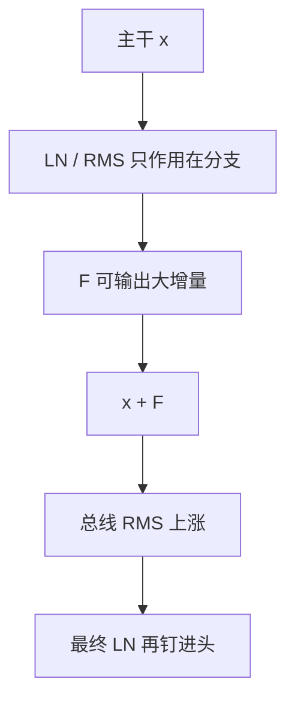

# 激活尺度漂移

残差公路上的未归一化和可以随层、随时间变大；层归一化只钉进子层的那一截，并不自动钉住总线本身。

<footer>—— 残差累加见 He et al., CVPR 2016；Transformer 中 LN 位置见 Xiong et al., 2020；对角增益见 Touvron et al., LayerScale, ICCV 2021</footer>

[上一课](/llm/grad-norm-monitoring)监控的是反向。缺口是前向：[残差流](/llm/residual-stream) 在 Pre-LN 下是 $x\leftarrow x+F(\mathrm{LN}(x))$，主干 $x$ 不被 LN 重标。深度缩放只约束第 0 step 的 $\mathrm{Var}(F)$；训练中 $F$ 学会输出更大的增量，$\|x\|$ 随层号与 step 涨。这会抬高注意力的 $q,k$（若无 QK-Norm）、抬高 FFN 中间激活、并在最后一层进入输出头前把动态范围交给一个 $\gamma$。本课写激活传感器，以及 LayerScale / 最后一层 LN 作为结构阀，不重写 [RMSNorm](/llm/rmsnorm) 公式。

## 问题

LN / RMSNorm 使 $F$ 的输入 RMS 约为 1。$F$ 仍可输出 RMS 为 10 的增量。加回主干后，下一层的 LN 再次把**分支输入**拉回，但主干范数已经变了。深度方向：底层 $\|x\|$ 小、顶层大，形成「残差流放大」。时间方向：同一层的 $\|x\|$ 随 CE 下降而涨。两者都让半精度与注意力 logits 承压，而梯度范数可以仍正常——因为 LN 的雅可比把 $F$ 内部梯度按输入尺度除过了。

Post-LN 每层把加法后的 $x$ 钉回，漂移改道到 LN 的内部统计与雅可比，Xiong 等人指出这使深层更难训。本课以当代默认 Pre-LN 为主，把 Post-LN 的「看起来没漂移」当成另一种病，留给下一课 warmup。

只打印 LN **之后**的激活，会得出「尺度很稳」的假象。传感器应打在残差加法之后、下一层 LN 之前，即总线本身。

## 方法

对若干层记录：残差加法后的 RMS 中位数、FFN 中间激活的 max、以及最后一层进入 lm_head 前的 RMS。与注意力 row-max、LSE 同一 step 对齐。若顶层 RMS 相对底层持续指数涨，先检查是否忘了残差 dropout 的 inverted 缩放，再检查 $F$ 输出投影是否被学习率放飞。

结构阀：

- **最终 LN。** Pre-LN 解码器在栈顶再做一次归一化再进输出头，避免把总线范数直接乘进 $W_{\mathrm{out}}$。这是惯例，不是可选项。
- **LayerScale。** $x\leftarrow x+\mathrm{diag}(\alpha)F(\cdot)$，$\alpha$ 起步接近 0 或很小，训练中学习每通道增益。Touvron 等人在深 ViT 上用它稳定深度方向的增量。
- **QK-Norm / cap。** 管的是注意力内部，不降低总线 RMS；总线仍要单独记。

不要用「把全局梯度 clip 再紧一点」当激活漂移的对策：clip 不缩小 $x$。

## 机制

RMSNorm 的反向含 $1/\mathrm{RMS}$ 因子。主干 $x$ 变大时，进 $F$ 的分支仍被归一化，但 LN 相对 $x$ 的梯度分配改变，$\gamma$ 承担更多「读写总线尺度」的工作。$\gamma$ 与嵌入、输出头一起放大，就是上一课 LSE 发散的一条路径。权重衰减若豁免 $\gamma$（后课），这条路径更畅通。

LayerScale 把增量先缩小，类似深度缩放的可学习版，但发生在整个训练期而不只是初始化。它与 drop-path 可同时出现在视觉配方里；语言预训练更常只留最终 LN，把 $\alpha$ 固定为 1。加 LayerScale 等于加一组新参数，coord check 要包含 $\alpha$ 的幅度。

## 边界

本课不把激活量化（INT8 校准）写完：那是压缩课。但训练期总线 RMS 的分位数，就是以后量化的范围估计。MoE 专家内部各有自己的激活尺度，全局一个数会骗人，应按专家桶打。下一课专门处理 Post-LN 仍被使用时，为何必须把 warmup 拉长——那是 LN 雅可比而不是总线 RMS 的故事。

## 小结

- Pre-LN 钉的是进 $F$ 的分支，不钉残差总线；漂移应在加法之后测。
- 梯度范数正常不能排除激活放大。
- 最终 LN 是 Pre-LN 栈的必需阀；LayerScale 是可学习的增量缩放。
- 对策不是把 clip 拧紧。
- 出处：He et al., CVPR 2016；Xiong et al., 2020；Touvron et al., ICCV 2021。
