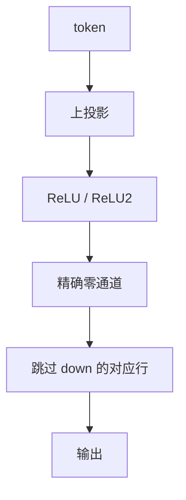

# 激活稀疏与 ReLU²

SwiGLU 几乎每个通道都亮；换成 ReLU 一类半波，FFN 的中间激活可以大部分是零——跳过的是乘加，掩码随 token 变。

<footer>—— Mirzadeh et al., ReLU Strikes Back, ICLR 2024；对照 GLU 激活在 LLaMA 族的默认</footer>

[上一课](/llm/sheared-llama) 静态地改架构宽度。本课形状不变：给定 $x$，FFN 中间哪些通道为 0，就可以跳过对应列。缺口是 **激活稀疏** 与权重稀疏正交——Wanda 的掩码跨样本固定，这里每步不同。后课 Deja Vu 用小网络预测这张动态掩码；本课先问激活函数把零率放到哪。

## 问题

LLaMA 一类用 SwiGLU / SiLU，中间激活很少真零，权重再稀，通道仍要算。ReLU（或 ReLU²，即平方 ReLU）把负半轴打成零，统计上可以出现很高的通道稀疏度。Mirzadeh 等人说明：在可比训练预算下，ReLU 族 LLM 能把这张稀疏变成推理跳过，而不必先做权重剪枝。问题是训练时就要用这种激活；对已经训好的 SwiGLU 基座，不能靠「推理时改 ReLU」白嫖，分布全错。

稀疏度随层、随 token 变。平均 90% 零不代表每步都能跳 90%：热 token 会点亮更多通道，核必须按最坏或按阈值门控。没有门控核，零仍占 FLOPs。

ReLU²$(x)=(\mathrm{ReLU}(x))^2$ 在部分工作里比 ReLU 更接近 GELU 的平滑正半轴，同时保留精确零。它不是二阶导数魔法，只是形状。

## 方法

预训练或继续预训练换成 ReLU / ReLU² FFN（门控线性层要改结构，不是只改函数名）。推理：对中间激活做阈值或直接利用精确零，跳过 $W_\mathrm{down}$ 的对应行（以及 $W_\mathrm{up}$ 的列，若预判）。与 MoE 不同：没有专家表，跳过的是稠密 FFN 的通道子集，通信模式仍是张量并行，不是 All-to-All。

对冻结的 SwiGLU 模型，一条弱路径是蒸馏到 ReLU 学生，或只在部分层替换再愈合。不要写成「QLoRA 式即插即用」。

## 机制

权重稀疏删的是对所有 $x$ 都为零的连接；激活稀疏删的是**这个** $x$ 上碰巧为零的乘加。表达力在权重里仍满，只是每次前向用子集。这更接近 MoE 的「条件计算」，但路由是激活函数本身，没有可学习门，也没有负载均衡项。代价是训练动态与 GLU 不同：负半轴没有梯度，死通道风险回到早期 ReLU 网的老问题，初始化与学习率要重调。

与 [LoRA](/llm/lora) 叠：适配器若加在 FFN 上，会改变哪些通道被点亮，稀疏统计要在合并后重测。服务端按未合并 LoRA 测的零率不能当合并后的数。

## 边界与工程取舍

不要把论文平均稀疏度写成稳定加速比。不要在 decode 的 tiny batch 上预期与 prefill 相同的跳过收益。下一课 Deja Vu：连 ReLU 都不必，用预测器估计「哪些 MLP 神经元、哪些头」对当前上下文有用。

## 小结

- 激活稀疏是逐 token 的通道零，与固定权重掩码正交。
- ReLU / ReLU² 把零写进函数；SwiGLU 基座不能推理期改装。
- 加速取决于门控核与热 token 的最坏零率。
- 无专家通信，条件计算发生在稠密 FFN 内部。
- 出处：Mirzadeh et al., ICLR 2024。
