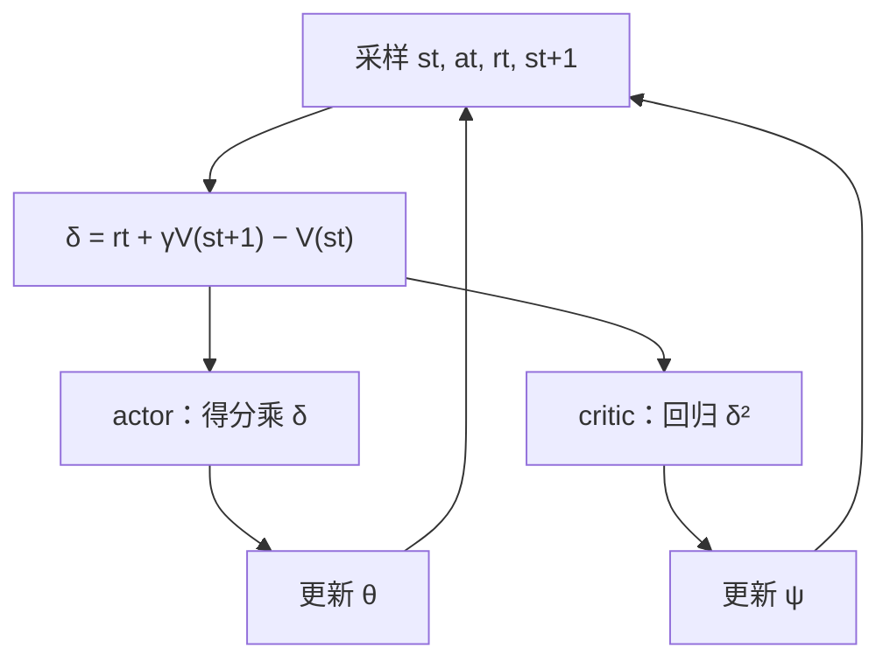
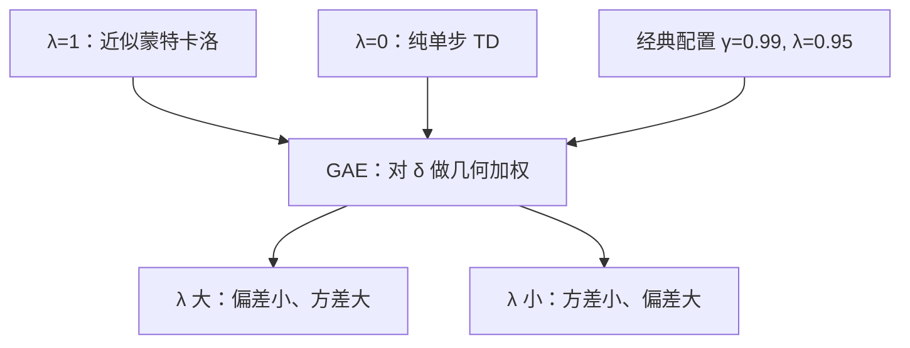

# actor-critic 与自举

蒙特卡洛要等剧终才结账；critic 学会自问「这一步之后还值多少」，让每一步当场结清——用一点偏差，买回大量方差与时间。

<footer>—— 据 Sutton &amp; Barto, 2018 §13.5；Schulman et al., GAE, ICLR 2016 整理</footer>

[上一课](/llm/baselines-advantage)证明了 $b=V^{\pi}$ 是好基线、优势 $A=Q-V$ 是干净的信用，但那里的 $V$ 仍靠回合末的蒙特卡洛回报回归——还是要等剧终，方差也原样保留。缺口是让 critic 自举：用 $r+\gamma V(s')$ 当回报的替身。本课写 actor-critic 的更新结构、自举带来的偏差-方差谱系，以及 GAE 的 $\lambda$ 如何把谱系连续化。

## 问题

蒙特卡洛优势 $\hat A_t=G_t-V(s_t)$ 有两笔账。时间账：回合不结束 $G_t$ 不存在，更新被回合长度卡住，采样预算被整条轨迹绑死。方差账：$G_t$ 是剩余轨迹的随机和，上一课的方差分析原样适用。无模型单元的 TD(0) 已给过答案的雏形——自举：不知道结局，就用当前估值 $V(s_{t+1})$ 顶上。把它搬进策略梯度，得到单步差分「自举」就是"拿自己的当前猜测当标准答案"：不知道整局游戏最后拿多少分，就先相信 critic 对下一状态的估值 $V(s_{t+1})$，用"这一步真实奖励 + 下一步的估值"来顶替"等到剧终才有的总回报"。好比给二手房估价时不等同邻屋真正成交，直接参考中介对邻屋的报价——快，但报价本身有错时就引入偏差。

$$
\delta_t=r_t+\gamma V_\psi(s_{t+1})-V_\psi(s_t),
$$

若 $V_\psi=V^{\pi}$，$\delta_t$ 恰是 $A^{\pi}(s_t,a_t)$ 的无偏样本。麻烦在 $V_\psi\neq V^{\pi}$：自举引入偏差，偏差大小由 critic 的误差决定。

## 方法

actor-critic 是两个学习器的交替。采样：用当前 $\pi_\theta$ 跑轨迹。critic 更新：最小化 $\delta_t^2$，即把 $V_\psi(s_t)$ 往 $r_t+\gamma V_\psi(s_{t+1})$ 拉——目标本身含 $V_\psi$，这就是「自举」。actor 更新：$\nabla_\theta\log\pi_\theta(a_t\mid s_t)\,\delta_t$，单步可用，不等回合。策略动、数据旧、critic 追：三个时间尺度不齐时 $\delta$ 的偏差最大，[Actor-Critic 稳定性](/llm/ac-stability)一课写的就是这个工程问题。谱系上把单步差分推广：$n$ 步优势用 $n$ 步真实奖励加一次自举；GAE 把所有 $n$ 做几何加权

$$
\hat A_t^{\mathrm{GAE}(\lambda)}=\sum_{l\ge 0}(\gamma\lambda)^{l}\,\delta_{t+l},
$$

$\lambda$ 一句话：从 0（纯单步 TD，低方差高偏差）到 1（近似蒙特卡洛，高方差低偏差）之间的连续插值旋钮。把 $\delta_t$ 想成"惊讶程度"：实际拿到的奖励加上对下一状态的期望，减去来之前的期望——差值就是这一步比预期好多少（正）或差多少（负）。actor 靠这份惊讶决定加码还是减码；critic 靠把它压回零来修正自己的估值。

求和验证 $\lambda=1$ 的残余偏差：$\sum_l\gamma^{l}\delta_{t+l}$ 望远镜式相消后等于蒙特卡洛回报减去末端截断处的 $\gamma^{T}V(s_{t+T})$——GAE(1) 仍含一次自举，不是纯 MC。经典配置取 $\gamma=0.99$、$\lambda=0.95$。

## 机制

自举省方差靠差分对消：设 $V_\psi=V^{\pi}+\epsilon$，则 $\delta_t=A^{\pi}(s_t,a_t)+\epsilon(s_t)-\gamma\epsilon(s_{t+1})$。GAE 求和里 $\epsilon$ 项按 $(\gamma\lambda)^{l}$ 几何衰减，$\lambda$ 越小衰减越快——critic 误差对优势的污染被压住，而 MC 回报里真实奖励的波动是全额进入。这就是偏差-方差谱系的机制版：$\lambda$ 调的不是「信多少步奖励」，而是「信多少 critic」。LLM 后训练里这笔交易的另一面是显存：价值头与策略同底座，反向多一整份；GRPO 干脆不买这份——用组基线换掉 critic，代价（时间结构）上一课已经算过。

数字感受一下 $(\gamma\lambda)^l$：$\gamma=0.99$、$\lambda=0.95$ 时 $\gamma\lambda\approx 0.94$，于是 10 步外的 critic 误差权重剩约 $0.54$，50 步外只剩约 $0.05$。也就是说 $\lambda$ 每往 0 挪一点，远处的 critic 猜错就更影响不到你——但远处真实奖励的影响也被一并衰减，这就是偏差那一头。

## 边界

自举把策略学习重新暴露在致命三要素之下：函数逼近、自举、离策略凑齐时有发散反例，本课程无模型单元讲过；这里只提醒，critic 的稳定性是 actor 的地基。价值头学不好时，$\delta$ 的噪声直接打进策略——看起来像「策略退化」，根因在 critic。奖励稀疏且回合超长时，中间步 $r_t=0$，$\delta$ 全靠 $V$ 差分传播信号，critic 误差被放大，这恰是 LLM 终端奖励的常态。$\lambda$ 是超参不是定理，没有单调性保证，选值依据是验证曲线。信任域问题——每次更新走多远——critic 帮不上忙，那是下一课。

## 小结

- actor-critic：critic 自举出单步优势 $\delta_t$，actor 用它加权得分，更新不等回合。
- 自举偏差换方差；$V_\psi$ 的误差在差分与 GAE 求和中按 $(\gamma\lambda)^l$ 衰减对消。
- GAE 的 $\lambda$ 是偏差-方差连续旋钮：0 是 TD，1 近似 MC（仍含末端自举项）。
- 经典配置 $\gamma=0.99$、$\lambda=0.95$；critic 质量决定 actor 上限。
- 致命三要素的风险随自举回归；LLM 稀疏终端奖励下 critic 误差被差分放大。
- 出处：Sutton &amp; Barto, 2018，§13.5；Schulman et al., *High-Dimensional Continuous Control Using Generalized Advantage Estimation*, ICLR 2016。
