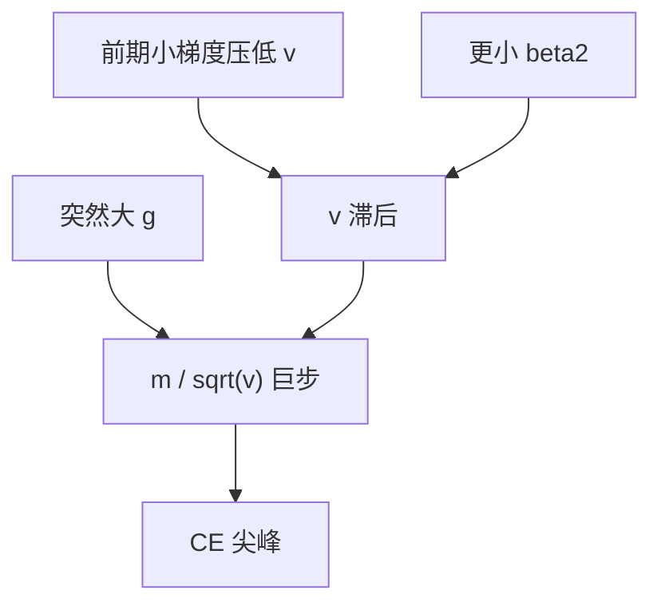

# β₂ 与损失尖峰

二阶矩若记得太久，梯度突然变大的那一步仍被旧的小 $v$ 除；有效步长瞬间放大，损失竖起一条尖刺。

<footer>—— Kingma & Ba 的 $\beta_2$ 默认；Wortsman et al., Small-scale proxies for large-scale Transformer training instabilities, ICLR 2024；Molybog et al., 2023</footer>

[上一课](/llm/adam-epsilon-update-scale)把分母地板 $\varepsilon$ 写清。缺口是分母里随时间变的那一项：$v_t=\beta_2 v_{t-1}+(1-\beta_2)g_t^2$。默认 $\beta_2=0.999$ 意味着半衰期约 $\ln 2/(1-\beta_2)\approx 700$ 步。若前一段梯度都很小，$v$ 很小；突然来一个大 $g$（坏 batch、长序列、数据配比切换），$m$ 跟上较快（$\beta_1=0.9$），$v$ 仍小，一步 $|m|/\sqrt{v}$ 极大。Wortsman 等人在小规模代理上复现大模型尖峰，并把 $\beta_2$ 降到 0.95 一类作为稳定杠杆。本课把尖峰从「数据坏了」里拆出优化器这一支。

## 问题

主干 [梯度裁剪](/llm/grad-clip-loss-spike) 能在 $\|g\|$ 上设天花板，但 Adam 的有效更新是 $m/(\sqrt{v}+\varepsilon)$。裁剪后的 $g$ 仍可能对某些坐标很大、对 $v$ 很小的坐标尤其大。全局 clip 不看 $v$。于是出现典型日志：grad norm 刚过 $c$ 或甚至未过，$|\Delta\theta|$ 已经很大，CE 尖峰。把这类尖峰全部归因于坏数据，会错过 $\beta_2$。

$\beta_2$ 越接近 1，$v$ 越平滑也越滞后。训练后期损失低、梯度小，$v$ 被压低，对后期突然的分布偏移更脆弱——这与「后期更稳」的直觉相反。Gopher / PaLM 报告的后期尖峰，一部分与此同构。

降低 $\beta_2$ 让 $v$ 更快跟上当前 $g^2$，尖峰变少，但每步更新噪声变大，最终损失可能略差。这是稳定性换效率，应在代理模型上同时看尖峰频率与幂律段斜率，不要只看「还炸不炸」。

## 方法

杠杆：

- 把 $\beta_2$ 从 0.999 降到 0.95 或 0.98（Wortsman 小代理与若干视觉-语言训练采用更小 $\beta_2$）。
- 保持 $\beta_1=0.9$，先只动 $\beta_2$；两个一起动无法归因。
- 与更大的 $\varepsilon$、更紧的 clip 做 $2\times 2$ 消融：三者都能减尖峰，作用坐标不同（滞后 $v$ / 冷坐标地板 / 全局幅度）。

实现注意偏置修正 $\hat v=v/(1-\beta_2^t)$。$t$ 小的时候修正把 $v$ 放大，减轻早期「$v$ 过小」；后期 $1-\beta_2^t\approx 1$，滞后问题完全暴露。因此只加长 warmup 而不改 $\beta_2$，对后期尖峰帮助有限。

不要在尖峰时手动把 $v$ 重置：那会让全体坐标忘记尺度，比尖峰更糟。skip 坏 batch 仍只对数据尖峰有效；若同一数据重放仍尖，偏向优化器。

## 机制

令某坐标旧 $v_{\mathrm{old}}\ll g_{\mathrm{new}}^2$。一步之后 $v_{\mathrm{new}}=\beta_2 v_{\mathrm{old}}+(1-\beta_2)g_{\mathrm{new}}^2$ 已经变大，所以尖峰往往是**单步或少数步**：随后 $v$ 跟上，更新恢复。若 CE 掉不回来，是权重已经被打到坏区（LN 统计崩、路由锁死），不是 $v$ 还没跟上。后者应回滚检查点，而不是指望再训几百步「磨平」。

与 [注意力 logit 增长](/llm/attention-logit-growth) 的耦合：熵塌缩后大多数 step 梯度极小，$v$ 被推低；偶尔一个需要软路由的 batch 带来大 $g$，正好踩中「小 $v$ 除大 $g$」。所以压 logit 增长也会减少这类 Adam 尖峰，不是两件无关的事。

## 边界

Adafactor 的事实分解、$1-\beta_2$ 随步数 schedule（有时称 $\beta_2$ warmup）是变体，本课不展开，只要求：若用了，日志里写明，不要和常 $\beta_2$ 的尖峰论文直接比频率。下一课把学习率敏感度放到 μP 实践里：$\beta_2$ 与 $\varepsilon$ 改完之后，窄模型扫到的 $\eta$ 才能比较有把握迁移。

## 小结

- $\beta_2$ 接近 1 时，$v$ 对突变梯度滞后，有效步长瞬间放大，形成非数据性尖峰。
- 降 $\beta_2$ 换稳定性、付更新噪声；与 $\varepsilon$、clip 分开消融。
- 后期更脆弱：梯度整体变小，$v$ 更低。
- 注意力塌缩会制造「长期小 $v$ + 偶发大 $g$」的搭配。
- 出处：Kingma & Ba, ICLR 2015；Wortsman et al., ICLR 2024；Molybog et al., 2023。
