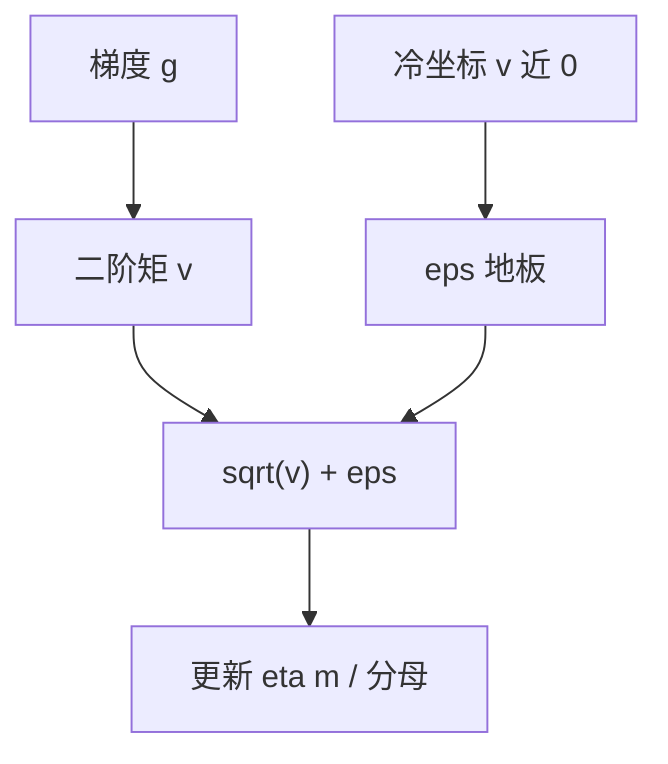

# Adam ε 与更新尺度

分母里的 $\varepsilon$ 本是为了避免除零；当二阶矩本身小于 $\varepsilon$，自适应步长不再由梯度尺度决定，而由这个常数决定。

<footer>—— Kingma & Ba, Adam, ICLR 2015；大模型中的不稳分析见 Molybog et al., A Theory on Adam Instability in Large-Scale Machine Learning, 2023</footer>

[上一课](/llm/post-ln-warmup)把 LN 位置与 warmup 对齐。缺口进入 [AdamW](/llm/adamw) 内部：更新是 $-\eta\,\hat m/(\sqrt{\hat v}+\varepsilon)$。主干写了解耦衰减，没有把 $\varepsilon$ 当成稳定性旋钮。Kingma 与 Ba 给的默认 $10^{-8}$ 在 FP32 全连接网上几乎看不见；LLM 里大量参数的梯度长期稀疏（词表尾、偏置、某些头），$\sqrt{v}$ 可以小于 $\varepsilon$，于是这些坐标的有效学习率变成 $\eta/\varepsilon$，与 μP 扫到的 $\eta$ 无关。本课写这个交叉，下一课写 $\beta_2$ 与尖峰。

## 问题

$v$ 是梯度平方的滑动平均。嵌入里罕见 token、刚被初始化的专家、以及 LN 的 $\gamma$ 在早期，都可以有 $g\approx 0$ 然后突然来一次非零 $g$。若此前 $v\approx 0$，分母 $\approx\varepsilon$，一步更新幅度是 $|g|$ 的 $\eta/\varepsilon$ 倍量级（再经 $m$ 平滑）。$\varepsilon=10^{-8}$、$\eta=3\times 10^{-4}$ 时 $\eta/\varepsilon=3\times 10^{4}$，对「几乎没见过梯度的坐标」是灾难。Llama 一类配方把部分参数组的 $\varepsilon$ 提到 $10^{-5}$ 或对 LN 单独分组，图的就是这个。

混合精度下还有第二条：$\sqrt{v}$ 在 BF16 里下溢到 0，即使 FP32 主权重上 $v$ 非零，若 $v$ 被错误地存成低精度，$\varepsilon$ 必须大到能当护栏。Molybog 等人从理论上讨论 Adam 在大规模训练中的不稳，与「分母过小 → 偶发巨步」同方向。

有的实现把 $\varepsilon$ **加在平方根里面**：$\sqrt{v+\varepsilon}$。这改变小 $v$ 时的渐近，与原论文 $\sqrt{v}+\varepsilon$ 不是同一更新。复现必须对到代码，不能只对到「AdamW, eps=1e-8」一行。

## 方法

分组而不是全局拧：

- 隐藏 GEMM：可保留 $10^{-8}$，它们的 $v$ 通常够大。
- 嵌入 / lm_head：更大的 $\varepsilon$ 或更小的 $\eta$，避免热 token 以外的行被 $\eta/\varepsilon$ 抽打。
- LN / RMSNorm 的 $\gamma,\beta$：维度极小，$v$ 估计噪，常常需要更大 $\varepsilon$ 或从自适应里拿出来用 SGD 式更新（少见，但应知道选项）。

coord check：在代理模型上画各层 $|\Delta\theta|/|\theta|$ 的中位数。若嵌入组比隐藏层大几个数量级，先查 $\varepsilon$ 与 $\eta$ 分组，再查是否忘了把嵌入从过大的全局 $\eta$ 里拆出。

不要用增大 $\varepsilon$ 去「当权重衰减」或「当 clip」：$\varepsilon$ 只在 $v$ 小的坐标上起作用，对已经很热的坐标几乎恒等。持续贴顶的梯度范数应回到上一课，而不是把 $\varepsilon$ 改成 $10^{-3}$ 把全体自适应关掉。

## 机制

Adam 本意是用 $\sqrt{v}$ 当每坐标 RMS 梯度，使更新与梯度尺度无关。$\varepsilon$ 是该估计的地板。地板一旦主导，自适应消失，退化成「大学习率 SGD + 动量」，且只发生在冷坐标上——最冷的坐标一步走最远。这与直觉「稀疏该学慢」相反。权重衰减在这些坐标上若仍按 $\eta\lambda$ 解耦乘，相对那一次巨步可以忽略，于是冷行的范数被单次更新决定。

μP 的表假设更新由正确的自适应尺度主导。$\varepsilon$ 主导时，宽度迁移失效：窄模型上所有坐标都够热，$\varepsilon$ 看不见；宽模型词表行更冷，$\varepsilon$ 突然接管。这是后课「学习率敏感度与 μP 实践」必须把 $\varepsilon$ 写进检查清单的原因。

## 边界

本课不改 $\beta_1,\beta_2$；$\beta_2$ 决定 $v$ 的记忆长度，下一课专门对尖峰。Adafactor、Lion、Sophia 有自己的地板与因式分解，不能把 Adam 的 $\varepsilon$ 数字贴过去。Fused Adam 的数值顺序（先加 $\varepsilon$ 再开方还是相反）属于实现，验收靠一小步对照非融合核，不要假设硬件核与论文公式逐位相同。

## 小结

- $\varepsilon$ 是自适应分母的地板；冷坐标上有效学习率变成 $\eta/\varepsilon$，可远大于名义 $\eta$。
- 按嵌入、LN、隐藏层分组，不要全局拧到 $10^{-3}$ 关掉 Adam。
- $\sqrt{v}+\varepsilon$ 与 $\sqrt{v+\varepsilon}$ 是不同更新；低精度存储 $v$ 会让地板更早接管。
- $\varepsilon$ 主导时 μP 迁移假设破裂。
- 出处：Kingma & Ba, ICLR 2015；Molybog et al., 2023。
