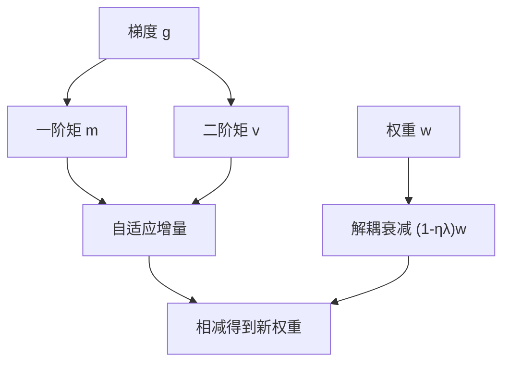

# AdamW

把权重衰减从损失里的 $L_2$ 项拆出来，与自适应学习率解耦，衰减才真正按权重本身的尺度进行，而不是被梯度二阶矩歪曲。

<footer>—— Loshchilov & Hutter, Decoupled Weight Decay Regularization, ICLR 2019</footer>

Adam 用梯度的一阶与二阶滑动平均给每个参数自己的步长，训练深度网络很稳，却长期和「权重衰减」以一种错误的方式绑在一起。许多人在损失上加 $\frac{\lambda}{2}\|w\|^2$，再把这项的梯度喂给 Adam，以为自己在做与 SGD 相同的衰减。Loshchilov 与 Hutter 指出：在自适应方法里，这不等于对权重做与尺度无关的衰减。AdamW 把衰减写成参数更新里单独的一项，与 Adam 的自适应步长解耦。它此后成为 Transformer 预训练的默认优化器，Gopher、Llama 以及后续解码器几乎都建立在这一更新上。

## 问题

SGD 带权重衰减的更新可以写成

$$
w \leftarrow w - \eta \bigl(\nabla \ell(w) + \lambda w\bigr) = (1-\eta\lambda)w - \eta\nabla\ell(w).
$$

$\lambda$ 直接把权重乘以一个略小于 1 的因子，与梯度尺度无关。Adam 把有效步长改成 $\eta / (\sqrt{\hat v}+\varepsilon)$，若把 $L_2$ 项的梯度 $\lambda w$ 加进 $g$，再拿 $g$ 去更新 $m,v$，则衰减强度被 $\sqrt{v}$ 调制：梯度长期较大的坐标，衰减反而被压小；稀疏坐标衰减相对更大。结果是：$L_2$ 正则在 Adam 里不再对应「所有权重同样向零拉一点」，超参 $\lambda$ 的含义随层、随坐标而变，迁移 SGD 上调好的衰减系数会失效。

预训练规模下这个问题被放大。嵌入、注意力投影、FFN 的梯度尺度差一个数量级，词表尾部更稀疏。若衰减被 $v$ 歪曲，正则实际落在错误的参数子集上，表现为泛化差或需要把 $\lambda$ 调到难以解释的范围。AdamW 要修的就是这一耦合，而不是另造一种动量。

### $L_2$ 与衰减在自适应方法里不是同一件事

在固定学习率的 SGD 上，损失加 $L_2$ 与更新时乘 $(1-\eta\lambda)$ 等价（忽略耦合进 batch 统计的细节）。Adam 打破了等价。Loshchilov 与 Hutter 的贡献是把已经在 SGD 里有效的那一种——解耦衰减——写回 Adam 的更新公式，并证明它在多种网络上泛化更好、对 $\lambda$ 更可调。名称里的 W 是 weight decay，不是一种新自适应机制。实现里若仍把 `weight_decay` 加进损失再调用普通 Adam，得到的是 Adam+$L_2$，不是 AdamW。框架默认有时会踩这个坑。预训练配置必须确认衰减发生在参数更新上，且对 bias、LayerNorm/RMSNorm 的增益是否豁免有明确政策。

## 方法

Adam 维护

$$
m_t=\beta_1 m_{t-1}+(1-\beta_1)g_t,\qquad
v_t=\beta_2 v_{t-1}+(1-\beta_2)g_t^2,
$$

再偏差修正得 $\hat m_t,\hat v_t$。AdamW 的参数更新为

$$
w_t = (1-\eta_t\lambda)\,w_{t-1} - \eta_t \frac{\hat m_t}{\sqrt{\hat v_t}+\varepsilon}.
$$

衰减项 $(1-\eta_t\lambda)w$ 不进入 $m,v$。$\eta_t$ 仍可走 warmup 与余弦；$\lambda$ 与 $\eta$ 的乘积决定每步收缩，因此学习率日程会改变有效衰减总量——这是解耦后仍要记住的耦合：日程不是只改步长。常见默认 $\beta_1=0.9$，$\beta_2=0.95$ 或 $0.999$，预训练里 $\beta_2=0.95$ 更常见，因为长训练下 $0.999$ 的二阶矩过慢。

### 哪些参数不衰减

预训练惯例：对二维以上的权重矩阵做衰减，对 bias、归一化的 $\gamma,\beta$ 以及有时对嵌入不做衰减。理由是这些参数的尺度本身在起正则或校准作用，再向零拉会破坏 LayerNorm 的恢复能力，或把词向量范数压得过低。政策必须与模型结构一起写进配置：RMSNorm 只有 $\gamma$ 时，豁免列表与 LayerNorm 不同。词表很大时，嵌入是否衰减会显著改变尾部词的范数，和上一篇的 $V$ 选择互相影响。

$\lambda$ 的数量级常在 $0.01$ 到 $0.1$，但必须与 $\eta$ 一起读。有的实现把衰减写成独立于学习率的乘数，有的写成 $\eta\lambda$。同一论文里的 $\lambda$ 换实现可能差一个 $\eta$ 因子。复现 Gopher / Llama 的优化设置，应对照它们使用的框架语义，而不是只抄一个数字。

## 机制

解耦之后，每个坐标仍享受 Adam 的按坐标步长，但向零的拉力与该坐标的 $v_t$ 无关。梯度噪声大的层不会因此「免于衰减」；梯度长期很小的层也不会被相对过强的 $L_2$ 项推到零。这让 $\lambda$ 重新成为全局可解释的超参：它约束的是权重范数的时间演化，而不是被 $v$ 加权过的混合量。

与预训练稳定性的关系是间接的。AdamW 不消除损失尖峰，也不替代梯度裁剪与学习率 warmup。它提供的是：在很长的 token 预算上，权重不会因自适应缩放而在某些层失控膨胀。衰减过强会欠拟合，表现为训练损失偏高；过弱则与高学习率叠加，造成范数漂。日志里应同时看损失与主要矩阵的 RMS，而不是只看损失。

### 和数据、词表的交界

有效衰减作用于「被更新的参数」。大词表尾部很少见到梯度，Adam 的 $v$ 很小，若错误地用耦合 $L_2$，尾部可能被异常衰减；解耦后尾部主要是「不怎么动」，范数保持初始化附近。这影响未见子词的行为。数据若高度重复（未走 Lee 式去重），某些嵌入被反复拉，另一些永不更新，衰减政策的不对称会被放大。优化器不能替代去重，但去重失败会表现为「只有 AdamW 调不好」的假象。

## 边界与工程取舍

AdamW 不是唯一能训 Transformer 的方法。后续矩阵优化器、Muon 一类工作针对层的二维结构改预条件，可能在部分设定里更省步数。那是后话。对今日大多数从零预训练，AdamW 仍是基线：实现成熟、超参社区有记忆、与混合精度和大规模数据并行兼容。换优化器应先在固定数据与日程上比，不要和配比、词表一起改。

数值上，$\varepsilon$ 过小在 BF16 下可能不稳；过大则削弱自适应。权重衰减与梯度裁剪的顺序按实现而异，应固定一种。学习率若按层缩放（μP），$\lambda$ 是否随宽度缩放是另一组决策，不能从 Loshchilov 与 Hutter 2019 年的图像实验直接外推到千亿解码器。Gopher、Llama 提供的是语言模型尺度上的工作点，不是定理。

把 AdamW 写成「正则所以能泛化」过于笼统。解耦衰减更接近对参数范数的约束，泛化来自这一约束与过参网络的合谋，而不是来自 Adam 的矩估计。关掉衰减、只靠早停，在预训练这种不允许按验证集随便早停的设置里通常更差。衰减是长时间训练的默认闸，不是可选项。

最后，不要在损失曲线上寻找 AdamW 的「形状特征」。它与 Adam+$L_2$ 的差别主要在最终泛化与 $\lambda$ 可调性，前期损失可能几乎重合。对照实验必须跑到足够 token，并用下游探针，而不是看前 1% 步谁降得快。那一段通常由学习率 warmup 与数据顺序主导。

## 小结

- AdamW 把权重衰减从 Adam 的矩更新里拆出，使衰减不再被 $\sqrt{v}$ 调制。
- 在自适应方法里，损失加 $L_2$ 不等于 SGD 意义下的权重衰减；实现必须写对。
- 更新为 $w\leftarrow(1-\eta\lambda)w-\eta\hat m/(\sqrt{\hat v}+\varepsilon)$；$\lambda$ 与学习率日程仍通过 $\eta\lambda$ 耦合。
- bias 与归一化参数通常不衰减；嵌入是否衰减要与词表大小一起定。
- 它是预训练默认优化器，不替代裁剪、warmup、数据清洗与配比。
- 重复数据与稀疏尾部词会让衰减表现失常，应先修数据再怪优化器。
- 出处：Loshchilov & Hutter，*Decoupled Weight Decay Regularization*，ICLR 2019；预训练实践对照 Gopher、Llama 等大规模解码器设定。
