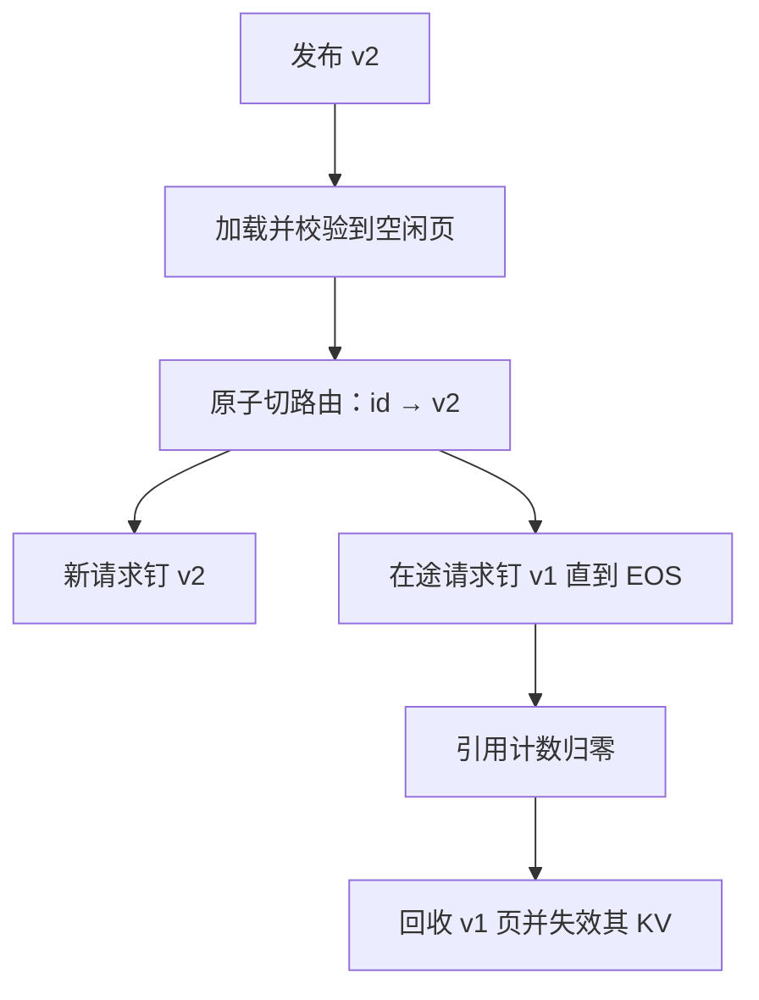

# 适配器热更新

    
换一份 $A,B$ 不该等于重启引擎；进行中的 decode 必须钉住旧页，新请求才看见新版本，KV 与路由键一起换代。

    <footer>—— 对照多 LoRA 服务中适配器作为可换页对象，以及发布时的版本钉扎</footer>

[LoRA](/llm/lora) 体积小，看起来可以像配置一样随时替换。生产里替换的是正在被若干请求逐步读的权重：某一步的 $A$ 来自 v1、$B$ 来自 v2，前向在数学上仍能跑完，语义已经不是任何一次训练的结果。热更新要保证的不是「文件能覆盖」，而是一次**原子换代**：旧版本对在途请求只读，新版本只对换代之后到达的请求可见，与该版本绑定的 KV 不得被新版本复用。本篇写这条约定，加载器实现见 [LoRAX](/llm/lorax-serving)，合并态下的额外约束见 [dLoRA](/llm/dlora)。不编造一篇名为 adapter hot-swap 的经典论文。

## 问题

适配器的发布频率高于基座：策略改一句、分类头重训一晚、客户数据再灌一轮，都可能出一份新的 $A,B$。若更新路径是停引擎、拷文件、再启动，[连续批](/llm/continuous-batching) 里所有流式连接断开，CUDA Graph 重捕获，冷启动的 TTFT 尖刺会写进当天的 P99。若更新路径是直接 `memcpy` 到正在服务的缓冲，decode 中途换权重，用户会看到风格突变、工具格式破裂，更糟的是安全策略 LoRA 在半句之后失效。

还有缓存。引擎内部的 [前缀缓存](/llm/prefix-caching) 与集群 [KV 感知路由](/llm/kv-aware-routing) 都把「模型身份」写进键。键若不含适配器版本，新权重会吃到旧 KV：位置编码还对，内容已经是另一套 $\Delta W$ 编出来的。表现为「提示没变、回答像在读旧说明书」。

### 进行中的请求是钉住的快照

自回归把一次请求拆成许多迭代，每一迭代都读当前 $W_0$ 与当前 $BA$。热更新若在迭代之间插入，等于在序列中途换模型。产品几乎总是不允许：聊天中途改人设、分类器中途改类别表，审计无法复盘。正确语义是请求级快照——`accept(request)` 时锁定 `(adapter_id, version)`，直到 EOS 或取消。新版本只影响锁定期之后的到达。

「热」指进程不重启、基座不重载，不指零等待。加载新页、校验形状、切路由、等旧引用计数归零，都可以是数百毫秒到数秒。看板应把这次发布标成一次计划内的尾延迟事件，而不是当成无成本。

## 方法

把适配器对象做成不可变页：一份 $A,B$ 带内容哈希，引用计数等于「正在用它做前向的请求数」。发布 v2 时：

1. 加载 v2 到空闲缓冲，校验层名、秩、dtype、$\alpha$ 与基座是否可服务。失败则发布中止，v1 继续。
2. 原子地把路由表里 `adapter_id → 当前版本` 从 v1 改为 v2。此后新请求只看见 v2。
3. v1 页保持只读，直到引用计数为零，再归还 HBM / CPU 缓存。
4. 使与 v1 绑定的前缀 KV 失效，或把版本写入缓存键，让旧 KV 自然 miss。不要在 v2 请求上复用 v1 的块。

合并态更严。若卡上跑的是 $W_0+B_1A_1$，热更新要么先解合并再换页，要么准备一份新的 $W'=W_0+B_2A_2$ 双缓冲切换。切的瞬间，运行集里不能混用两份满秩权重，除非引擎真的为两份 $W$ 做了双背景——那已经是两份基座的显存账。[Punica](/llm/punica) 的不合并路径更适合频繁换代：只换小页，背景 GEMM 不动。

### 双缓冲与排水

高峰期引用计数可能长时间不为零（一条 `max_tokens` 很大的写作）。发布不能无限等。策略有三：等到超时再**取消**仍钉 v1 的请求并 409/503；允许 v1/v2 在不合并核里共存直到自然结束（显存付两份适配器）；对超长请求在迭代边界**抢占**，让客户端重试——重试必须带幂等键，以免工具侧效果执行两次。双缓冲的容量要预留，否则「热更新」会在 KV 池已满时 OOM。

HTTP 契约：客户端应能指定版本或接受「服务端当前」。返回体带实际生效的版本哈希，便于客诉对照。`model` 字段若是别名，别名切换等于热更新，日志里要留下别名→哈希的解析。加载中的新请求进该适配器的隔离队列，不要用基座顶上并 200。

## 机制

原子性来自「指针切换，而不是原地改矩阵」。SGMV 一类 gather 核吃的是页地址数组；把某 `adapter_id` 对应的指针从页 1 换成页 2，已启动的 kernel 仍用启动时拍下的地址，下一迭代才读新指针——因此切换应落在迭代边界，并与调度器的运行集更新同一把锁。若在 kernel 运行中改指针，就是数据竞争，不是热更新。

### 版本必须写进 KV 与路由指纹

KV 失效的原因是函数变了。同一 token 前缀，v1 与 v2 的键值投影不同，注意力分数不同。前缀缓存若只哈希 token 而不哈希适配器版本，就会把 v1 的 KV 喂给 v2。路由表同样：集群若按 `adapter_id` 粘滞却不按版本，会把请求打到仍持有旧 KV 的副本，表现为假命中、错回答。版本必须进入指纹。

安全类适配器（拒答风格、分类头）的热更新要当政策发版：先在影子流量比对类别分布，再切主路径。只换文件不比对，等于在生产做一次未评测的对齐。

## 边界与工程取舍

不是所有「适配器」都能热更新。插层集合变了、新增模块、词表加了特殊 token，计算图已变，应走滚动重启，不要假装换页。基座权重本身的更新不是本篇范围：那是另一份数 GB 的对象，通常蓝绿副本。QLoRA 基座 4-bit 与 LoRA 的数值耦合若在 v2 改变缩放，仅换 $A,B$ 可能溢出；校验规则要把量化配置算进去。

多卡 TP 下，每一张卡上的切片必须同版本；不能出现 rank 0 已切 v2、rank 1 仍 v1。切应做成栅栏：全部加载成功再一起改指针。跨区域见 [多区域故障转移](/llm/multi-region-failover)：一区先切、一区后切的窗口里，同一用户来回打会看到两种人格——要么会话粘滞到区，要么接受短暂不一致并在网关写明。

不要用「覆盖同一路径上的 `.safetensors`」当发布。文件系统可见性、mmap 缓存、已经 map 进进程的旧页，三者不同步。发布物应是新对象键，旧键只读到引用为零。

## 小结

- 热更新是迭代边界上的指针切换：在途请求钉旧页，新请求钉新页；禁止一步之内 $A$ 与 $B$ 跨版本。
- 适配器版本必须进入 KV 缓存键与集群路由指纹，否则会复用错误的前缀状态。
- 合并态要双缓冲满秩权重或先解合并；不合并路径更适合频繁换代。
- 引用计数排水、超时取消、双页共存是容量问题，要预留 HBM。
- 图结构变化或词表变化应滚动重启；安全适配器按政策发版评测。
- 出处：对照 Punica / S-LoRA / LoRAX 把适配器当可换页对象的实现惯例，以及请求级快照的服务语义；无单独经典论文名。
