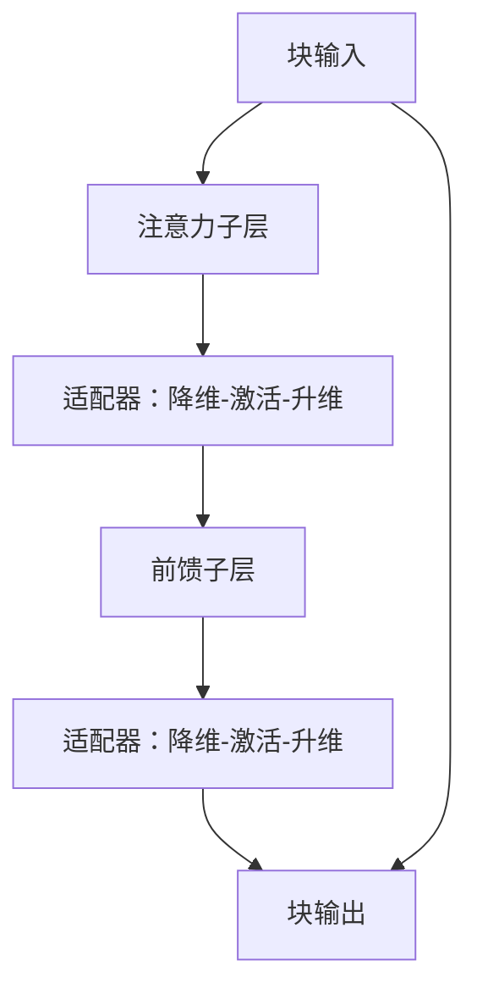

# Adapter 层

在冻结的 Transformer 块里插入瓶颈：先压到很小的维，再扩回原宽，用残差把这点增量加回去。任务换一份小模块即可，不必复制整网。

<footer>—— Houlsby 等，Parameter-Efficient Transfer Learning for NLP，ICML 2019</footer>

LoRA 出现之前，NLP 里已经有一条成熟的参数高效路线：Houlsby 等人在 BERT 类模型的注意力与前馈之后各插一个瓶颈适配器，基座冻结，只训适配器与层归一化。下游每个任务一份适配器，体积远小于全参副本，切换任务就是切换这几层小矩阵。今日它不再是大模型微调的默认——LoRA 把增量融进现有线性层，推理可以合并得更干净——但瓶颈残差这一结构仍是后续 PEFT 的原型：先降维、再非线性、再升维、加回原流。理解 Adapter，是为了看清 LoRA、IA3 各自省略了什么。

## 问题

逐任务全参微调在 BERT 时代已经贵：任务数量乘以模型副本，部署与存储先爆。特征提取（全冻只训分类头）又往往不够，因为分类头看不见需要改写的内部表示。需要一种插入式模块：参数少、能改中间表示、任务之间隔离。插入位置必须与 Transformer 的残差对齐，否则冻结主干的梯度高速公路会被打断，适配器自己也难训。

瓶颈是容量与成本的折中。适配器宽度若等于隐层宽度，参数量回到与一层 FFN 同阶，失去「高效」。若过窄，非线性再强也表达不了任务所需的方向。Houlsby 等人把这个问题写成可扫的瓶颈维 $d_a\ll d$，并用实验表明百分之几的额外参数即可在 GLUE 上接近全参微调。问题的另一半是放几处：只放 FFN 后，还是注意力后也放；以及适配器内部要不要自己的残差与归一化。

### 与分类头微调的差别

只训头，等于假设预训练表示已经是任务的充分统计。适配器允许在每一块之后对表示做一次任务相关的非线性修正，再送入下一块。修正是局部的、可叠加的：深层适配器看到的是已经被浅层适配器改过的表示。这比「最后线性探针」强，又比「所有 $W$ 都动」隔离——任务 A 的适配器不会改写任务 B 要加载的那些矩阵。

Houlsby 适配器是串在子层输出上的模块，不是低秩分解原权重。LoRA 后来把「增量」塞回 $W$ 的加性低秩项，推理可合并；经典 Adapter 在推理期仍是额外的两层小 MLP，除非另行蒸馏或折叠。

## 方法

记子层输出为 $h\in\mathbb{R}^{d}$（注意力或 FFN 之后）。Houlsby 适配器为

$$
h \leftarrow h + W_{\mathrm{up}}\,f(W_{\mathrm{down}} h),
$$

其中 $W_{\mathrm{down}}\in\mathbb{R}^{d_a\times d}$，$W_{\mathrm{up}}\in\mathbb{R}^{d\times d_a}$，$f$ 为非线性（原文用 GELU）。内部残差保证初始化若令 $W_{\mathrm{up}}$ 近零，适配器起步接近恒等，不破坏预训练前向。每个 Transformer 块插两处：多头注意力之后、前馈之后，都在块级残差与 LayerNorm 的既有结构里。可训练参数还包括 LayerNorm 的仿射，以便尺度能跟着任务走。

瓶颈比 $d_a/d$ 给出额外参数相对基座的比例：两处适配器、每处 $2dd_a$，再乘层数。$d_a=64$、$d=768$ 的 BERT-Base 上，额外参数大约几个百分点。训练时基座权重 `requires_grad=False`。多任务即多套 $(W_{\mathrm{down}},W_{\mathrm{up}})$，推理加载对应套件。

后续工程把插法收窄：例如只在 FFN 后插一个适配器（常称 Pfeiffer 风格），参数再减一截，很多任务上足够。这不否定 Houlsby 的双插入，只是说明「注意力后再改一次」并非所有下游都必要。

## 机制

### 瓶颈非线性比线性低秩多了什么

LoRA 的 $BA$ 是线性的（再乘常数 $\alpha/r$）。适配器在瓶颈里放了 $f$，可以在 $d_a$ 维里做按坐标的弯曲，再映回 $d$ 维。对需要「门控某些特征、折叠另一些特征」的任务，这一点非线性有用。代价是无法把适配器合并进相邻的冻结线性层：GELU 挡在中间，$W_{\mathrm{up}}f(W_{\mathrm{down}}W_0x)$ 不等于某张新的线性权重乘 $x$。因此 Adapter 的部署默认永远多两次小矩阵乘，LoRA 合并后可以是零额外层。这是结构表达力与推理开销的交换。

残差加近零初始化，使早期梯度主要流过主干，适配器慢慢承担任务差。若 $W_{\mathrm{up}}$ 随机且尺度大，插入本身就会把预训练表示打偏，冻结主干无法纠正——因为主干不更新。这一初始化纪律与 LoRA 的 $B=0$ 同类。

适配器的降维是任务相关的随机（可学习）投影，不是 PCA。它不必保留预训练的主方差方向；它可以丢掉对当前任务无用的方差，这正是迁移所要的。

### 任务隔离与组合

每套适配器是独立参数。切任务不改 $W_0$，没有权重算术冲突。若要同时服务两个任务，可以把两套适配器的输出相加，或在瓶颈维拼接再学一个混合，但那已超出原文设定。原文的使用方式是：一份基座，任务之间硬切换。与 LoRA 融合（任务向量相加）相比，Adapter 的非线性使「相加再训练」没有同样干净的代数。多适配器并行服务是工程层的路由问题，不是瓶颈公式自带的性质。

## 边界与工程取舍

在今日解码器大模型上，Houlsby 双插入加每层两次额外 MLP，训练吞吐与推理延迟都不如可合并的 LoRA。它仍适用于：必须保留非线性瓶颈、需要与 2019 年以来的适配器库兼容、或研究「插入式模块」本身。瓶颈维 $d_a$ 与 LoRA 的 $r$ 不是同一单位：一个是非线性隐层宽，一个是线性低秩。把 $d_a=r$ 当公平对照会低估或高估某一方，对照应比可训练参数量与推理 FLOPs。

LayerNorm 是否解冻影响很大。只训适配器、冻住 LN，尺度不能跟任务走，有时表现为怎么加 $d_a$ 都不涨点。解冻 LN 则每任务要存 $\gamma$、$\beta$，切换时漏加载 LN 会出现「适配器在、模型仍像基座」的假失败。

Adapter 不是 IA3。IA3 用向量去乘激活，没有瓶颈 MLP。也不是 Prefix-Tuning：前缀改注意力记忆，适配器改子层输出的特征。三个名字常被堆在 PEFT 综述里，插入点与函数类都不同。

### 何时仍优先 Adapter

需要在冻结主干上表达明显非线性的任务偏移，且推理可以承受额外 MLP；或监管、合规要求「基座权重字节级不变、增量可审计地隔离」——瓶颈模块作为独立文件比合并后的 $\Delta W$ 更好拆送。若目标是单卡训 65B 再合并部署，LoRA / QLoRA 更顺。把 Houlsby 结构当作默认插入 PEFT，在 2019 年正确，在今日需要显式理由。

## 小结

- Houlsby 适配器是插在注意力与 FFN 之后的瓶颈残差：降维、非线性、升维。
- 近零升维初始化使起步接近恒等，基座冻结仍可稳定训练。
- 非线性挡在中间，默认不能合并进相邻线性层，推理保留额外矩阵乘。
- 瓶颈维决定容量；后来的单插入变体用更少参数换接近的效果。
- 任务之间靠整模块切换隔离；非线性使简单的权重加法融合不像 LoRA 那样干净。
- 与 LoRA、前缀、IA3 的差别在插入点与函数类，不只在参数量。
- 出处：Houlsby 等，*Parameter-Efficient Transfer Learning for NLP*，ICML 2019。
