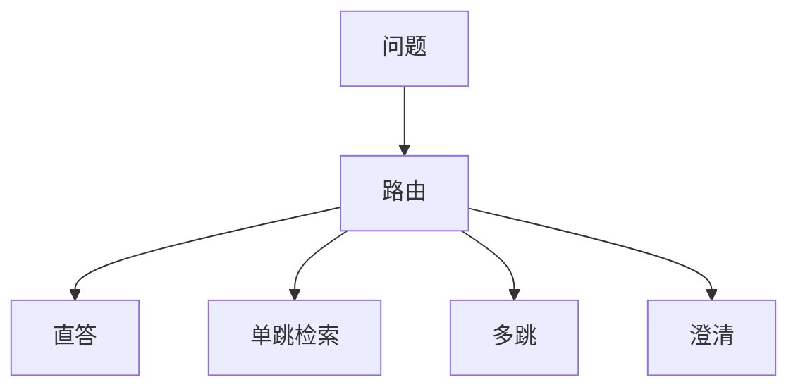

# 自适应 RAG

不是每个问题都该检索。参数已会的短事实检索会引入噪声；需要证据的问题不检索会编造。路由本身要被评测。

<footer>—— Jeong 等 Adaptive-RAG；检索触发与迭代深度当决策</footer>

[上一课](/llm/rag-evaluation)给出能否定位故障段的指标。下一步是策略：何时检索、检索几次。Jeong 等人的 Adaptive-RAG 按问题复杂度选单跳、多跳或直答。缺口是把检索当**可选动作**，而不是管道常量。后课上下文压缩默认：已经决定检索之后，才谈塞进窗口之前怎么剪。

## 问题

一律检索：延迟固定税、无关块污染、过时索引干扰已掌握的常识。一律不检索：私有知识与时效问答失败。需要分类器或小模型估复杂度：简单事实直答，需要证据则检索，需要组合则多跳。分类错误的代价不对称——漏检索通常比多余检索更伤事实任务，阈值应偏召回。

与[弃权](/llm/abstention-calibrated-refusal) 的关系：低校准自信时应检索或拒答，而不是硬编。自适应是决策，校准是输入特征之一。

用 LLM 自己说「我需要检索吗」会自我偏好式地乱。应用独立路由头或规则（含时间词、含内部文档名则检索）。

## 方法

路由特征：问题类型、是否含私有实体、口头或模型自信、历史检索失败。动作：直答 / 单跳 / 多跳 / 澄清。用[评测课](/llm/rag-evaluation)的分列指标做决策的奖励：多余检索惩罚延迟与忠实度下降。上线后用[部署监控](/llm/deployment-monitoring)看路由漂移。

## 机制

检索改变条件分布：加入块等于换上下文。路由是在估计「当前参数分布是否足够」。估计器若与阅读器同参数且未单独训，会把「我会说」当成「我知道」。分离路由头、用检索是否改变答案的反事实当监督，更接近决策质量。

## 边界

自适应不是关闭索引的借口。下一课：决定检索之后，块仍可能超出窗口，需要压缩。

## 小结

- 检索是动作，不是常量；漏检索与多余检索代价不对称。
- 路由要独立监督与分列指标，不能只靠模型自述。
- 复杂度阶梯：直答 / 单跳 / 多跳。
- 出处：Jeong 等 Adaptive-RAG。
