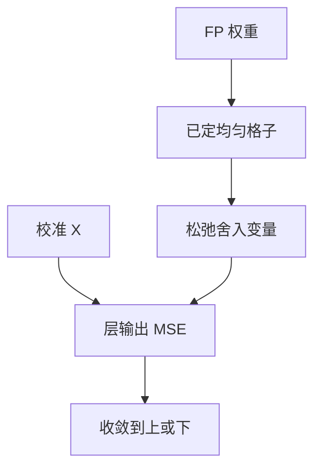

# AdaRound

最近邻舍入最小化的是权重误差；层输出误差的最优整数点往往在台阶的另一侧。AdaRound 在校准激活上把舍入当成可学习的二值决策。

<footer>—— Nagel et al., Up or Down? Adaptive Rounding for Post-Training Quantization, ICML 2020</footer>

[校准集](/llm/calibration-set) 给出层输入 $X$。本课在均匀格子上问：每个权重该向上还是向下取整。缺口是 RTN（round-to-nearest）对 $\|W-\hat W\|$ 最优，对 $\|WX-\hat W X\|$ 不必最优。[GPTQ](/llm/gptq) 用二阶补偿改邻居权重；AdaRound 不改连续值补偿，而改 **离散选择本身**。后课 Hessian 感知会把两条线接到一起。

## 问题

RTN 在 $|x|$ 大时一步台阶的绝对误差大，但若该方向的 $X$ 能量小，输出不疼；反之，小权重落在高能量方向上，RTN 仍就近，输出很疼。校准 $X$ 把「能量方向」读进来，舍入应偏向减小 $WX$ 误差的那一侧。缺口就是承认：**量化器的最近邻几何 ≠ 任务几何**。没有 $X$，AdaRound 退回 RTN。

AdaRound 原论文面向视觉网络 PTQ。LLM 上同类思想出现在后续重建量化里。本课讲机制；大规模默认路径仍常是 GPTQ/AWQ，但舍入不必是最近邻这一课要先立住。

## 方法

对已确定 $s$ 的均匀量化，每个权重落在两个相邻整数之间。Nagel 等人把选择松弛成可学习变量，目标是校准上的层输出 MSE，加正则把松弛推回 0/1，逐层优化。不回传全网，仍是 PTQ；比纯 RTN 贵（每层要跑一轮小优化），比 QAT 便宜。

与 GPTQ 分工：AdaRound 假定格子已定，只动舍入；GPTQ 在列上取整并用 Hessian 改未量化列。可以先 AdaRound 再当初始化，或只在较小模型上用 AdaRound，175B 上 GPTQ 的块 Cholesky 更常见。不要把两者写成互斥教条。

## 机制

局部目标 $\min \|\hat W X - W X\|_F^2$ 对每个舍入位是组合问题。松弛 + 退火正则把它变成连续优化，局部极小对应一套一致的上/下模式。校准偏了，模式拟合错误 $X$，换域更差——比 RTN 更过拟合校准，因为自由度正好用在这批激活上。

计算：每层一次优化，内存要放 $W$ 与 $X$。宽层、长校准会贵。分组量化时，舍入仍逐元素，尺度按组固定。

## 边界与工程取舍

不要在没有校准的「即时量化」里谈 AdaRound。不要期望它解决离群绑架 $s$ 的问题——$s$ 错了，两侧台阶都远。先粒度与校准，再舍入。下一课用 Hessian 显式做二阶，GPTQ 是 LLM 规模的可用算法。

## 小结

- RTN 优权重 MSE；层输出 MSE 的最优舍入可以是另一侧。
- AdaRound 在校准 $X$ 上学习上/下，仍是逐层 PTQ。
- 比 RTN 更拟合校准域；集必须对。
- 与 GPTQ 补偿正交：一个改离散选择，一个改剩余连续权重。
- 出处：Nagel 等 ICML 2020 AdaRound。
