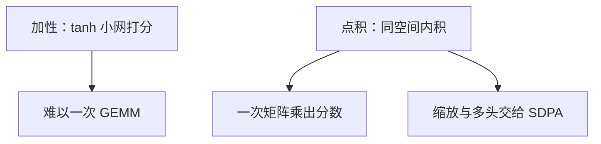

# 从加性注意力到点积

若查询与键已经躺在同一内积空间里，匹配分数就是点积；加性网络多出来的 tanh 层并不是寻址接口本身。

<footer>—— 据 Luong, Pham &amp; Manning, Effective Approaches to Attention-based Neural Machine Translation, EMNLP 2015；Vaswani et al., NeurIPS 2017 整理</footer>

[注意力作为内容寻址](/llm/attention-content-address)给出查询、槽、软地址、读出。本课不重画四件套。缺口是：Bahdanau 的 $s$ 是一个小 MLP，每对 $(q,m_j)$ 都要跑。若先把查询和键线性映到同一 $\mathbb{R}^{d_k}$，匹配可以用[范数、余弦与投影](/llm/norm-cosine-projection)里的点积 $q^\top k_j$，一次矩阵乘出全部分数。本课只完成这一替换。**不**写 $\mathrm{softmax}(QK^\top/\sqrt{d})$ 的完整缩放点积注意力，不写多头、不写因果自注意力——那是主干 [SDPA](/llm/sdpa) 的课。

## 问题

加性打分表达力强，但在 $n$ 个槽上无法收成一次 GEMM：tanh 挡在中间。机器翻译里 Luong 等人比较了点积、加性与「先把 $q$ 映一下再点积」，发现点积在投影之后足够好，且更快。缺口是承认：内容匹配可以就是内积。尺度问题已经在范数课暴露——未归一点积含长度——但如何除 $\sqrt{d_k}$、如何用温度，留给 SDPA 课，避免在基础课把主干第一公式讲完。

点积要求 $q$ 与 $k_j$ 同维。编码器 $h_j$ 与解码器 $h_t$ 维数不同时，先做线性投影。这不是新的寻址定义，是让内积合法的形状对齐——回到第一课。

### 点积注意力不是已经训好的 Transformer

把 $q^\top k$ 写出来，并不等于多层自注意力块。还没有残差流上的自匹配、没有头的切分、没有缩放与掩码的标准实现。本课的对象仍是编码器—解码器：查询来自解码步，键值来自源。自注意力（查询也来自同一序列）会把位置问题立刻暴露出来，那是下一课的入口，不是本课提前实现。

Luong 的 global dot-product 与 Bahdanau 同属「每步读全体源」。local 注意力再加窗口，本课不取。Vaswani 把点积配上缩放与多头；本课只借「点积可当作匹配」这一句，公式停在 $q^\top k$。

## 方法

投影：$q=W_q h^{\mathrm{dec}}$，$k_j=W_k h_j^{\mathrm{enc}}$，可选 $v_j=W_v h_j^{\mathrm{enc}}$。分数 $e_j=q^\top k_j$。权重与读出仍是 softmax 与加权和。形状：一批查询 $(B,d_k)$ 对键 $(B,n,d_k)$ 经批矩阵乘得 $(B,n)$。加性则无法单用一次 GEMM 表达 tanh。工程动机与几何动机同时成立：同一内积空间里，夹角小则分数大。

## 机制

内积把「内容相近」收成标量，与词向量课的余弦检索是同一几何，只是现在查询是动态的解码状态，不是静态词型。长度仍会污染分数：$\|q\|$ 或 $\|k\|$ 随层变化时，softmax 饱和——这正是后课要除 $\sqrt{d}$ 或先归一化的原因。本课点名隐患，不把缩放写进默认公式，以免与 SDPA 课重复推导。

若先对 $q$ 与 $k$ 做 $\ell_2$ 归一再点积，分数落在 $[-1,1]$，饱和减轻，但丢掉了长度里可能有用的置信度。是否归一化是归纳偏置，不是对错。本课两者都不定为默认，只要求读实现时看清 $e_j$ 是 $q^\top k$ 还是 $\hat q^\top\hat k$。

从加性换到点积，寻址接口不变：仍是内容寻址。变的是匹配函数的归纳偏置（双线性 vs 一层 tanh）和计算图（GEMM vs 逐对 MLP）。

## 边界

本课不定义多头、不定义 $1/\sqrt{d}$、不定义自注意力掩码。下一课[位置还没进模型](/llm/why-need-position)问：若键可以任意置换，点积读出为何分不清次序。后课默认：匹配可以用点积；完整的缩放点积注意力在主干 SDPA，不在本课。

## 小结

- 内容匹配可以是同空间点积；加性 MLP 不是接口的必要部分。
- 点积能收成 GEMM；维数不同时先投影。
- 未缩放的点积仍有尺度饱和隐患，处理留给 SDPA。
- 本课仍是编解码读取，不是多层自注意力块。
- 出处：Luong et al., EMNLP 2015；Vaswani et al., NeurIPS 2017（点积作为匹配，细节见后课）。
