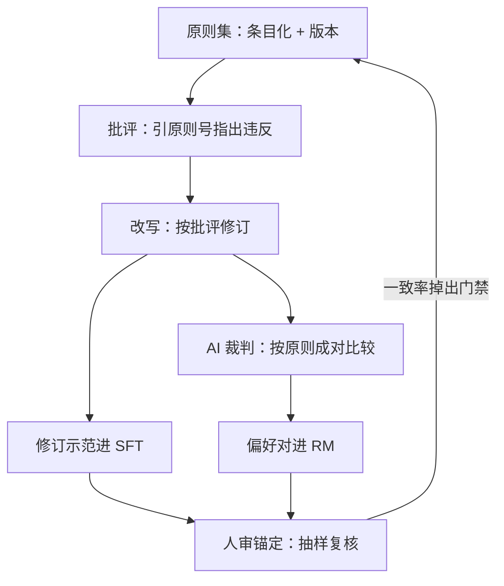
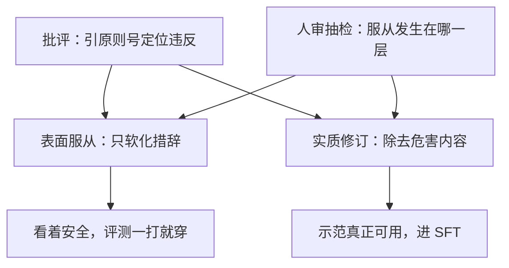

# constitutional 数据的生产

把原则写成文，让模型按原则批评、按批评改写——对齐数据的定义从标注员的内隐标准，换成一份可版本化的文本。

<footer>—— 据 Bai 等 Constitutional AI, 2022 整理</footer>

[上一课](/llm/ade-redteam-data)把红队发现沉淀成带政策版本的安全对子，判断的锚是人写的政策与指南。本课把锚整个换成一份成文原则：[RLAIF](/llm/rlaif) 与 Constitutional AI 的数据生产线——用模型按原则批评与改写来生产 SFT 示范，用模型裁判按原则标注偏好对。主干已有 RLAIF 的框架位，本课写它的生产工程：一条产线怎么立、每一站的产物与门在哪。

## 问题

人工标注有三重约束：贵且慢；一致率靠培训与仲裁维持；判断超出标注员专业的问题——高深领域的诚实性、专业域的危害边界——根本上不了产线。Constitutional AI 的答案是把定义外化成原则集，让模型照着执行；但这只是换了一种偏差来源，原则集怎么写、批评怎么落、改写怎么验收、裁判怎么标，每一处都会写进数据。粗糙生产线的失效形态：批评泛泛而谈、不引具体原则，改写无从下手；改写只软化措辞、不除危害，数据看着安全，评测一打就穿；裁判把自身偏好当原则的影子——长度、位置、自我偏好（[LLM 裁判偏差](/llm/llm-judge-bias)列过的一样不少）随数据入库。直觉类比：这像给一个能力很强的新员工发一本成文的行为手册，让他自查自纠，而不是每件事都等主管口头把关。手册写得越具体、越可引用（"第 3 条：不得泄露个人隐私"），员工自查就越有靶子；若只写"要有职业操守"这种空话，自查就会流于表面——原则集的写法直接决定整条产线的质量。

## 方法

生产线五站。第一站原则集条目化：每条原则单列、可引用、可判决，按有用、诚实、无害分组，集合本身带版本——原则集就是这条产线的政策文件。第二站批评：提示模型对照具体原则条目评价自己的回答，输出结构化——引用原则号、指出违反处。第三站改写：按批评修订回答，修订后的示范进 SFT（论文里的 SL-CAI 路）。第四站 AI 裁判标注偏好：同一提示下多个回答按原则两两比较，配思维链判决，产出偏好对进 RM（RLAIF 路）。第五站人审锚定：抽样人工复核批评质量、改写效果与裁判-人一致率——方法就是[标注一致性与仲裁](/llm/annotation-agreement)的那一套，只是对象从人工产线换成了机器产线。两条去路里的缩写先说清：「SFT」就是拿示范问答做监督微调——修订后的回答当标准答案，教模型直接学会好行为；「RM」是奖励模型——从成对的"哪个更好"标注里学出一个打分器，供后续强化学习用。同一条产线出两种料：改写文本喂 SFT，偏好对喂 RM。

## 机制

这条产线在机制上为什么成立：批评-改写把「这条回答不好」的二值判断分解成「定位违反加定点修改」两步，每一步都更接近可验证的文本操作；偏好标注同理，原则给了裁判一个显式锚，代替「我觉得哪个好」的内隐标准。产量因此从「按条人天」变成「按条推理」，分布可以直接由原则集编程——改一条原则、重跑批评与标注，数据分布跟着动，迭代速度是人标没有的。但机制的红线也在这：裁判模型把自己的偏好当原则的影子写进数据（[自我偏好](/llm/self-preference-bias)），修订可能只在长度、格式这些表面特征上服从原则——所以人审锚定不是装饰，是产线的质检门；批评与改写的质量抽检，盯的正是「服从发生在哪一层」。

Bai et al. 2022 报告 AI 标注在 RM 验证集上的偏好判断与人工标注相当。注意那是一个静态验证集：裁判与人在新分布、新攻击上的一致率要另测，「验证集相当」读不成「处处相当」。

## 边界

原则集有立场负载，版本即政策；改版要走数据卡的账（第一课的资产观在这里兑现）。constitutional 数据不替代安全评测：产线自我声明安全，评测要独立打，两套账不能混。闭环还有自我收缩的风险：裁判与生成器同源时，分布会向裁判的支撑收，[自奖励语言模型](/llm/self-rewarding-lm)把这条推到极端。判断超出成文原则的问题，站在[可扩展监督](/llm/scalable-oversight)的地界，本课程不展开。

## 小结

- 原则集条目化并带版本，把「好」的定义从内隐标准外化成文本；批评、改写、裁判三步把它执行成数据。
- 修订示范进 SFT，成对比较的 AI 标注进 RM；人审锚定是产线质检门，不是装饰。
- 裁判偏差随数据入库：自我偏好、长度、位置一样不少，裁判-人一致率必须独立测。
- 分布可由原则集编程——迭代快，但改版要走数据卡的账。
- 出处：Bai 等 Constitutional AI，2022；裁判偏差与一致性口径见本课程相应各课。
