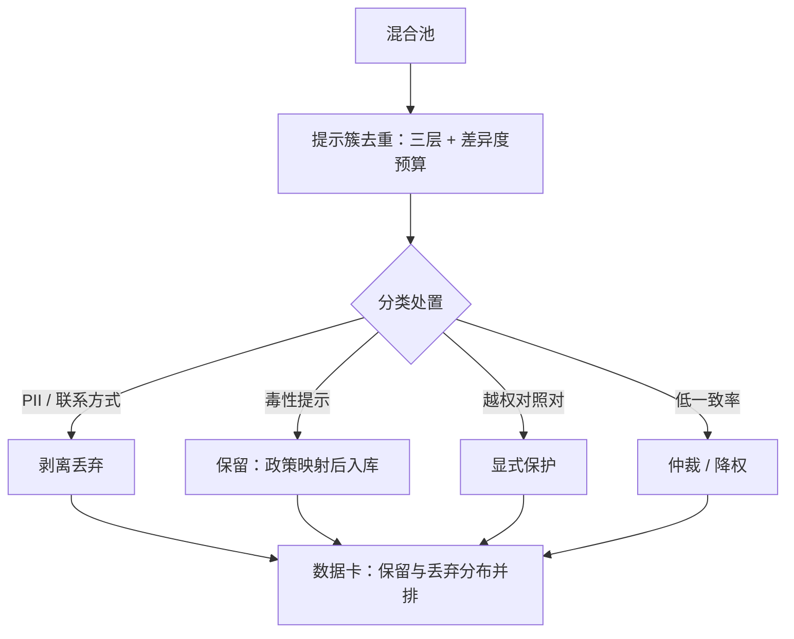
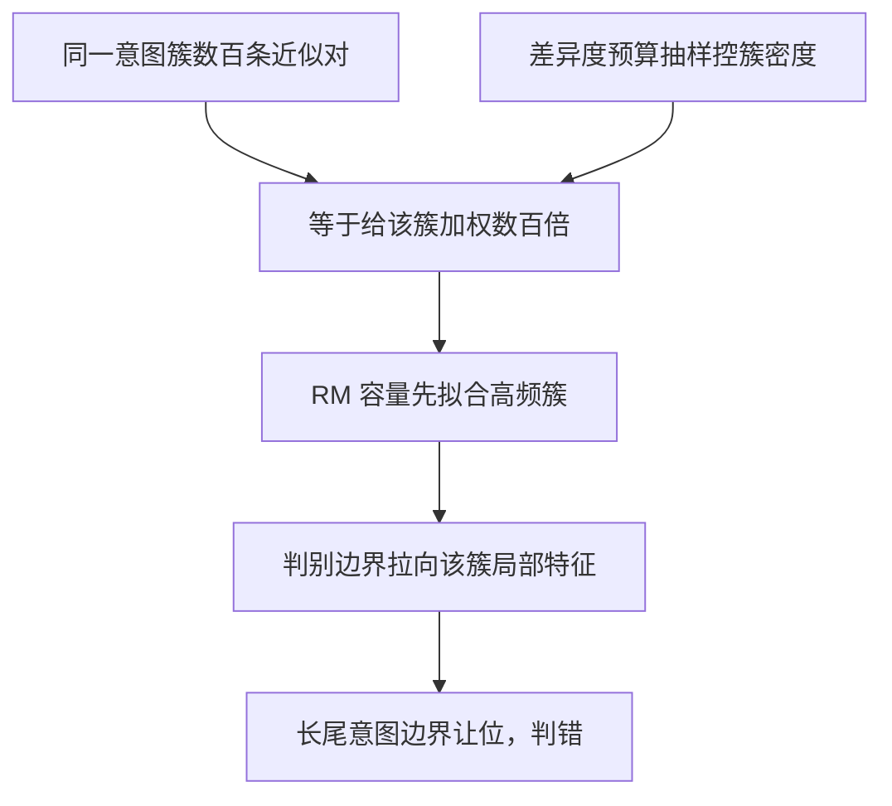

# 对齐数据的去重与清洗

预训练去重防背诵，对齐数据去重防边界悄悄偏移；清洗丢掉的每一类样本，都是一次无声的再配比。

<footer>—— 据 Lee et al., 2021、Kandpal et al., 2022 与本课程口径整理</footer>

[上一课](/llm/ade-constitutional-data)把原则变成可编程的生产线，产量不再是瓶颈；产量上来，脏东西一起上来。本课写对齐数据自己的去重与清洗——工具与预训练清洗、合成数据清洗同族（[合成数据的去重与污染](/llm/synthetic-dedup-contamination)给过四层去重），但目标不同：防的不是背诵，是边界偏移与验证失真。

## 问题

三种对齐特有的失效。其一，近重复提示抬高持有集读数：真实日志里用户反复问同一件事，语义近邻横跨训练与持有两侧，验证准确率量到的有一部分是记忆。其二，同簇过密拖偏边界：一个意图簇里数百条近似对，等于给该簇加权数百倍，RM 的容量先拟合它，长尾边界让位。其三，清洗规则与边界打架：毒性提示要不要删？删了，模型从未见过「必须拒绝的题面长什么样」，拒绝边界外移，漏拒与越权一起出问题；隐私清洗要剥的是个人信息，不是危害类别。标签噪声另算：低一致率的对子静默丢弃，丢弃分布不均匀，又是一次再配比。术语先翻译：「持有集」就是刻意留出、不参与训练、专供考试的题库。麻烦在"近邻泄漏"：题库里的题和练习册里的题长得几乎一样（用户换了个说法问同一件事），考出来的高分掺了背诵的水分——验证指标看着漂亮，线上能力却没那么好。

## 方法

分层处理。去重在提示侧与响应侧分开做：精确、MinHash、语义三层照搬，但「同一提示多响应」是资产不是重复——同一 $x$ 下的多个 $y$ 正是偏好对比的信息量；去重的对象是提示簇，簇内保留按差异度预算抽样，与合成侧骨架去重同一招。清洗分三类记账：隐私剥离（PII、联系方式）照删；毒性提示保留，过政策映射后入库——它们是拒绝边界的定义样本；越权对照对（红队课的疫苗）显式保护，任何清洗规则不得顺手删掉它们。噪声处理不静默：低一致率对子走仲裁或降权（[标注一致性与仲裁](/llm/annotation-agreement)的口径），丢弃必须记账——丢弃分布写进数据卡，与保留分布并排。

## 机制

去重目标为什么不同：预训练的重复经似然损失放大成背诵；对齐数据的重复经对比损失放大成「最便宜可分特征在高频簇上的拟合」——重复给簇加权，加权把 RM 的判别边界拉向该簇的局部特征。持有集失真的机制是近邻泄漏：去重阈值就是泄漏检测的阈值，两端要用同一把尺。清洗即再配比的机制，合成课说过一遍，这里再钉一次：每条丢弃规则作用于分布的不均匀子集，删完分布就变了——所以要看被保留集合的意图分布相对原分布移动了多少，不看删了多少条（[质量过滤：打分器与一致性](/llm/synthetic-quality-filter)「过滤即重加权」的口径）。

数字感受一下"加权"：某常用意图簇有 500 条近似对，而某个长尾意图只有 5 条——仅凭条数，前者在训练里的话语权就是后者的 100 倍。RM 参数有限，先学会的分界自然是那条被重复 100 次的边界，长尾意图的"对错线"被挤到没人管的角落，评测一覆盖长尾就露馅。

最容易错手的一条规则：「删掉所有含敏感词的提示」。它删掉的恰好是拒绝边界最需要的定义样本——删完之后安全分数好看（没题可错），线上漏拒率上涨。

## 边界

去重不解决标注噪声，那是仲裁的题；语义去重的阈值是超参，错删边界对子的代价高于留几条重复。清洗规则要按「特征」审查而不按「内容」审查：按长度删、按格式删都会变成隐性配比。上游与下游的接口在下一课：清洗守的是单条质量与簇密度，配比守的是池与格子的形状——本课交付的是一份带丢弃记账的干净池，不是一份配平的池。常见误区：把"干净"理解成"删得越狠越好"。对齐数据里删错的代价不对称——多留几条重复只是浪费一点容量，错删一条定义拒绝边界的毒性提示或越权对照对，就是悄悄挪了一次安全边界。所以阈值要偏保守，宁可疑而保留，记账后再审。

## 小结

- 对齐去重防的是边界偏移与持有集失真，不是背诵；去重在提示簇层做，同题多响应是资产。
- 清洗分三类：隐私照删，毒性提示保留（它们定义拒绝边界），对照对显式保护。
- 噪声不静默丢弃：仲裁或降权，丢弃分布与保留分布并排写进数据卡。
- 清洗即再配比：看保留集合的分布移动，不看删除条数。
- 出处：Lee et al., 2021；Kandpal et al., 2022；四层去重与过滤口径见合成数据课。
