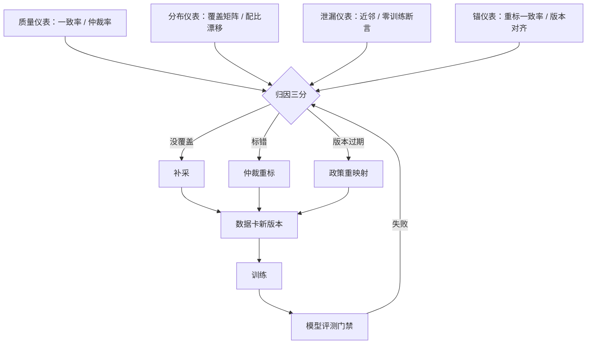
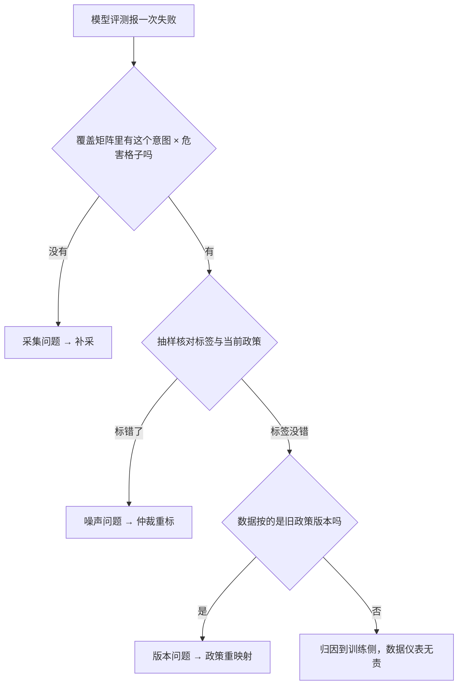

# 对齐数据的评测闭环

模型要评测，数据也要：评的不是模型答得好不好，而是这份数据还定义得动边界吗。

<footer>—— 据 Touvron 等 Llama 2, 2023 的迭代评测与本课程口径整理</footer>

[上一课](/llm/ade-iteration-data-strategy)把轮次间的采集收在失败驱动与新旧混锚；本课补上闭环的最后一环：数据侧自己的仪表，以及它怎么接上模型评测的门禁。模型侧的评测体系有整门对齐评测深钻，收束在[对齐评测收束](/llm/aeval-map)；本课不重讲模型怎么测，只写数据侧的仪表怎么让那些失败可归因。

## 问题

团队普遍盯着模型分数，数据指标静默腐烂：标注团队换人，一致率慢慢掉没人看见；轮次滚动，配比被一批批新数据悄悄搬动；持有集与训练池的近邻越来越像，验证读数虚高；政策改版三个月，安全池里一半对子还按旧政策标着。这些都不立刻体现在模型分数上——分数的变化要等下一次训练才显形，显形时已经分不清是数据的问题还是训练的问题。缺口是把数据质量做成有门禁、有触发条件的仪表，并且与模型评测的门禁接成同一个环。

「持有集」就是刻意不拿去训练、专门留着考试的数据；「训练池」则是平时刷题的题库。如果考试的题混进了题库，学生考高分只说明背过答案，不代表会做——所以要有泄漏仪表，用近邻检测把长得太像的题挑出来。

## 方法

四类仪表加一个接缝。质量仪表：分批、分团队的一致率与仲裁率，指南版本 diff——掉出门禁就停采，先修标注流程。分布仪表：覆盖矩阵（意图 × 危害类别）逐轮对比，配比漂移报警——移动超阈值触发配比复核。泄漏仪表：持有集对训练池的近邻检测（与去重同一把尺），回归集零训练断言。锚仪表：旧提示重标不一致率，政策版本对齐检查。接缝是归因三分：模型评测的失败落进三个格子——数据没覆盖（采集问题）、覆盖了但标错（噪声问题）、政策改了数据没跟上（版本问题）；三个格子对应三个动作：补采、仲裁重标、政策重映射。混在一起就只剩一个动作——再采一批，恰好是最贵的那一个。

## 机制

闭环为什么必须闭合：模型门禁只报「哪里失败」，数据仪表报「失败在数据侧的对应物存不存在」——两边的格子一对，归因才有分母。持有一个机制性的细节：验证集是数据的抽样，数据分布一动，验证读数的指称就变了——这就是为什么数据卡版本必须绑进模型检查点（第一课的资产观），否则跨轮比较的两个数字根本不指同一个量。锚仪表的机制在轮次课给过：重标不一致率同时含口径差与随机误差，要配未改版对照组。所有仪表的共同性质是便宜：它们都是对已有数据的统计，不需要新标注——最贵的动作永远是盲目的那一次补采。

拿到一次模型评测失败后，归因三分的分诊流程是先查覆盖、再查标签、最后查版本，三问走完仍无答案的才移交训练侧排查：

「一致率」可以这样理解：让两位标注员独立标同一批数据，统计他们给出相同答案的比例。假设抽 200 条、两人有 170 条标得一样，一致率就是 85%。低于门禁说明指南写得含糊或有人没读懂——注意它只测「稳不稳」，测不出「对不对」。

上线前最便宜的三个断言：回归集与训练集交集为零；持有集与训练池的最大相似度不超过去重阈值；每个检查点查得到数据卡版本。三条过不了，后面的分数不用看。

## 边界

数据仪表不替代模型评测：一致率高只说明流程稳，不说明指南对——锚定错了的指南，一致率越高错得越整齐，外部金标与人审抽检是另一道。仪表也有盲区：标注员的系统性偏差在一致率上不可见（大家一致地偏），要靠评测侧的对照探针兜住。闭环的尽头还是那个前提：判断可成文、可采集；超出成文范围的部分，本课程的仪表都够不着。

「对照探针」像考试里故意混进去的送分题和陷阱题：正确答案早就知道。如果整个流程连送分题都答错，说明存在大家「一致地偏」的系统性偏差，而不是这道题特别难——这正是标注一致率看不见的那类问题。

## 小结

- 数据侧四类仪表：质量（一致率/仲裁率）、分布（覆盖矩阵/配比漂移）、泄漏（近邻/零训练断言）、锚（重标/版本对齐）。
- 接缝是归因三分：没覆盖、标错、版本过期对应补采、重标、重映射，别把三个动作混成「再采一批」。
- 数据卡版本绑进模型检查点，跨轮的数字才有同一指称。
- 一致率高不等于指南对；系统性偏差要在评测侧用对照探针兜住。
- 出处：Touvron 等 Llama 2，2023；模型侧门禁体系见对齐评测收束课，按本课程整理。
