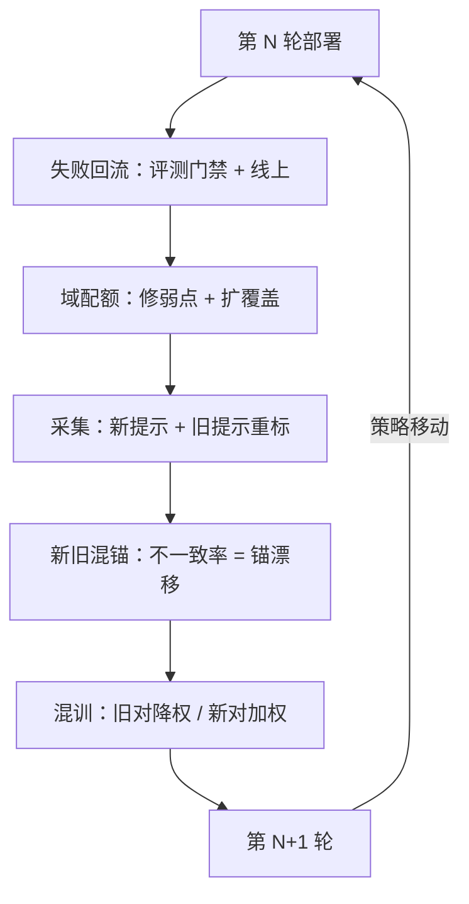

# 迭代轮次的数据策略

每一轮训练都移动策略，策略一动，上一轮的数据就开始贬值；迭代不是重复采集，而是对着这一轮的失败，买下一轮的数据。

<footer>—— 据 Ouyang 等 InstructGPT 2022、Touvron 等 Llama 2 2023 的多轮迭代口径整理</footer>

[上一课](/llm/ade-safety-helpful-mix)把配比钉成分域下限与帕累托工作点，并留了一句：工作点每轮重估。本课把时间轴拉进来——轮次之间数据怎么组织：采什么、留什么、退役什么。第一课立过资产生命周期的循环，本课写循环每转一圈的具体账。

## 问题

迭代把两个时间效应摆上桌面。其一是分布贬值：策略每轮移动，旧对子的 $y_w \gt y_l$ 取自旧策略的支撑，新策略的输出落在新支撑里，旧边界开始对外推负责（[分布外的奖励行为](/llm/rm-ood-behavior)的机制），训练侧再叠加离策略的修正负担（[离策略与重要性采样](/llm/off-policy-importance-rl)的口径）。其二是定义漂移：指南与政策改版后，旧批次的判断锚过期——数据没坏，测的东西换了。全量重采不可能，全量复用更不行；每轮的账要算清楚：多少预算修已知弱点，多少预算扩新覆盖，旧数据留多少、降多少权。

## 方法

轮次策略四件。第一件失败驱动的配额：上一轮的失败（评测门禁的失败域加线上回流）定义下一轮采集的域配额，每条候选样本的信息价值用[主动采集下一批偏好](/llm/rm-active-collection)的口径估计；预算分两个口袋记账——修弱点与扩覆盖，只修弱点的轮次序列会让覆盖悄悄停滞。第二件分层保留：提示库是长寿资产（不依赖策略），比较对是耗材（随策略贬值），政策映射随政策版本；三层半衰期不同，账本分开。第三件新旧混锚：新一轮对旧轮的部分提示重标，同提示新旧标签的不一致率直接量化判断锚漂移了多少，顺带把新指南的口径带进旧簇。第四件四元组版本绑定：轮次号、模型版本、指南版本、政策版本写进每批数据卡，让任何一轮的分数都能对上「用哪份定义、哪批分布训的」。

## 机制

贬值为什么是机制的必然而不是管理问题：RM 学的是「在策略支撑内分辨好坏」，这个前提随策略移动而松动。旧对子并非清零——它对不变的部分（格式、语言、长期稳定的偏好）仍有解释力，贬值的是与新策略相关的部分，所以降权比丢弃便宜且稳：丢弃等于断言旧分布毫无信息，通常不成立。锚漂移用重标不一致率度量，机制上它同时含两件事：指南改版的口径差与标注流程的随机误差——所以要配上未改版提示的对照组，把两者分开：改了版的提示不一致率高是口径差，没改版的提示不一致率也高，那是流程在抖。

实用的一刀切账法：每轮数据卡上写两行——「本轮为修弱点花多少、为扩覆盖花多少」。三轮之后翻回去看，若扩覆盖一行持续为零，这个模型的边界在这三轮里没有变大过。

## 边界

轮次策略不替代质量门：旧数据降权也不豁免入库前的去重与清洗。迭代有过优化的天花板：轮次越多，策略对 RM 缺口的利用越充分（[RM 过优化与 Goodhart](/llm/rm-overoptimization) 的曲线），靠堆轮次掩盖数据缺口会把曲线推向陡段。线上反馈的持续回流与模型的持续更新是另一门课的地界，本课只到「轮」为止——轮是工程上有账可查的最小单位。

## 小结

- 策略每轮移动，旧比较对随之贬值；提示是资产，比较对是耗材，政策映射随版本。
- 失败驱动配额：修弱点与扩覆盖分开记账，主动采集给信息价值定价。
- 新旧混锚：旧提示重标的不一致率量化锚漂移，配未改版对照组分离随机误差。
- 四元组版本绑定让每轮分数可追溯；降权比丢弃便宜。
- 出处：Ouyang 等 InstructGPT，2022；Touvron 等 Llama 2，2023 的迭代口径，按本课程整理。
