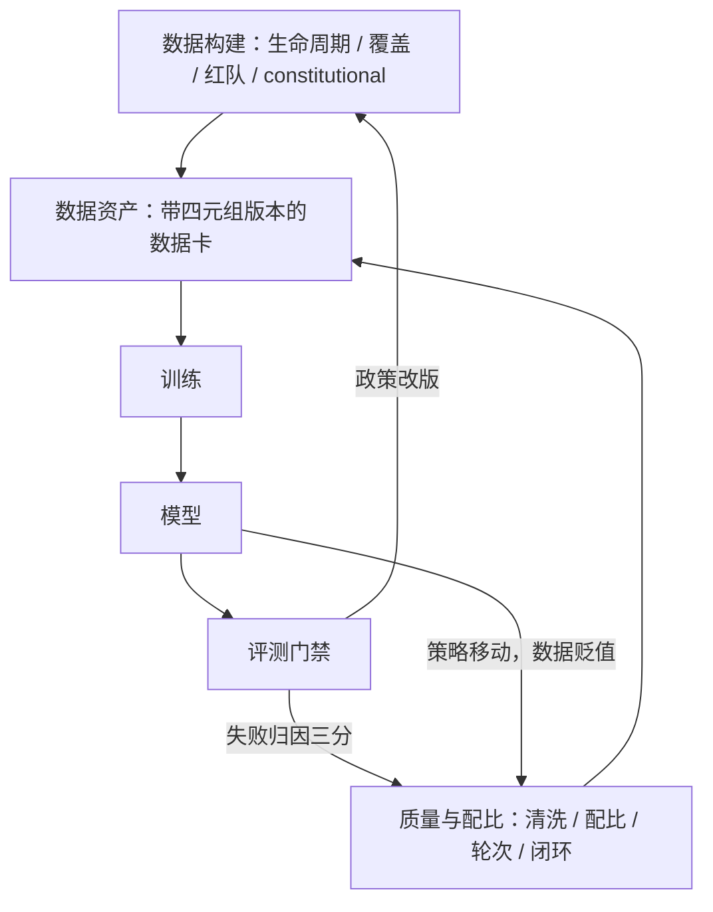

# 对齐数据工程收束

对齐数据工程是把价值观写成可版本化的数据资产：原则与指南是锚，边界对是内容，配比是工作点，仪表是闭环。

<footer>—— 据 Ouyang 等 InstructGPT 2022、Bai 等 Constitutional AI 2022、Touvron 等 Llama 2 2023，按本课程整理</footer>

[上一课](/llm/ade-eval-loop)把数据仪表接上模型评测的门禁，归因三分让每个失败有了对应的动作，闭环成形。本课程从 [RM 工程收束](/llm/rm-engineering-map)的「数据定天花板」开卷，经数据构建与质量配比两单元九课，至此收束。收束课做该做的事：把两个单元放回同一张账，写明每课回答的问题、留下的手段，以及它们共享的那条主线。**本课程到此收束。**

## 问题

把九课压成一个判断：对齐数据工程管两件事。构建单元管把「好」的定义写成数据——生命周期给资产观（版本、账本、退役），提示覆盖给管辖范围（意图分类法与格子配额），红队沉淀给边界（训练对、对照对、评训分离），constitutional 生产给可编程性（原则集直接编程分布）。质量与配比单元管守住定义的执行——去重清洗守住单条质量与簇密度（清洗即再配比），配比守住工作点（分域下限、帕累托读数），轮次策略守住时间轴（贬值、锚漂移、混锚），评测闭环守住归因（没覆盖、标错、版本过期三分）。缺任何一件的失效形态，都在各自的课里见过：定义失版本，行为漂移无账可查；覆盖失格子，边界留外推的洞；沉淀失对照，越权拒绝疯长；闭环失归因，预算全花在盲目的补采上。

## 方法

每课留下一件可持续的东西。生命周期留下资产观与四元组版本；覆盖留下分类法与格子配额；红队沉淀留下「评训分离加对照对」；constitutional 留下「改原则即改分布」的产线；清洗留下丢弃记账；配比留下分域下限与工作点；轮次留下「提示是资产、比较对是耗材」的分层账本；闭环留下三分归因与三条上线断言。每件都能独立运行，合起来是一份新项目的开工顺序：先钉政策与指南的版本号，再立分类法与数据卡，然后才是采集与规模。顺序反了的项目，会在第三轮迭代时找不到「第零轮的边界是什么」。

## 机制

全课程的主线只有一条，而且与[奖励模型工程](/llm/rm-engineering-map)的主线是同一条的两段：指南与原则写下的每一个锚，经偏好对进入 BT 损失，变成 RM 的判别边界；策略再把这个边界放大成行为。「好」的定义在文本里写下多清楚，边界就立得多稳；定义的版本管理多松，行为就漂得多远。课程里所有根本解都作用在同一环——改数据的经验分布：对照对在边界另一侧加样本，格子配额在欠覆盖处加样本，原则改写直接改分布的定义，重标把锚的版本对齐。凡是绕开这一环、在损失端或评测端做局部止血的，都有副作用，只配当第二道防线。

给新项目的自查顺序：先问「好」的定义写在哪份文档、第几版；再问每格数据的判断锚是谁、一致率多少；最后才问模型多大、损失怎么选。顺序反了，预算通常会从第一问流到第三问。

## 边界

收束即边界。本课程全部方法以「好可成文、边界可由对比表达」为前提；判断超出成文范围的问题站在[可扩展监督](/llm/scalable-oversight)的地界，偏好由强裁判代打的部分继承了裁判的偏差（[生成式奖励模型](/llm/generative-rm)是那边的入口）。可验证域是另一个出口：验证器不需要一致率，本课程大半仪表在那里用不上，工程量换成了「验证器覆盖不到什么」的新问题（[RLVR 的设计空间](/llm/rlvr-design-space)）。最后，对齐数据工程的输出从不只是训练数据：它把一个组织的价值观写成原则集、指南、数据卡与仪表——这四样东西比任何单个模型活得都久。

## 小结

- 全课主线：定义写成锚，锚经数据变成边界，策略把边界放大成行为；定义的版本管理决定行为漂移。
- 构建单元四件：资产观与版本、覆盖矩阵、评训分离的沉淀、原则可编程的产线。
- 质量与配比单元四件：清洗记账、分域下限与工作点、轮次分层账本、三分归因闭环。
- 根本解都在改数据的经验分布；损失端与评测端是第二道防线。
- 出处：Ouyang 等 InstructGPT，2022；Bai 等 Constitutional AI，2022；Touvron 等 Llama 2，2023；Ganguli et al., 2022，按本课程整理。
