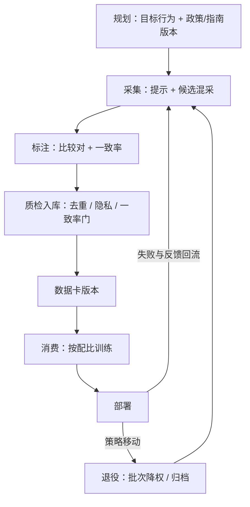
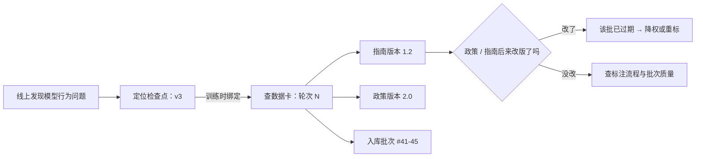

# 偏好数据的全生命周期

偏好数据不是一次采集，而是一份随策略移动而贬值的资产：它有版本、有账本，也有退役日。

<footer>—— 据 Ouyang 等 InstructGPT 2022、Touvron 等 Llama 2 2023 的多轮迭代口径整理</footer>

[上一课](/llm/ce-map)把推理成本工程收成三单元一线与八问决策单：先口径后杠杆，验证永远成本、延迟、质量三列同看。深钻层在这里换挡：从算钱换到喂数——[奖励模型工程](/llm/rm-engineering-map)立过「数据定天花板」的主干结论，本课程把这句话当一门独立工程来做：对齐数据工程。第一课写偏好数据的全生命周期：从规划、采集、标注、入库，到消费、回流、退役。[偏好数据的来源谱系](/llm/rm-data-sources)已经把「比较对从哪来」钉成四类源的谱系；本课把谱系放进时间轴：数据不是名词，是一份有版本的资产。后课默认本课的资产观已就位。

## 问题

常见做法是把偏好数据当一次性耗材：采一批、训一版、脚本归档。三个月后政策改版，没人说得清库里哪批数据按哪版指南标的、哪批已经过期；模型出了问题想回查数据，发现「数据」只是一个没有账本的文件夹。失效形态有三。版本缺失：指南与政策改了，旧数据被静默混用，判断锚已经换了。无回流：部署后收集到的失败案例不回数据管线，下一轮从零再采。无退役：过期数据与新数据等权混训，RM 的边界被旧分布拖住。缺口不是某个技巧，而是把数据当资产管理的那张生命周期表：每段有产物、有门、有责任人。

把数据当耗材还是当资产，可以类比发传单和图书馆：发传单用完就扔，谁也说不清发过哪些；图书馆每本书有编号、借阅记录和下架日期。三个月后政策改版时，前者只能重买一遍书，后者按编号一查就知道哪些书是按旧规则编目的。

## 方法

生命周期八段，每段有产物与门。规划段写数据卡草稿：目标行为、政策版本、指南版本。采集段产出提示与候选，候选混采自当前策略及其近邻（来源课的口径）。标注段产出比较对与一致率。质检入库段跑去重、隐私剥离与一致率门（后课展开），产物是带数据卡版本的入库批次。消费段按配比进训练。回流段收集部署失败与用户反馈，折进下一轮采集的域配额。退役段按规则给批次打过期标记：政策版本变更或策略大版本移动后，比较对降权或归档，提示库保留。八段不是流水线而是循环：回流与退役把第 $N$ 轮的账带进第 $N+1$ 轮。

## 机制

为什么必须是循环而不是流水线：偏好数据的价值绑在两个会移动的锚上。第一个锚是策略——RM 的分辨边界只在策略的支撑内可用，策略每轮移动，旧对子的 $y_w \gt y_l$ 逐渐描述一个不再存在的分布。第二个锚是定义——指南与政策是「好」的文本定义，文本一改，同一条数据测的东西就换了。数据卡版本的作用是把这两个锚钉进每个模型检查点：分数可以对上「用哪份定义、哪批分布训出来的」。提示层与比较层的半衰期不同：提示不依赖策略，是长寿资产；比较对是耗材。承认这一点，退役规则才有落点——过期的是判断，不是题目。

数据卡的另一个用途是反向回查：线上出了问题，顺着检查点往回追到具体批次与指南版本：

「策略的支撑」可以理解成「这个模型写得出来的那些回答的范围」。旧偏好对里的两个回答都是旧模型写的；新模型能力范围变了，旧数据就像用三年前的地图给今天的路导航——大方向可能还行，新修的路已经对不上了。

Llama 2-Chat 的 RLHF 按迭代组织：多轮「采新偏好数据—重训 RM—再训策略」，每轮数据与当轮检查点绑定；约 141 万条比较对是一批批攒出来的账本，不是一次性库存。

## 边界

生命周期表不回答配比——各批次占多少是后面配比课的题；也不回答质检怎么跑——去重与清洗有专课。隐式反馈的回流有隐私与合规约束，本课只给它安放在回流段的位置，规则不在此展开。最后，资产观有成本：数据卡、版本、退役规则都是账面工作，小团队会嫌重；但第一次政策改版就会把省下的这笔账连本带利讨回去——找回「哪批数据按哪版指南标」的时间，远多于当初记账的时间。

「隐式反馈」指用户没被明确问「哪个更好」时留下的信号：点踩、跳过、换个问法重新提问。它便宜但含糊——点踩可能因为答案错了，也可能只是网页卡了；再加上可能夹带个人信息、受合规约束，所以本课只给它留了回流段的位置，规则不展开。

## 小结

- 偏好数据是随策略移动而贬值的资产：有版本、有账本、有退役日。
- 生命周期八段成循环：规划、采集、标注、入库、消费、部署、回流、退役；产物是带版本的数据卡。
- 两个会移动的锚：策略分布与文本定义；数据卡版本把两者钉进模型检查点。
- 提示是长寿资产，比较对是耗材；退役过期的是判断，不是题目。
- 出处：Ouyang 等 InstructGPT，2022；Touvron 等 Llama 2，2023 的迭代口径，按本课程整理。
