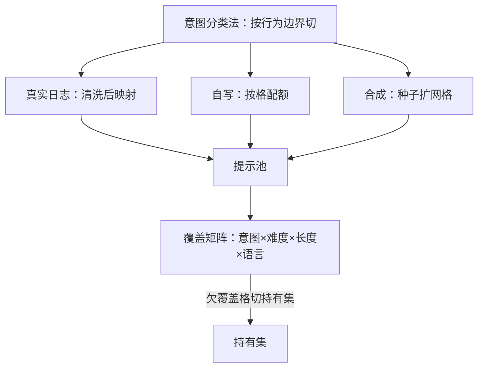

# 提示词的多样性与覆盖

提示分布是「好」这个字的管辖范围：哪里没有提示，哪里就没有偏好，也就没有边界。

<footer>—— 据 Ouyang 等 InstructGPT 2022 与 Zhou 等 LIMA 2023 的提示来源口径整理</footer>

[上一课](/llm/ade-preference-lifecycle)把偏好数据钉成有版本、有退役的资产，采集是循环的第一段；本课停在采集段最上游的原料上：提示词本身。要决定的不是「采多少条」，而是「提示分布覆盖什么、漏掉什么」。[偏好数据的来源谱系](/llm/rm-data-sources)给过提示的三个填法——真实日志、标注员自写、模型生成；本课写这三个分布怎么拼成一张覆盖图。

## 问题

提示分布决定偏好在哪些问题上被定义。覆盖的失效是静默的：头部意图（写邮件、改代码）被日志自然过采，长尾（冷门专业域、少数语言、非常规格式）几乎缺席；RM 在缺席处没有对比样本，分数是外推（[分布外的奖励行为](/llm/rm-ood-behavior)的机制位），而 RL 与 best-of-n 恰好会把手伸进这些区域。三条来源各有偏置：真实日志保覆盖但脏且带隐私；自写提示干净但窄，标注员的职业画像会变成提示的画像；模型生成扩张最便宜，但生成器的分布同质化，几百条变体可能是同一个格子的重复敲门。没有一张意图分类法把三者对齐，覆盖就只是条数的错觉。

## 方法

先钉分类法，再谈配额。意图分类法的粒度以「行为边界是否不同」为准：同一意图下好坏答案的分界相似，就并成一类；分界不同，就拆开。分类法立起来后按三个动作填分布。真实日志先过[质量过滤](/llm/data-quality-filter)：隐私剥离、毒性分流、模板归并，再按意图映射进池。自写提示按分类法下配额——标注员领任务，不是自由发挥。合成扩张拿聚类中心做种子，扩网格不扩头部，多样性的量法沿用[多样性的度量与覆盖](/llm/synthetic-diversity-metrics)的口径。覆盖矩阵用「意图 × 难度 × 长度 × 语言」四维记账，每个格子设下限；持有集故意从欠覆盖的格子里切，让验证读数对薄弱处诚实。

## 机制

为什么配额要对长尾过采：若按使用频率配，头部意图占九成样本，而每条样本的边际信息量随同簇密度递减——第一千封「帮我写邮件」教会 RM 的东西趋近于零，长尾格子里第一条样本定义的却是整块边界。所以配额的真实语义是「按每格的信息价值分配」，不是按自然频率。三条来源的机制分工由此清晰：日志提供真实分布的形状（什么问题真的会出现），自写提供格子的最低保障，合成提供密度与格式变体；三者拼起来，分类法才是那张对齐表——同一个格子里的三条来源，测的才是同一件事。

InstructGPT 的提示池明写三个来源——API 真实提交、标注员撰写、GPT 生成——并按比例混采。这不是冗余保险，而是三个分布各补一块：真实形状、格子保障、廉价密度。

## 边界

多样性有上界：离目标行为太远的提示稀释预算，也制造假覆盖——格子填了，问题却没人会问。分类法本身要随政策与产品迭代，是活文档，版本走第一课的数据卡。日志的隐私约束是硬边界，有些格子只能靠自写与合成去补。最后，覆盖无法被证明，只能被审计：矩阵是账本不是证书，欠覆盖格子迟早要还，晚还不如实记录。对抗性的提示分布不在本课——刻意制造失败的那一支，是下一课红队数据的题。

## 小结

- 提示分布定义偏好的管辖范围；缺席处没有边界，只有外推。
- 三条来源各补一块：日志给真实形状，自写给格子保障，合成给密度与变体。
- 先立意图分类法（按行为边界切），再按四维覆盖矩阵配额与验收。
- 长尾过采的机制是边际信息量：头部重复样本趋近零价值。
- 覆盖只能审计不能证明；持有集从薄弱格子切，让验证诚实。
- 出处：Ouyang 等 InstructGPT，2022；Zhou 等 LIMA，2023；多样性度量见合成数据课。
